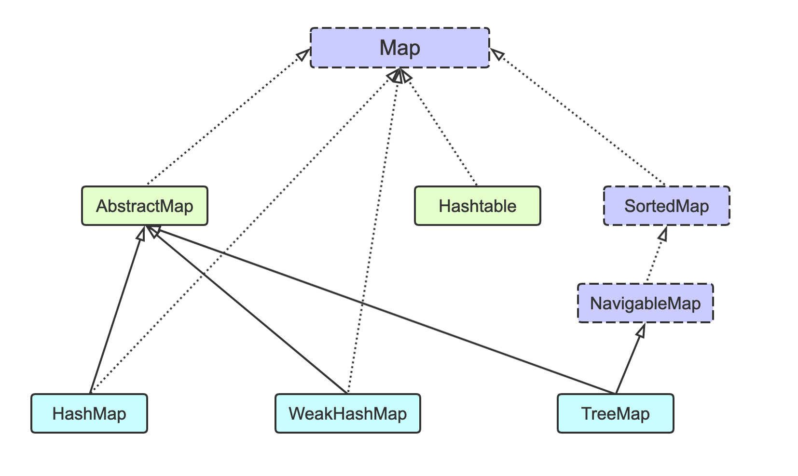

# Java




# 随笔

### 键盘读入

```java
import java.util.*;
public class Main{
    public static void main(String[] args) {
        Scanner sc = new Scanner(System.in);
        while(sc.hasNext()) {
            int n = sc.nextInt();
            String[] strs = new String[n];
            for(int i = 0; i < n; i++) {
                strs[i] = sc.next();
            }
        }
    }
}

BufferedReader reader = new BufferedReader(new InputStreamReader(System.in));
reader.readLine();
```

