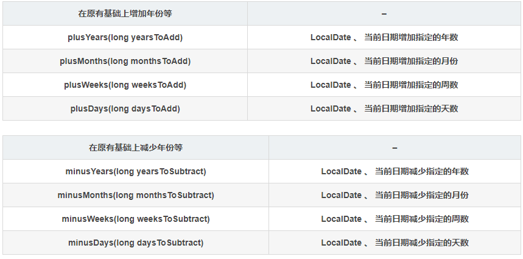
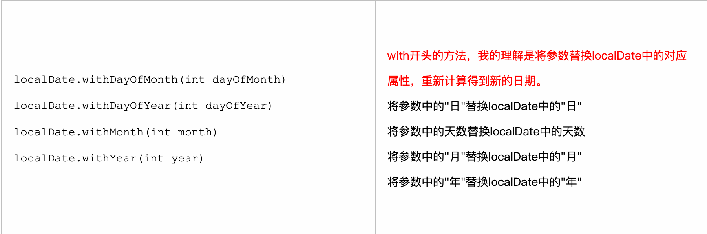
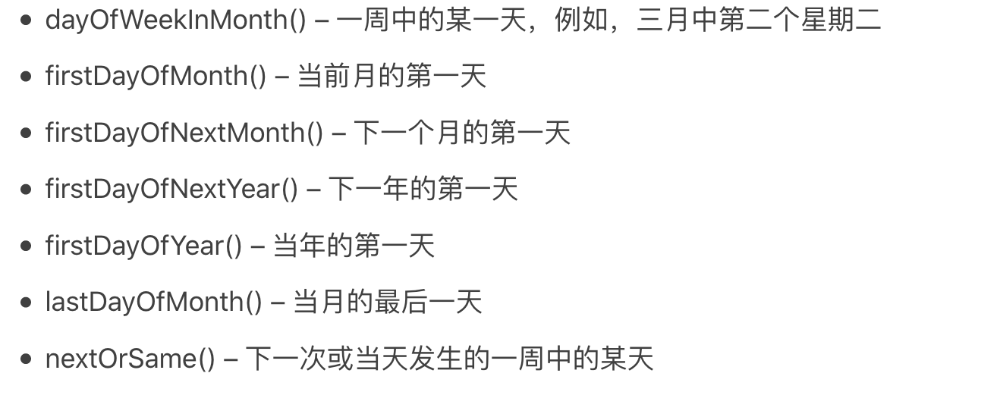

# Java8-实战

## 第一章：Java8


### 1.1 常识

- JDK1.0：1996发布
  - 之前多线程【Thread API】才能使用多个内核，线程使用较难
  - 一般程序都只能使用一个核
- JDK1.8：2014发布
  - Stream API：支持许多数据处理的**并行操作**【**避免synchronized，容易出错，成本高**】，主要用于描述对数据的计算【并行】
  - Collection：集合，只要是为了存储和访问数据，【串行】；
  - 流处理：Unix--cat xxx xxx | sort | tail -3：命令是**同时进行**的；
- 行为参数化
  - **方法作为参数传给方法**
- 各版本：https://blog.csdn.net/qq934235475/article/details/82220076

### 1.2 Java1.8 的大致改变

1. 函数即方法：泛指静态方法

   1. Java8中新增了函数--**值的新形式**

      - 值：(42)int, ("ssss")String
      - 一等公民：值，即在程序**运行期间可以改变**的变量
      - 二等公民：方法【1.8之前】，类，在运行期间不可以改变
      - 在运行时将**方法作为值【参数】传递**，Stream的基础

   2. 方法引用1.8：  **::**

      ```java
      // :: 将isHidden()方法作为值传入到listFiles()方法
      new File(".").listFiles(File::isHidden);
      
      /*
      * 与用对象引用传递对象类似[new]， ::创建了一个方法引用
      */
      ```

      - 将**方法作为一等公民**，上处为有名函数【方法】
      - Lambda【类似匿名函数】，作为一等公民
        - 只用一次的函数不用写定义

2. Predicate--谓词

   - 接受一个参数，并返回boolean【是否满足参数条件】

   ```java
   // jdk 1.8
   @FunctionalInterface
   public interface Predicate<T> {
     boolean test(T t);
   }
   ```

3. lambada -- stream

   ```java
   filterApples(appleList, (Apple a) -> "green".equals(a.getColor()));
   
   list.stream().filter((Apple a) -> a.getWight() > 100).collect(toList);
   
   ```

4. 默认方法：JDK1.8**接口可有默认实现**方法

   ```
   default void xxx
   ```

   - 1.8 接口可以包含实现类没有提供实现的方法签名了，缺失的方法总体由接口提供了，即默认实现`default`

   ```java
   public interface List<E> extends Collection<E> {
       default void sort(Comparator<? super E> c) {
           Object[] a = this.toArray();
           Arrays.sort(a, (Comparator) c);
           ListIterator<E> i = this.listIterator();
           for (Object e : a) {
               i.next();
               i.set((E) e);
           }
       }
   }
   ```


## 第二章：行为参数化

### 2.1 应对变化的需求

- 行为参数化：处理频繁变更需求的软件开发模式，即：准备好一个方法，目前不去执行它，可以以后方法调用方法
  - 即：准备一个方法，做某件事
  - 例：开车--{买东西方法，取包裹方法...}；
  - go(): 接受不同的新行为作为参数，然后去执行
- 一类判断抽象化【**谓词**】，算法族
  - 筛选苹果：大小，颜色，产地【是否满足抽象化】
  - 实现抽象，做不同筛选标准
  - 策略设计模式，不同实现为策略
- 过滤器(抽象化)：行为参数化
  - 参数化过滤器：**过滤器的行为根据参数而定**；

### 2.2 使用行为参数化

1. 使用定义新类：缺点，需要实现好几个只用一次的类

```java
package com.xjj.topic2;

import java.util.ArrayList;
import java.util.Arrays;
import java.util.List;

public class FilteringApples {

    public static void main(String[] args) {
        List<Apple> inventory = Arrays.asList(new Apple(80,"green"),
                new Apple(155, "green"),
                new Apple(120, "red"));

        List<Apple> filter = filter(inventory, new AppleGreen());

    }

    /*行为参数化--过滤器(类，抽象化类)
    * 1. 参数化过滤器：过滤器的行为根据参数而定；
    * 2. 传入具体实现类
    * 3. filter的【行为取决于】ApplePredicate传递的代码
    * */
    public static List<Apple> filter(List<Apple> apples, ApplePredicate ap) {
        ArrayList<Apple> result = new ArrayList<>();
        for (Apple apple : apples) {
            // 调用真正的实现
            if (ap.test(apple)) {
                result.add(apple);
            }
        }
        return result;
    }

    /*
    * 嵌套接口
    * 1. 一类判断抽象化【**谓词**】
    * 2. 唯一方法返回boolean,[可根据要求修改]
    * */
    interface ApplePredicate {
        boolean test(Apple a);
    }

    /*不同实现代表不一样标准，筛选*/
    static class AppleWeight implements ApplePredicate {
        @Override
        public boolean test(Apple a) {
            return a.getWeight() > 150;
        }
    }
    static class AppleGreen implements ApplePredicate {
        @Override
        public boolean test(Apple a) {
            return "green".equals(a.getColor());
        }
    }
}
	
```

2. 匿名类：允许同时声明并实例化一个类

   - 随用随建随毁
   - 缺点：笨重【占用很多空间，模板代码】

   ```java
   /*匿名类*/
   List<Apple> redApple = filter(inventory, new ApplePredicate() {
     @Override
     public boolean test(Apple a) {
       return "red".equals(a.getColor());
     }
   });
   ```

3. Lambad

   - 陈述问题本身

   ```java
   /*lambda ：默认实现函数式接口的唯一抽象方法*/
   List<Apple> apples = filter(inventory, (Apple apple) -> "red".equals(apple.getColor()));
   ```

4. List类型抽象化

   ```java
   /*过滤器 抽象化【泛型】*/
   public static <T> List<T> filter(List<T> list, Predicate<T> p) {
     List<T> result = new ArrayList<>();
     for (T e : list) {
       if (p.test(e))
         result.add(e);
     }
     return result;
   }
   
   /*类型 抽象化*/
   public interface Predicate<T> {
     boolean test(T t);
   }
   
   // 测试
   filter(numbers, (Integer i) -> i % 2 ==0);
   ```

5. Java内置

   - Comparator 排序，sort(行为参数化)

     ```java
     public interface Comparator<T> {
     	int compare(T o1, T o2);
     }
     
     /*匿名类 排序，List.sort()*/
     inventory.sort(new Comparator<Apple>() {
       @Override
       public int compare(Apple o1, Apple o2) {
         return o1.getColor().compareTo(o2.getColor());
       }
     });
     // lambda
     inventory.sort((Apple a1, Apple a2) -> a1.getColor().compareTo(a2.getColor()));
     ```


## 第三章：lambda

### 3.1 lambda

1. 概念：
   - 类似简介的匿名函数：**没有名称，有参数列表，函数主体，返回类型，也可抛出异常**
   - 函数：不像方法属于某个类
   - 传递，lambda表达式可作为参数**传递给方法**或**存储在变量**中，简洁传递代码
2. 构成
   - 参数、箭头、主体(a -> {})

### 3.2 使用lambda

1. 函数式接口： 只定义了`一个抽象方法`的接口;

   - 其他为默认方法实现等
   - 继承包含两个抽象方法都不是

   ```java
   @FunctionalInterface
   public interface Comparator<T> {
     int compare(T o1, T o2);
   }
   
   @FunctionalInterface
   public interface Runnable {
   	public abstract void run();
   }
   
   ```

2. lambda允许以`内联形式`为函数式接口的唯一抽象方法提供实现，即相当于默认实现该接口的唯一抽象方法

   - 匿名内部类也可完成

     ```java
     // 默认实现run()方法	() -> void
     Runnable r1 = () -> print("lambda");
     ```

3. 函数描述符：函数式接口的抽象方法的`签名`【参数与返回值】就是lambda表达式的签名

   - () -> void

   - 当lambda作为变量传给接受`函数式接口`为参数的方法时，其签名要与抽象方法的一致才能默认实现；

     ```java
     public void process(Runnable r) {
       r.run();	// () -> void
     }
     // 签名一致
     process(() -> print("lambda"));
     ```

   - lambda仅可用于上下文是函数式接口的情况

     - 不添加函数类型：避免语言变得更复杂

4. @FunctionalInterface

   - ```java
     /* @since 1.8
      */
     @Documented
     @Retention(RetentionPolicy.RUNTIME)
     @Target(ElementType.TYPE)
     public @interface FunctionalInterface {}
     ```

   - 用于批注该接口会设计成一个函数式接口

   - 建议使用，不是必须，类似@Override


### 3.3 环绕执行模式

1. 围绕重要【功能】代码执行处理
   - 类似资源处理
   - Try-with-catch：不用显式关闭
2. 让功能代码**行为参数化**
   - 传递行为：Lambda的本领
3. 简要步骤：
   1. 定义原本处理方法，无法扩展，死代码；
   2. 行为参数化：
      - 使用函数式接口【类似谓词，因为lambda仅支持】定义抽象化一类处理(一个方法)；
      - 定义方法使用函数式接口作为其参数以完成行为参数化；
   3. 具体定义方法-->行为参数化
   4. 传递lambda式【方法的具体实现】，以解决不同问题

### 3.4 Java API 函数式接口

1. Predicate	

   -  test();	T -> boolean

   ```java
   @FunctionalInterface
   public interface Predicate<T> {
         boolean test(T t);
   }
   ```

2. Consumer

   - accect();	T ->void

   ```java
   @FunctionalInterface
   public interface Consumer<T> {
       void accept(T t);
   }
   
   // <指定类型>
   Consumer<String> consumer = (String s) -> System.out.println(s.length());
   Consumer<String> consumer = s -> System.out.println(s.length());
   
   
   /*
    * 实现forEach
    * <T>这个T 修饰符的功能，表示该方法为泛型方法，传入参数有泛型，
    * 就像有static修饰的方法是个静态方法一样。
    * */
   public static <T> void forEach(List<T> list, Consumer<T> consumer) {
     for (T i: list) {
       // 对i 做什么操作
       consumer.accept(i);
     }
   }
   public static void main(String[] args) {
     // 签名一致，泛型T，需要为对象，所以不能为基本类型
     forEach(Arrays.asList(1, 2, 3), (Integer i) -> System.out.println(i));
   }
   ```

​	

3. Supplier-

   - get: 创建者
   - () ->T

   ```java
   @FunctionalInterface
   public interface Supplier<T> {
   
       /**
        * Gets a result.
        *
        * @return a result
        */
       T get();
   }
   
   
   Supplier<Integer> supplier = () -> s.length();
   System.out.println(supplier.get());
   ```

4. Function<T, R>

   - apply: (T) -> R

   ```java
   @FunctionalInterface
   public interface Function<T, R> {
   
       /**
        * Applies this function to the given argument.
        *
        * @param t the function argument
        * @return the function result
        */
       R apply(T t);
   }
   
   
   Function<Integer, Apple> f2 = (weight) -> new Apple(weight);
   ```

5. 


### 3.5 类型检查，推断

1. 类型检查

   - 目标类型：函数式接口【方法】接受的类型 <T>-->String

     ```java
     // 目标类型， T绑定到Apple
     Predicate<Apple>
     ```

2. 类型推断
   
   - JDK 会从目标类型推断出Lambda的签名

```java
// 目标类型	<String> 必须指定
// 没有涉及类型推断，显示指定Lambda的类型
Consumer<String> consumer = (String s) -> System.out.println(s.length());
// 涉及类型推断，没有显示指定Lambda的类型
Consumer<String> consumer1 = s -> System.out.println(s.length());
// () -> void  <> 不用指定
Runnable runnable = () -> System.out.println("12312");
```

3. 使用局部变量

   ```java
   /*
    * Lambda可以使用局部变量，但是该变量必须是最终的或隐式最终的【不修改】
    * */
   int test = 100;
   Runnable r1 = () -> System.out.println(test);
   // lambda错误
   test = 1000;
   ```

   

### 3.6 方法引用

```java
/*
* lambda的一种快捷写法：调用Apple的getWeight()方法
* 不需要括号
* = (Apple a) -> a.getWeight();
*/ 
list.sort(comparing(Apple::getWeight));


List<String> strs = Arrays.asList("a", "b", "c");
// 默认实现 int compare(T o1, T o2);
strs.sort((s1, s2) -> s1.compareToIgnoreCase(s2));
// 方法引用  调用实例方法
strs.sort(String::compareToIgnoreCase);
```

1. 分类：
   - 指向`静态方法`的方法引用【调用静态方法】，Integer::parseInt
   - 指向任意类型实例方法，s.length()==String::length;
   - 指向现有对象的实例方法，???

### 3.7 构造函数引用

- ClassName::new

- 无参构造：Supplier  () -> T

  ```java
  // 1. 无参构造
  Supplier<Apple> c1 = Apple::new;
  Supplier<Apple> c2 = () -> new Apple();
  Apple a1 = c1.get();
  ```

- 一参构造：Function<T, R>.     (T) -> R

  ````java
  Function<Integer, Apple> f1 = Apple::new;
  Function<Integer, Apple> f2 = (weight) -> new Apple(weight);
  Apple a2 = f1.apply(10);
  ````

- 二参构造：BiFunction<T, U, R>.   (T, U) -> R

  ```java
  BiFunction<Integer, String, Apple> b3 = Apple::new;
  BiFunction<Integer, String, Apple> b4 = (w, c) -> new Apple(w, c);
  Apple a3 = b3.apply(100, "red");
  ```

  

### 3.8 排序实战整合

1. ```java
   public static void main(String[] args) {
     List<Apple> inventory = Arrays.asList(new Apple(80,"green"),
                                           new Apple(155, "green"),
                                           new Apple(120, "red"));
   
     /*
   	* sort(Comparator<? super E> c)
   	* 接受Comparator，参数化
     * */
   
     /*1. 原始比较
           * 定义实现接口Comparator
           * */
     public static class AppleComparator implements Comparator<Apple> {
     @Override
     public int compare(Apple o1, Apple o2) {
         return o1.getWeight().compareTo(o2.getWeight());
       }
     }
     inventory.sort(new AppleComparator());
     
     /*2. 匿名内部类*/
     inventory.sort(new Comparator<Apple>() {
       @Override
       public int compare(Apple o1, Apple o2) {
         return o1.getWeight().compareTo(o2.getWeight());
       }
     });
   
     /*3. Lambda表达式，默认实现函数接口唯一方法
           *  类型推断List<Apple>
           * */
     inventory.sort((a1, a2) -> a1.getWeight().compareTo(a2.getWeight()));
   
     /*4. Comparator.comparing 静态辅助方法
           *    public static <T, U> Comparator<T> comparing(
                   Function<T, U> keyExtractor)
           * 默认实现apply()方法
           * 底层实现为 3. Lambda表达式
           * */
     Function<Apple, Integer> f = (a) -> a.getWeight();
     inventory.sort(Comparator.comparing(f));
   
     inventory.sort(Comparator.comparing((a) -> a.getWeight()));
   
     /*5. 方法引用--指向实例方法的引用*/
     inventory.sort(Comparator.comparing(Apple::getWeight));
   
   }
   ```

   ### 3.9 Lambda表达式复合

   1. 函数式界面默认实现方法

      ```java
      /*1. 比较器复合
              * */
      // 逆序排序
      inventory.sort(Comparator.comparing(Apple::getWeight).reversed());
      // 同等重量在排序
      inventory.sort(Comparator.comparing(Apple::getWeight).reversed().thenComparing(Apple::getColor));
      
      /*2. 谓词复合
              * negate==非
              * and 、or
              * */
      Predicate<Apple> redApple = (a) -> "red".equals(a.getColor());
      // 非红苹果
      Predicate<Apple> negate = redApple.negate();
      Predicate<Apple> and = redApple.and(a -> a.getWeight() > 150);
      
      ```
      
      

### <？ extends E>和<？ super E>

1. <？ extends E>

   - <? extends E> 是 Upper Bound（上限） 的通配符，用来限制元素的类型的上限为E，比如

   ```
   List<? extends Fruit> fruits;  
   ```

   表示集合中的元素类型上限为Fruit类型，即只能是Fruit或者Fruit的子类，因此对于下面的赋值是合理的

   ```java
   fruits = new ArrayList<Fruit>();  
   fruits = new ArrayList<Apple>();  
   ```
   - <?>是<? extends Object>的简写

   

2. <？ super E>

   <? super E> 是 Lower Bound（下限） 的通配符 ，用来限制元素的类型下限E，比如

   ```
   List<? super Apple> apples;  
   ```

   表示集合中元素类型下限为Apple类型，即只能是Apple或Apple的父类，因此对于下面的赋值是合理的

       apples = new ArrayList<Fruit>();  
       apples = new ArrayList<Object>();  

3. **为了保证类型安全**


## 第四章：流

### 1. 简介

- ​	import java.util.stream

  ```java
  list.stream();
  // 并行处理
  list.parallelStream();
  ```

2. 包含

   - 数据源：集合

   - 中间操作-链，流水线

     - 类似构建模式

     ```java
     NyPizza nyPizza = new NyPizza.Builder(NyPizza.Size.S)
       .addTopping(Pizza.Topping.A).addTopping(Pizza.Topping.C).build();
     ```

     - 中间操作不会执行处理，合并处理
     - filter(), map()：同时处理【**循环合并**】，limit(3)：即使有很多元素也只操作第三条【**短路技巧**】
     - 短路技巧：不需要处理整个流，满足即返回

   - 终端操作：执行流水线，生成结果

     - 类似build()方法
     - 触发执行

3. 关键概念
   - 流使用`内部迭代`，具体操作透明化，可**并行执行**代码【外部迭代，单一线程】
   - 流中的元素是按需计算的：例如观看视频等

```java
inventory.stream()
  .filter(apple -> apple.getWeight() > 100)
  .map(Apple::getColor)						// Function--apply()方法，T -> R
  .limit(3)												// 短路技巧，符合立即返回
  .collect(Collectors.toList());	// 终端操作
```


## 第五章：使用流

**对象流**

### 1. 筛选与切片

1. 谓词筛选-filter[ T -> boolean ]

   ```java
   Stream<T> filter(Predicate<? super T> predicate);
   ```

2. 切片：

   - limit(n), skip(跳过)
   - 如一满足，立即返回

### 2. 映射

1. map

   - ```java
     <R> Stream<R> map(Function<? super T, ? extends R> mapper);
     
     // apply()  T -> R
     R apply(T t);
     ```

   - 创建新版本返回

2. flatmap

   - ```java
     <R> Stream<R> flatMap(Function<? super T, ? extends Stream<? extends R>> mapper);
     ```

   - 扁平化

### 3. 规约

1. reduce

   ```java
   // 初始值identity
   T reduce(T identity, BinaryOperator<T> accumulator);
   
   Integer reduce = nums.stream().reduce(1, (a, b) -> a * b);
   // 看reduce需要的参数是谁，Integer::sum就默认实现谁
   nums.stream().reduce(1, Integer::sum);
   ```

   - 易于并行化

### 4. 数值流

1. 解决暗含装箱成本
2. 原始类型流特化
   
- IntStream, DoubleStream, LongStream
  
3. 映射到数值流

   ```java
   // mapToXXX, 返回xxxStream()对象
   inventory.stream().mapToInt(Apple::getWeight).sum();
   ```

   

### 5. 生成流

1. 类型

   - 值创建流
     - Stream.of()
     - Arrays.stream()
   - 文件生成流
     - Files.lines()
   - 函数生成流
     - Stream.iterate(初始值, UnaryOperator)
     - Stream.generate(Supplier---T get();)

   ```java
   public static void main(String[] args) {
     /*1.  由值创建流  */
     // 调用Arrays.stream()
     Stream<String> stream = Stream.of("123", "java", "hhhh");
     stream.map(String::toCharArray).forEach(System.out::println);
   
     // 创建空流
     Stream<String> empty = Stream.empty();
     // Arrays静态方法
     int sum = Arrays.stream(new int[]{1, 2, 3}).sum();
   
   
     /*2. 文件生成流*/
     long count = 0;
     try (Stream<String> lines = Files.lines(Paths.get("123.txt"), Charset.defaultCharset())) {
       count = lines.flatMap(line -> Arrays.stream(line.split(" ")))
         .distinct()
         .count();
     } catch (IOException e) {
     }
   
     /*3. 函数生成流 生成无限流*/
     // 有初始值
     Stream.iterate(0, n -> n+1)
       .limit(10)
       .forEach(System.out::println);
     // 无初始值
     Stream.generate(Math::random)
       .limit(5)
       .forEach(System.out::println);
   }
   ```

   

## 第九章：默认实现

### 1. 概念

- 接口中的默认实现方法
- Java1.8 引入的新特性
- 问题：解决接口中增加新方法，无法控制用户的实现；让类库的设计者放心改进应用程序接口，无需担忧向后兼容的问题，
- 实现更新接口的类会自动继承一个默认的方法实现
- 兼容性
  - 二进制兼容性：为接口添加新方法
  - 源代码兼容性
  - 函数行为兼容性

### 2. 概述默认方法

1. 辨识
   - default 修饰符修饰，`非抽象方法`
   - 实现类自动继承

2. 案例
   - Collection接口的stream()
   - List接口的sort()

3. 接口与抽象类

   - 同：都可以包含抽象方法和包含方法体的实现【默认方法】

   - 区：

     - 一个类只能**继承一个抽象类**，但是一个类可以**实现多个接口**

     - 抽象类可包含实例变量，但是接口不能有实例变量

       ```java
       public interface InterfaceTest {
           // 类变量，默认static final
           String s = "123";
           // 实例变量不允许有
       		// String s;
       }
       
       public abstract class AbstractTest {
           // 实例变量
           int i;
           String s = "123";
       }
       ```

4. 使用模式

   - 可选方法
     - 减少无效的模板代码，即默认实现一个空方法
   - 行为的多继承
     - 类型的多继承：一个类只能继承一个类，但是可以实现多个接口【继承多个默认方法】；
     - 正交方法精简接口
       - 将不同方法为接口的默认实现，通过组合接口实现方法继承

5. 解决同样签名冲突

   - 签名：参数+返回值
   - 冲突：类实现的多个接口中含有相同签名的方法
   - C++菱形问题：一个类同时继承了具有相同函数签名的两个方法，Java中也有
   - 规则
     - 类中定义的方法【覆盖】优先级最高，类或父类高于默认方法
     - 先上，**子接口中的优先级最高**，最具体实现的
     - 上，无法判断哪个更具体，实现类必须通过**显示覆盖**和**调用期望的方法**；B.super().hello();

6. Java1.8
   
   - 接口可允许默认方法或静态方法通过代码实现；

## 第十章：Optional

### 1. null指针

- NullPointerException异常
- 不属于任何类型，
- 使代码陷入深度嵌套点null检查，可读性降低
- null检查只是掩盖问题，不为Optional表示该属性一定不为null

### 2. Optional

- Util.Optional<T>，封装Optional值的类
- Optional.empty(), 尝试解引用null，一定会触发NullPointerException异常，但是empty没事
- 代码非常清晰地表达了模型是否拥有某属性
- 清晰知道变量值的缺失是**结构上的问题**，还是**算法上的缺陷**，还是**数据的问题**

### 3. 创建Optional对象

1. ```java
   Optional<Car> empty = Optional.empty();
   Optional<String> s = Optional.of("xxx");			// 对象为null，报异常
   Optional<String> s1 = Optional.ofNullable("123");	// 不会引起异常
   ```

2. 方法

   - map
   - flatMap, 分解Optional对象
   - orElse
   - 同Stream接口类似

### 4. Optional实战

1. 封装可能为null的值

   ```java
   Optional<Object> value = Optional.ofNullable(map.get("key"));
   ```

2. 异常处理

   ```java
   public static Optional<Integer> strToInt(String s) {
     try {
       return Optional.of(Integer.parseInt(s));
     } catch (NumberFormatException e) {
       return Optional.empty();
     }
   }
   ```


## 第十一章：异步编程

### 题

1. 并发与并行
   - 并发：同一个CPU上执行多个任务，让CPU的核充分忙碌，实现最大化吞吐量
   - 并行，多个CPU上同时执行多个任务

### 1. Future， CompletableFuture

- 实现异步编程
- 1.8开始


## 第十二章：新日期与时间API

### 1. LocalDate与LocalTime

- java1.8提供的包

- Java.time

- 不可变对象，认为理解的

  ```java
  // LocalDate 静态工厂方法
  final LocalDate date = LocalDate.of(2014, 3, 18);
  int year = date.getYear(); // 2014
  int len = date.lengthOfMonth(); // 31 (days in March)
  boolean leap = date.isLeapYear(); // false (not a leap year)是否闰年
  
  final LocalDate now = LocalDate.now();      //当前日期 2020-11-10
  
  // LocalTime
  LocalTime time = LocalTime.of(13, 45, 20); // 13:45:20
  ```

2. 获取特定值

   - public interface **TemporalField**：定义日期时间域

   - enum **ChronoField** implements TemporalField：时间标准域

   - ```java
     int y = date.get(ChronoField.YEAR);
     
     public int get(TemporalField field) {
       if (field instanceof ChronoField) {
       	return get0(field);
       }
       return ChronoLocalDate.super.get(field);
     }
     ```


3. 合并LocalDateTime

   1. ```java
      LocalDateTime dt1 = LocalDateTime.of(2014, Month.MARCH, 18, 13, 45, 20); // 2014-03-18T13:45
      LocalDateTime dt2 = LocalDateTime.of(date, time);
      LocalDateTime dt3 = date.atTime(13, 45, 20);
      LocalDateTime dt4 = date.atTime(time);
      LocalDateTime dt5 = time.atDate(date);
      ```

   2. date.atTime, time.atDate

### 2. 机器时间

1. Instant

   - 都继承`Temporal`接口
   - 获取持续时间Duration.between()
   - 获取持续一段时间Period.between()
   - 不可变：更好**支持函数式编程，线程安全，保持领域模式**

   ```java
   Instant instant = Instant.ofEpochSecond(44 * 365 * 86400);
   Instant now = Instant.now();
   
   Duration d1 = Duration.between(instant, now);
   System.out.println(d1.getSeconds());     // 持续时间s
   System.out.println(d1.getNano());     // 持续时间ns
   
   Period tenDays = Period.between(LocalDate.of(2014, 3, 8),
                                   LocalDate.of(2014, 3,18));
   System.out.println(tenDays.getDays());	// 10
   ```

   

### 3. 更多方法

1. 增加减少



2. 改变withxxx

   

3. TemporalAdjusters类

   

## 第十三章：函数式编程

### 1. 共享的可变数据

- 副作用大，共享可变1
- 专注于如何实现：命令式编程【面向对象】
- 关注要做什么：声明式编程，实现细节留给函数库，更像是陈述问题，由系统选择如何实现

### 2. 函数式编程

1. 什么是：使用函数进行编程的方式
   - 对应于一个数学函数，**相同参数返回结果一定相同**，同样，**基于参数但不修改参数**
   - 没有副作用【纯粹函数式】
   - 用户感知无副作用
   - Scanner.nextLine()每次调用都不同，非函数式
2. 函数式Java编程
   1. 传统加锁会失去在多核处理器并发执行的能力
   2. 准则
      - 被称为“函数式”的函数或方法都只能修改本地变量
      - 它引用的对象都是不可修改的
      - 不应该抛出异常：Optional
      - 没有可感知的副作用--透明性
      - String.xxx：返回新结果，未在this上修改

3. 案例
   - {1, 4, 9}的子集
   - 思路：划分为包含1和不包含1的两部分【首元素】，然后在将1插入到不包含1点子集当中【递归】；不包含1--{4, 9}，将1插入其子集

## 第十四章：函数式编程技巧

### 1. 函数

1. 高阶函数

   - 接受至少一个函数作为参数【方法引用】
   - 返回的结果是一个函数

2. 科里化

   - 简单：将具备2个参数的函数f(x, y) 转换为使用一个参数的函数(g(x))(y)

     ```java
     static DoubleUnaryOperator curriedConverter(double y, double z) {		//f(x, y)
       return (double x) -> x * y + z;
     }
     
     DoubleUnaryOperator convertKmtoMi = curriedConverter(0.6214, 0);
     System.out.println(convertCtoF.applyAsDouble(24));		//g(z)
     ```

   - 同理可推....
   - 部分引用的：一个函数使用所有参数但是只有部分被传递时


## 附录A

**Java1.8 其他更新**，https://www.runoob.com/w3cnote/java-annotation.html

### 1. 注解

1. 重复注解：@Repeatable

   ```java
   @Repeatable(Authors.class)
   @Retention(RetentionPolicy.RUNTIME)
   public @interface Author {
       String name();
   }
   
   @Retention(RetentionPolicy.RUNTIME)
   public @interface Authors {
       Author[] value();
   }
   
   @Author(name = "123")
   @Author(name = "1233")
   public class Book {
       public static void main(String[] args) {
           Author[] authors = Book.class.getAnnotationsByType(Author.class);
           Arrays.asList(authors).forEach(a -> System.out.println(a.name()));
       }
   }
   ```

   

### 2. 类型注解

自Java8开始，注解已经能应用于任何类型，

- new 操作符， 类型转换，instanceof检查，泛型类型参数

- implements, throws

  ```JAVA
  List<@NonNull Apple> apples = new ArrayList<>();
  ```

### 3. 通用目标类型推断

```java
// 之前
List<Car> cars = Collections.<Car>emptyList();

// 现在
List<Car> cars = Collections.emptyList();
```


