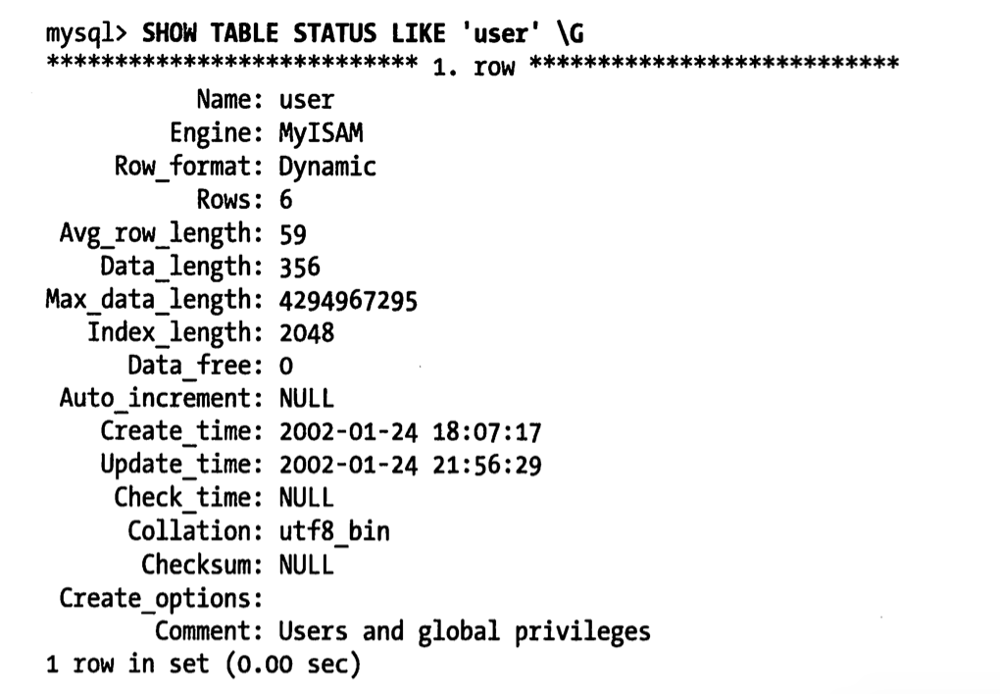

# 高性能MySQL

# 1. 架构与历史

## 1.1 逻辑架构


### 1. 三层架构

最上层【服务器层】

- 连接处理，授权认证，安全等
- 连接：每个客户端连接都会在服务器进程中拥有一个线程

第二层

- 核心服务功能
- 查询解析，分析，优化，缓存，以及所有内置函数
  - 数学，日期，时间，加密函数等
- 跨引擎的功能
  - 存储过程
  - 触发器
  - 视图

第三层【引擎层】

- 存储引擎，负责MySQL的数据的存储与提取

## 1.2 并发控制

1. 读写锁

- 共享锁【读锁】
  - 读锁是共享的，相互不堵塞，即多个客户是同一时刻可以同时读取同一个资源
- 排他锁【写锁】
  - 写锁是排他的，写锁会堵塞其他写锁和读锁

2. 锁粒度
   - 让锁定的对象更有选择性，即只锁定需要修改的部分
     - 行级锁
     - 锁定的数据量越少，并发程度越高
   - 加锁也需要消耗资源
     - 获得锁，检查锁，释放锁
3. 表锁
   - MySQL最基本的锁策略，也是开销最小的策略
   - 锁定整张表
4. 行级锁
   - 可以最大程度地支持并发处理，同时也带来最大开销
   - 只在存储引擎层实现，服务器层完全不了解
     - InnoDB和XtraDB

## 1.3 事物

1. ACID

   - 原子性【Atomicity】
   - 一致性【consistency】
   - 隔离性【Isolation】
   - 持久性【Durability】
   - 难
     - 实现非常难，基本是不可能完成的任务
     - 需要更强的CPU处理能力，更大的内存，更多的磁盘空间
     - 即MySQL的存储引擎是插件式的，根据业务来选择是否需要事物处理

2. 隔离级别

   - SQL标准
     - Read Uncommitted【读取未提交】
       - 事务可以读取未提交的数据--**脏读**
     - Read Committed【读取已提交】
       - 只能访问已经提交的事务所做的修改，即一个事务从开始直到提交前，所做的任何修改都是不可见的--**不可重复读**
     - Repeatable Read【可重复读】
       - 解决脏读，无法解决幻读
       - MySQL的默认事物隔离级别
     - Serializable【可串行化】
       - 最高的隔离级别
       - 强制事物串行执行
       - 对每行都加锁，所以可能导致大量的超时和锁争用问题

   

3. 死锁

   指两个或者多个事务在同一个资源上相互占用，并请求锁定对方占用资源，从而导致恶性循环的现象。

   - InnoDB目前处理死锁的方法
     - 将持有最少行级排他锁的事务进行回滚
   - 锁的行为和顺序是和存储引擎相关的

4. 事务日志

   - 可以提高事务的效率
   - 预写式日志
     - 在修改表数据时，只需修改内存拷贝
     - 再把修改该行记录到持久在硬盘上的事务日志中，而不用每次都持久到磁盘中
     - 事务日志采取追加方式，即写为磁盘上一小块顺序IO
     - 在闲时在写入磁盘

5. MySQL中的事务

   - MySQL提供了两种事务型引擎

     - InnoDB和NDB Cluster

   - 自动提交【AUTOCOMMIT】

     ```
     show variables like 'autocommit';
     ```

     

     

6. 显式锁定
   - InnoDB采用两阶段锁定协议
     - 整个事务分为两个阶段，前一个阶段为加锁，后一个阶段为解锁。
     - 在加锁阶段，事务只能加锁，也可以操作数据，但不能解锁，
     - 直到事务释放第一个锁，就进入解锁阶段，此过程中事务只能解锁，也可以操作数据，不能再加锁。
     - 两阶段锁协议使得事务具有较高的并发度，因为解锁不必发生在事务结尾。它的不足是没有解决死锁的问题，因为它在加锁阶段没有顺序要求。如两个事务分别申请了A, B锁，接着又申请对方的锁，此时进入死锁状态。
   - **一次性锁协议**，事务开始时，即一次性申请所有的锁，之后不会再申请任何锁，如果其中某个锁不可用，则整个申请就不成功，事务就不会执行，在事务尾端，一次性释放所有的锁。一次性锁协议不会产生死锁的问题，但事务的并发度不高。
   - MySQL也支持`LOCK TABLES` 与 `UNLOCK TABLES`
     - 在InnoDB无需显示使用上面命令，没必要，还影响性能

## 1.4 多版本并发控制

- MVCC：通过保存数据在某个时间点的快照来实现的
  - 根据事物开始的时间不同，每个事务对同一张表看到的数据可能不一样
- 行级锁的一个变种，但是避免了加锁操作，因此开销更小
- 只在可重复读和读已提交隔离级别下工作
  - 读未提交：总是读取最新的数据行
  - 串行化：对所有读取的行都加锁

## 1.5 存储引擎



1. InnoDB
   - MySQL的默认事务型引擎，优先考虑InnoDB引擎
   - MySQL5.1之前版本，MyISAM是默认的存储引擎


# MySQL基准测试

是针对系统设计的一种压力测试