# JavaWeb

## 1.基本概念

- 静态web
  - html, css
  - 提供给用户看的数据不会变化

- 动态web
  - Servlet，JSP， ASP，PHP

### 1.2、web应用程序

指可以提供浏览器访问的程序：能访问到的任何页面与资源

url

这个统一的web资源会被放在同一个文件夹下，web应用程序-->Tomcat:服务器

一个web应用由多个部分组成

- HTML,CSS,JS
- JSP, Servlet
- java程序
- jar包
- 配置文件（Properties）

web应用程序编写完毕后，若想提供给外界访问，需要一个服务器来统一管理

### 1.3、静态web

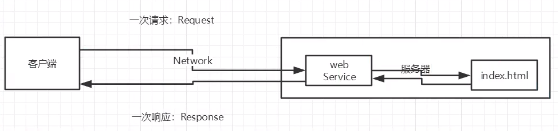

### 14、动态web

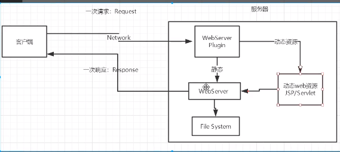

动态更新，可以与数据库交互（数据持久化）

## 2、web服务器

**ASP**

- 微软：国内最早的
- 在HTML中加VB的脚本，
- C#+IIS

**PHP**

- 开发速度块，功能强大，跨平台，代码简单
- 无法承载大访问量的情况

**JSP/Servlet**

- sun公司主推的B/S架构
- 基于Java
- 可以承载高并发、高可用、高性能所带来的影响

java包--rt.jar

### 2.2 web服务器

服务器是一种被动的操作，用来处理一些请求和返回用户响应信息。

**IIS**

**Tomcat**

Tomcat 服务器是一个免费的开放源代码的Web 应用服务器，属于轻量级应用[服务器](https://baike.baidu.com/item/服务器)，中小型系统和并发访问用户，是开发和调试JSP 程序的首选。

而Tomcat 实际上运行JSP 页面和Servlet。

## Tomcat

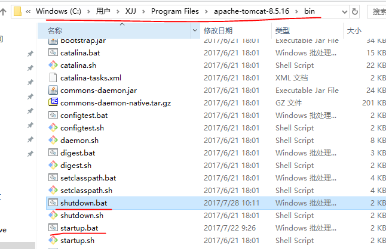

配置在：

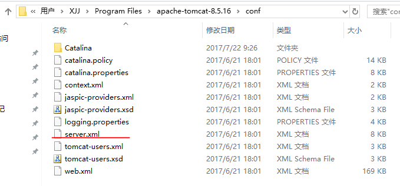

**网站时如何访问的**

1. 输入一个域名：回车
2. 检查本机的 C:\Windows\System32\drivers\etc\hosts配置文件下有没有这个域名映射：
   1. Y：直接返回对应的ip地址，响应web程序
   2. N：DNS--域名映射系统

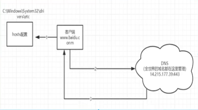

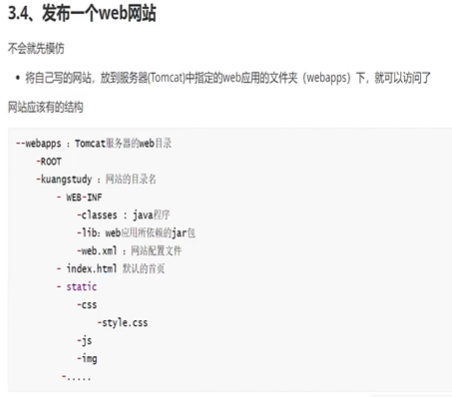

## Http

http(超文本传输协议)是一个简单的请求-响应协议，它通常运行在TCP之上。它指定了客户端可能发送给服务器什么样的消息以及得到什么样的响应。

- 图片，音乐，视频，定位，地图
- 80
- https（安全的）：443

### 时代

- http1.0：客户端与web服务连接后，只得到一个web资源，断开连接
- http2.0：可以获得多个web资源

### 请求

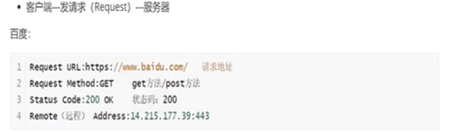

- 请求方式
  - get：请求携带的数据大小有限制，URL显示数据不安全，但高效
  - post：请求携带的数据大小没有限制，安全

- 消息头

  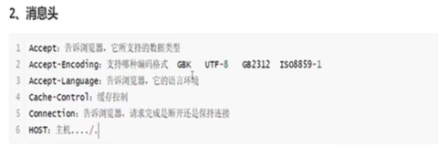

## Maven

在java开发中，需要使用大量的jar包，需要手动导入

**maven项目架构管理工具**

- 核心思想：约定大于配置
- 强大之处：自动帮我导入该jar包依赖的其他jar包

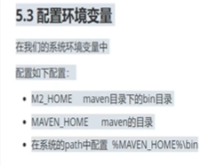

### Idea配置Tomcat

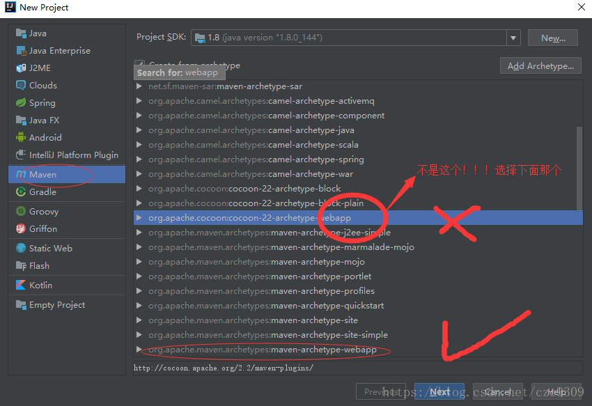

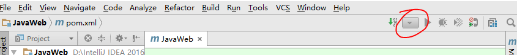

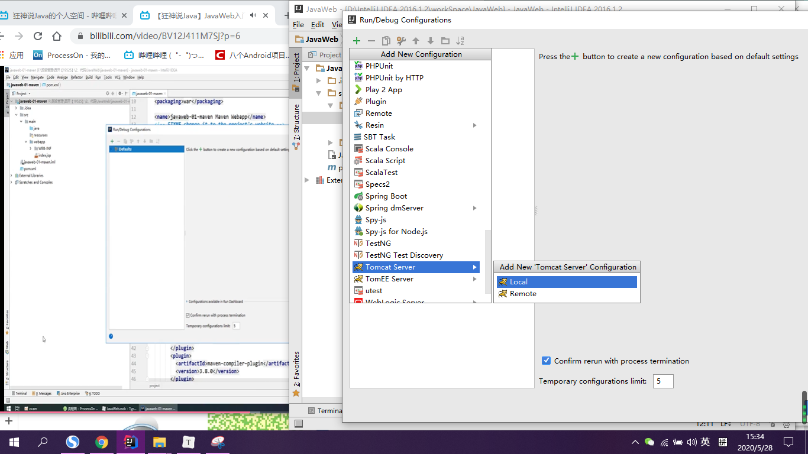

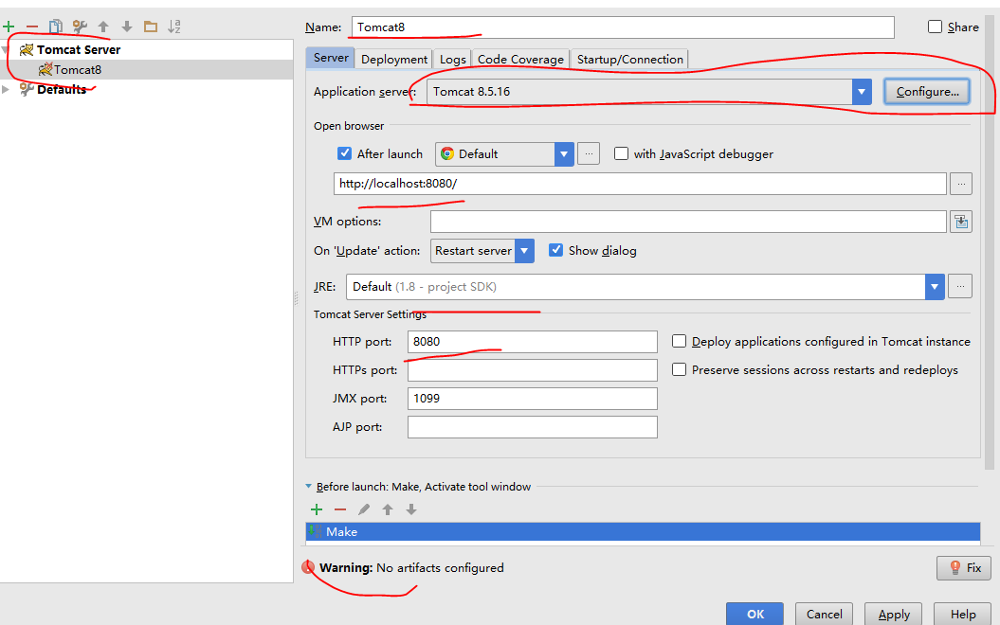

### pom.xml

```xml
<?xml version="1.0" encoding="UTF-8"?>

<project xmlns="http://maven.apache.org/POM/4.0.0" xmlns:xsi="http://www.w3.org/2001/XMLSchema-instance"
  xsi:schemaLocation="http://maven.apache.org/POM/4.0.0 http://maven.apache.org/xsd/maven-4.0.0.xsd">
  <modelVersion>4.0.0</modelVersion>

  <groupId>com.xjj</groupId>
  <artifactId>JavaWeb01</artifactId>
  <version>1.0-SNAPSHOT</version>
  <!-- Package:项目打包的方式
  jar:java应用
  war:JavaWeb应用
  -->
  <packaging>war</packaging>

  <properties>
      <!--默认编码-->
    <project.build.sourceEncoding>UTF-8</project.build.sourceEncoding>
      <!--编码版本-->
    <maven.compiler.source>1.7</maven.compiler.source>
    <maven.compiler.target>1.7</maven.compiler.target>
  </properties>

    <!--项目依赖-->
  <dependencies>
    <dependency>
      <groupId>junit</groupId>
      <artifactId>junit</artifactId>
      <version>4.11</version>
      <scope>test</scope>
    </dependency>
  </dependencies>
</project>

```

解决资源导出问题

```xml
<!--在build中配置resources，来防止我们资源导出失败的问题-->
<build>
    <resources>
        <resource>
            <directory>src/main/resources</directory>
            <includes>
                <include>**/*.properties</include>
                <include>**/*.xml</include>
            </includes>
            <filtering>true</filtering>
        </resource>
        <resource>
            <directory>src/main/java</directory>
            <includes>
                <include>**/*.properties</include>
                <include>**/*.xml</include>
            </includes>
            <filtering>true</filtering>
        </resource>
    </resources>
</build>
```


## Servlet

