- ## Mybatis


环境：

- JDK1.8
- MySQL5.7
- maven3.6.1
- IDEA

回顾：

- JDBC
- MySQL
- Java基础
- Maven
- Junit：单元测试

框架：有配置文件，官网文档学习

### 1、简介

#### 1.1 概念

- iBatis:基于Java的持久层框架


- MyBatis 是一款优秀的持久层框架，

- 它支持自定义 SQL、存储过程以及高级映射。

- MyBatis 免除了几乎所有的 JDBC 代码以及设置参数和获取结果集的工作。

- MyBatis 可以通过简单的 XML 或注解来配置和映射原始类型、接口和 Java POJO（Plain Old Java Objects，普通老式 Java 对象）为数据库中的记录。


#### 1.2 获取

- maven仓库

  ```xml
  <!-- https://mvnrepository.com/artifact/org.mybatis/mybatis -->
  <dependency>
      <groupId>org.mybatis</groupId>
      <artifactId>mybatis</artifactId>
      <version>3.5.2</version>
  </dependency>
  ```

- Github:https://github.com/mybatis/mybatis-3/releases

- 中文文档：https://mybatis.org/mybatis-3/zh/index.html

#### 1.3 持久化

- 数据持久化：即存数据库-->即将程序在持久状态和瞬时状态转换的过程
- 内存：断电即失
- 数据库(jdbc)

#### 持久层

DAO层，Service层，Controller层

- 完成持久化工作的代码块
- 层界限十分明显

#### 为什么Mybatis

- 方便--使用的人多
- 传统JDBC代码太复杂。为了简化，框架--自动化（将数据存入数据库中）
- 不用Mybatis也可以，更容易上手
- sql与代码的分离

## 2、第一个Mybatis程序

思路：搭建环境--导入--编写代码--测试

### 2.1 配置环境

#### 2.1.1 创建数据库

```mysql
create table `mybatis`;
use `mybatis`;
create table if not exists `user` (
	`id` INT(20) not null,
	`name` varchar(30) default null,
	`pwd` varchar(30) default null,
	primary key(`id`)
)engine=InnoDB default charset=utf8;

insert into `user` (`id`, `name`, `pwd`) values
(1, 'hhh','1331'),
(2, 'hhha','1331'),
(3, 'hhhq','1331')
```

#### 2.2.2 创建Maven项目

新建maven--生成src--导入maven依赖

- Idea连接数据库

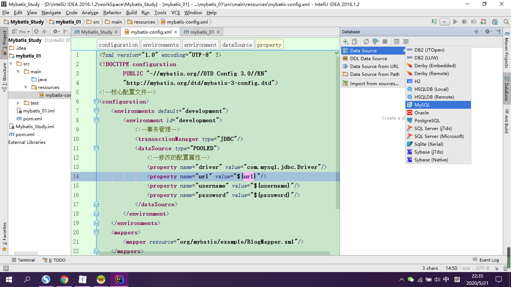

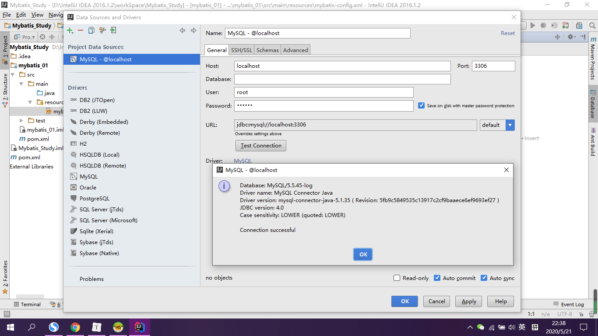

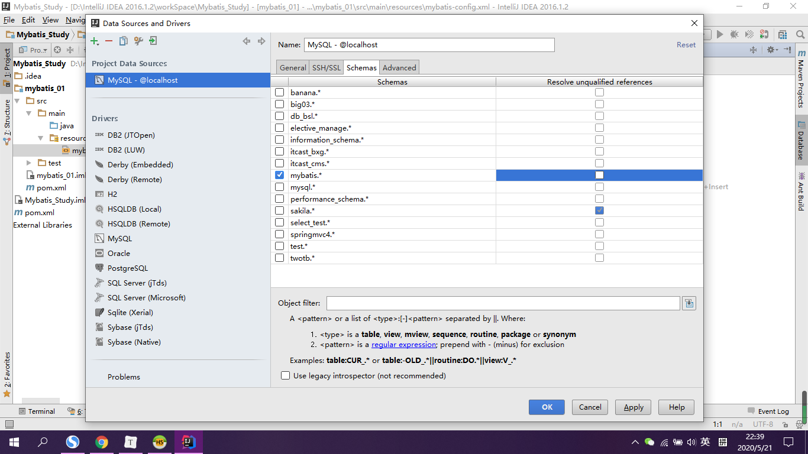

#### 2.2.3 编写mybatis-config核心文件

```xml
<?xml version="1.0" encoding="UTF-8" ?>
<!DOCTYPE configuration
        PUBLIC "-//mybatis.org//DTD Config 3.0//EN"
        "http://mybatis.org/dtd/mybatis-3-config.dtd">
<!--核心配置文件-->
<configuration>
    <environments default="development">
        <environment id="development">
            <!--事务管理-->
            <transactionManager type="JDBC"/>
            <dataSource type="POOLED">
                <!--修改的配置属性-->
                <property name="driver" value="com.mysql.jdbc.Driver"/>
                <!--useSSL-安全连接，存中文-->
                <property name="url" value="jdbc:mysql://localhost:3306/mybatis?useSSL=true&amp;useUnicode=true&amp;characterEncoding=UTF-8"/>
                <property name="username" value="root"/>
                <property name="password" value="123456"/>
            </dataSource>
        </environment>
    </environments>
    <!--每一个Mapper.xml配置文件都需要在mybatis-config中注册 -->
    <mappers>
        <mapper resource="com/xjj/dao/UserMapper.xml"/>
    </mappers>
</configuration>
```

#### 2.2.4 编写mybatis工具类

- 获得SqlSession对象

```java
/**
 * Created by XJJ on 2020/5/22.
 * 工具类--工厂模式
 * sqlSessionFactory -->sqlSession
 */
public class MybatisUtils {
    private static SqlSessionFactory sqlSessionFactory;
    // 静态代码块，加载类时加载
    static {
        // 使用Mybatis第一步：获取sqlSessionFactory对象
        String resource = "mybatis-config.xml";
        try {
            InputStream inputStream = Resources.getResourceAsStream(resource);
            sqlSessionFactory = new SqlSessionFactoryBuilder().build(inputStream);

        }catch (IOException e){
            e.printStackTrace();
        }
    }
    // 既然有了 SqlSessionFactory，顾名思义，我们可以从中获得 SqlSession 的实例。
    // SqlSession 提供了在数据库执行 SQL 命令所需的所有方法。
    public static SqlSession getSqlSession() {
        return sqlSessionFactory.openSession();
//        SqlSession sqlSession = sqlSessionFactory.openSession();
    }
}
```

#### 2.2.5 编写代码

- 实体类（User-->get,set方法）

- DAO（接口）

  ```java
  /**
   * Created by XJJ on 2020/5/22.
   * 接口层--DAO
   * (Data Access Object) 数据访问对象是一个面向对象的数据库接口
   */
  public interface UserDAO {
      List<User> getUserList();
  }
  
  ```

- 接口实现类--由原来的UserDAOImpl转换为Mapper配置文件:userMapper.xml

  ```xml
  <?xml version="1.0" encoding="UTF-8" ?>
  <!DOCTYPE mapper
          PUBLIC "-//mybatis.org//DTD Mapper 3.0//EN"
          "http://mybatis.org/dtd/mybatis-3-mapper.dtd">
  <!--该配置文件可概括为接口UserDAO的实现类-->
  <!--命名空间=绑定一个对应的DAO/Mapper接口-->
  <mapper namespace="com.xjj.dao.UserDAO">
      <!--查询语句、返回类型得对应-->
      <select id="getUserList" resultType="com.xjj.pojo.User">
        SELECT * FROM  mybatis."user"
      </select>
  </mapper>
  ```

#### 2.2.6 测试

- (test包下)

- 注意：


1. 每一个Mapper.xml配置文件都需要在mybatis-config中注册 ；

2. 路径以斜杠/结尾，同时是在target文件夹下寻找class文件；

3. 核心pom.xml中配置：

   ```xml
   <!--在build中配置resources，来防止资源导出失败的问题，即无法找到配置文件-->
   <build>
       <resources>
           <resource>
               <directory>src/main/resources</directory>
               <includes>
                   <include>**/*.properties</include>
                   <include>**/*.xml</include>
               </includes>
               <filtering>true</filtering>
           </resource>
           <resource>
               <directory>src/main/java</directory>
               <includes>
                   <include>**/*.properties</include>
                   <include>**/*.xml</include>
               </includes>
               <filtering>true</filtering>
           </resource>
       </resources>
   </build>
   ```

- JUnit

  ```java
  public class UserDAOTest {
      @Test
      public void test() {
          // 第一步：获得SqlSession对象
          SqlSession sqlSession = MybatisUtils.getSqlSession();
          // 方式一：getMapper执行SQL
          UserDAO mapper = sqlSession.getMapper(UserDAO.class);
          List<User> userList = mapper.getUserList();
  
          for (User user: userList) {
              System.out.println(user);
          }
          //关闭SqlSession
          sqlSession.close();
      }
  }
  ```

### 3 CRUD

- 提交事务--非常重要

  sqlSession.commit();

- 增删改查

  ```java
  @Test
  public void deleteUser() {
      SqlSession sqlSession = MybatisUtils.getSqlSession();
      // 传入接口对象
      UserDAO mapper = sqlSession.getMapper(UserDAO.class);
      int res = mapper.deleteUser(1);
      // 提交事务--非常重要
      sqlSession.commit();
      sqlSession.close();
  }
  ```

#### 3.1 namespace

命名空间中的包名要和Dao/Mapper接口的包名一致。

#### 3.2 select

查询：

```xml
<select id="getUserById" parameterType="int" resultType="com.xjj.pojo.User">
    SELECT * FROM mybatis.user WHERE id = #{id}
</select>
```

- id:就是namespace中接口对应的方法名

- resultType:Sql语句执行的返回值
- parameterType:参数类型

1. 编写接口

   ```java
   User getUserById(int id);
   int addUser(User user);
   int updateUser(User user);
   int deleteUser(int id);
   ```

2. 编写对应的mapper中的sql语句

3. 测试

#### 3.3 Insert

```xml
<insert id="addUser" parameterType="com.xjj.pojo.User">
    INSERT INTO mybatis.user(id, name, pwd)
    VALUES (#{id}, #{name}, #{pwd});
</insert>
```

#### 3.4 Update

```xml
<update id="updateUser" parameterType="com.xjj.pojo.User">
    update mybatis.user set name=#{name}, pwd=#{pwd} where id=#{id};
</update>
```

3.5 Delete

```xml
<delete id="deleteUser" parameterType="int">
    DELETE FROM mybatis.user WHERE id=#{id};
</delete>
```

#### 3.6错误注意

- 标签不要匹配错误
- resource绑定mapper,需要使用路径-->/

#### 3.7 万能Map

- 在实体类（数据库）中字段参数过多，应当考虑Map<key,value>,传递key
- map传递参数，直接在sql取出key即可
- 对象传递参数，sql中取对象的属性
- 只有一个基本类型参数时，可以在sql中省略参数直接取到
- 多个参数用map

```java
// 万能Map
int addUser2(Map<String, Object> map);

UserDAO mapper = sqlSession.getMapper(UserDAO.class);
Map map = new HashMap<String, Object>();
map.put("userId", 5);
map.put("userName", "hello");
int res = mapper.addUser2(map);

<!--万能map,传递key-->
<insert id="addUser2" parameterType="map">
    INSERT INTO mybatis.user(id, name, pwd)
    VALUES (#{userid}, #{userName});
</insert>
```

#### 3.8 模糊查询

- 防SQL注入（like）

  1. Java代码执行的时候，传递通配符%%

     ```Java
     List<User> like = mapper.getUserLike("%你%");
     ```

  2. 在Sql拼接中使用%%

     ```xml
     select * from user where name like "%"#{value}"%"
     ```

```java
// 方法存在多个参数，所有参数前面必须加上@Param("")注解
// 同时以@Param("id")为准
@Select("select * from user where id = #{id} ")
User getUserById(@Param("id") int id, @Param("name") String name);
```

#### 关于@Param()注解

- 基本类型的参数或者String类型，需要加上
- 引用类型不需要加
- 如果只有一个基本类型，可以不加，但建议加上
- 在SQL中引用的就是@Param("id")中设定的属性名

#### #{}与${}

- #{}可防SQL注入


#### 自动提交事务

工具类里：

```java
public static SqlSession getSqlSession() {
    // return sqlSessionFactory.openSession();
    // 自动提交事务
    return sqlSessionFactory.openSession(true);
}
```

### 4 配置解析

1 核心配置文件（configuration中必须按此顺序编写）

```
properties（属性）
settings（设置）
typeAliases（类型别名）
typeHandlers（类型处理器）
objectFactory（对象工厂）
plugins（插件）
environments（环境配置）
environment（环境变量）
transactionManager（事务管理器）
dataSource（数据源）
databaseIdProvider（数据库厂商标识）
mappers（映射器）
```

- mybatis-config.xml
- 默认的事务管理器(transactionManager)是JDBC，数据源连接池是：POOLED

#### 属性（properties)

这些属性可以在外部进行配置，并可以进行动态替换。【db.properties】

1. 编写配置文件：db.properties

```properties
driver=com.mysql.jdbc.Driver
url=jdbc:mysql://localhost:3306/mybatis?useSSL=true&useUnicode=true&characterEncoding=UTF-8
username=root
password=123456
```

2. 引入外部配置文件：并可以在其中引入一些属性-->优先外部配置

   ```xml
   <configuration>
       <!--引入外部配置文件-->
       <properties resource="db.properties"/>
       <environments default="development">
           <environment id="development">
               <!--事务管理，默认JDBC:提交与回滚-->
               <transactionManager type="JDBC"/>
               <!--数据源，连接池-->
               <dataSource type="POOLED">
                   <!--修改的配置属性-->
                   <property name="driver" value="${driver}"/>
                   <!--useSSL-安全连接，存中文-->
                   <property name="url" value="${url}"/>
                   <property name="username" value="${username}"/>
                   <property name="password" value="${password}"/>
               </dataSource>
           </environment>
       </environments>
   </configuration>
   ```

#### 类型别名（typeAliases）

- 类型别名可为 Java 类型设置一个缩写名字。 它仅用于 XML 配置，意在降低冗余的全限定类名书写。

```xml
<!--给实体取别名-->
<typeAliases>
	<typeAlias type="com.xjj.pojo.User" alias="User"/>
</typeAliases>
```

- 也可以指定一个包名，MyBatis 会在包名下面搜索需要的实体类，并用小写代替：
- 若有注解，则别名为其注解值。

#### 映射器（mappers）

MapperRegistry：注册绑定Mapper文件

方式一：【推荐】

```xml
<!--每一个Mapper.xml配置文件都需要在mybatis-config中注册 -->
<!-- 使用相对于类路径的资源引用 -->
<mappers>
    <mapper resource="com/xjj/dao/UserMapper.xml"/>
</mappers>
```

方式二：

```xml
<!-- 使用映射器接口实现类的完全限定类名 -->
<mappers>
  <mapper class="org.mybatis.builder.AuthorMapper"/>
</mappers>
```

- 接口和他的Mapper配置文件必须同名，且必须在同一个包下。

#### 生命周期与作用域

不同作用域和生命周期类别是至关重要的，因为错误的使用会导致非常严重的**并发问题**。

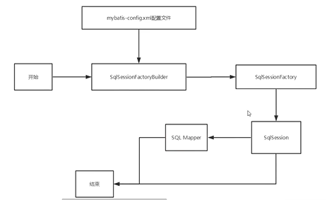

##### SqlSessionFactoryBuilder

- 一旦创建了 SqlSessionFactory，就不再需要它了
- 局部变量

##### SqlSessionFactory

- 可为：数据库连接池
- 一旦被创建就应该在应用的运行期间一直存在
- 最佳作用域是应用作用域
- 最简单的就是使用单例模式或者静态单例模式。

##### SqlSession

- 每个线程都应该有它自己的 SqlSession 实例，实例不是线程安全的，因此是不能被共享的
- 连接池的一个请求
- 用完关闭，否则资源占用

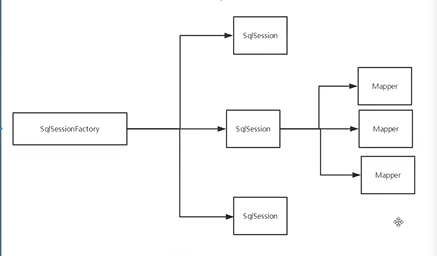

*每一个Mapper即代表一个具体的业务（增删改查）*

### 属性名与字段名不一致

解决方法：

- 起别名

  select id,name,pwd as password from user where id = #{id};

#### resultMap

结果集映射

- `resultMap` 元素是 MyBatis 中最重要最强大的元素。
- ResultMap 的设计思想是，对简单的语句做到零配置，对于复杂一点的语句，只需要描述语句之间的关系就行了。

```
id name pwd
id name password
```

```xml
<!--结果集映射-->
<resultMap id="userMap" type="User">
    <!--column为数据库中的字段，property实体类中的映射-->
    <result column="pwd" property="password"/>
</resultMap>

<!--查询语句：id为接口方法、返回类型得对应-->
<select id="getUserList" resultMap="userMap">
	SELECT * FROM mybatis.user
</select>
```

### 日志

#### 日志工厂

数据库操作出现异常，打印日志

曾经：sout，dubug

<set>里

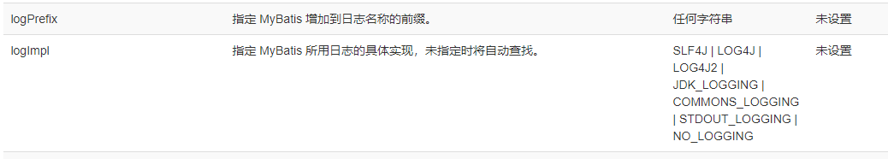

Mybatis 通过使用内置的日志工厂提供日志功能。内置日志工厂将会把日志工作委托给下面的实现之一：

- SLF4J
- LOG4J【掌握，有日志级别】
- JDK_LOGGING
- COMMONS_LOGGING 
- STDOUT_LOGGING
- NO_LOGGIN

#### 标准日志工厂

在mybatis-config中配置：

```xml
<settings>
    <!--日志配置，标准日志工厂-->
    <setting name="logImpl" value="STDOUT_LOGGING"/>
</settings>
```

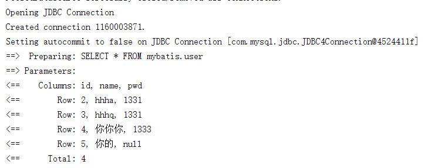


#### Log4j--LOG4J>>mybatis-03

1 先导入包

```xml
<!-- https://mvnrepository.com/artifact/log4j/log4j -->
<dependency>
    <groupId>log4j</groupId>
    <artifactId>log4j</artifactId>
    <version>1.2.17</version>
</dependency>
```

2 resources下-->log4j.properties

```properties
#将等级为DEBUG的日志信息输出到console和file这两个目的地，console和file的定义在下面的代码
log4j.rootLogger=DEBUG,console,file

#控制台输出的相关设置
log4j.appender.console = org.apache.log4j.ConsoleAppender
log4j.appender.console.Target = System.out
log4j.appender.console.Threshold=DEBUG
log4j.appender.console.layout = org.apache.log4j.PatternLayout
log4j.appender.console.layout.ConversionPattern=[%c]-%m%n

#文件输出的相关设置
log4j.appender.file = org.apache.log4j.RollingFileAppender
log4j.appender.file.File=./log/xjj.log
log4j.appender.file.MaxFileSize=10mb
log4j.appender.file.Threshold=DEBUG
log4j.appender.file.layout=org.apache.log4j.PatternLayout
log4j.appender.file.layout.ConversionPattern=[%p][%d{yy-MM-dd}][%c]%m%n

#日志输出级别
log4j.logger.org.mybatis=DEBUG
log4j.logger.java.sql=DEBUG
log4j.logger.java.sql.Statement=DEBUG
log4j.logger.java.sql.ResultSet=DEBUG
log4j.logger.java.sql.PreparedStatement=DEBUG
```


3 配置Loh4j为日志实现

```xml
<settings>
    <!--日志配置，标准日志工厂-->
    <setting name="logImpl" value="LOG4J"/>
</settings>
```

```
static Logger logger = Logger.getLogger(UserDAOTest.class);
```

### 分页

减少数据处理量--效率高

使用limit分页

```sql
select * from user limit startIndex,length;
```

#### 使用mybatis实现分页

- 接口

  ```java
  //分页
  List<User> getUserByLimit(Map<String, Integer> map);
  ```

- Mapper.xml

  ```xml
  <!--分页查询-->
  <select id="getUserByLimit" parameterType="map" resultType="User">
  	select * from mybatis.user limit #{startIndex}, #{pageSize};
  </select>
  ```

- 测试

#### RowBounds分页

### 注解开发

#### 面向接口编程

- 解耦，可扩展
- 定义与实现的分离
- 反应对系统的抽象理解


#### 使用注解开发

- 在接口里

```java
@Select("select * from user")
List<User> getUsers();
```

- 在核心配置文件中绑定接口

  ```xml
  <!--绑定接口-->
  <mappers>
      <mapper class="com.xjj.dao.UserMapper"/>
  </mappers>
  ```

- 本质：反射机制实现

- 底层：动态代理《租房中介等》

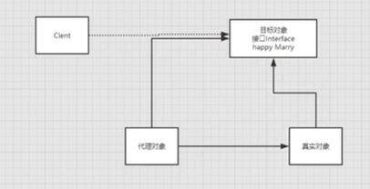

### Lombok

实体类不用再写get/set，toString等等方法

@Data：无参构造，set,get,toString,hashcode,equals

```
<!-- https://mvnrepository.com/artifact/org.projectlombok/lombok -->
<dependency>
    <groupId>org.projectlombok</groupId>
    <artifactId>lombok</artifactId>
    <version>1.18.10</version>
    <scope>provided</scope>
</dependency>
```


### 多对一处理--mybatis06

- 关联【多对一】
- 集合【一对多】
  - association ：一个复杂类型的关联；许多结果将包装成这种类型(学生-->老师)
    - 嵌套结果映射 – 关联可以是 `resultMap` 元素，或是对其它结果映射的引用
  - collection： 一个复杂类型的集合（老师-->学生）
    - 嵌套结果映射 – 集合可以是 `resultMap` 元素，或是对其它结果映射的引用

```sql

use `mybatis`;
CREATE TABLE `teacher` (
`id` INT(10) NOT NULL,
`name` VARCHAR(30) DEFAULT NULL,
PRIMARY KEY (`id`)
) ENGINE=INNODB DEFAULT CHARSET=utf8;

INSERT INTO teacher(`id`, `name`) VALUES (1, '李老师');

CREATE TABLE `student` (
`id` INT(10) NOT NULL,
`name` VARCHAR(30) DEFAULT NULL,
`tid` INT(10) DEFAULT NULL,
PRIMARY KEY (`id`),
KEY `fktid` (`tid`),
CONSTRAINT `fktid` FOREIGN KEY (`tid`) REFERENCES `teacher` (`id`)
) ENGINE=INNODB DEFAULT CHARSET=utf8;


INSERT INTO `student` (`id`, `name`, `tid`) VALUES ('1', '小明', '1');
INSERT INTO `student` (`id`, `name`, `tid`) VALUES ('2', '小红', '1');
INSERT INTO `student` (`id`, `name`, `tid`) VALUES ('3', '小张', '1');
INSERT INTO `student` (`id`, `name`, `tid`) VALUES ('4', '小李', '1');
INSERT INTO `student` (`id`, `name`, `tid`) VALUES ('5', '小王', '1');
```

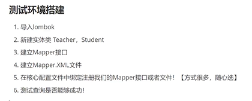

#### 实体类

```java
@Data
public class Student {
    private int id;
    private String name;
    //学生关联老师
    private Teacher teacher;
}

@Data
public class Teacher {
    private int id;
    private String name;
}
```

#### 按照查询嵌套处理

```xml
<!-- 查询多对一
子查询：
 SELECT s.id, s.name, t.name from mybatis.stuent s, mybatis.teacher t WHERE s.tid = t.id
 -->
<select id="getStudent" resultMap="StuTea">
    SELECT * FROM mybatis.student;
</select>
<resultMap id="StuTea" type="Student">
    <!-- 实体属性property, 数据库字段column-->
    <result property="id" column="id"/>
    <result property="name" column="name"/>
    <!-- 复杂的属性==多对一：association,一对多：collection -->
    <association property="teacher" column="tid" javaType="Teacher" select="getTeacher"/>
</resultMap>
<select id="getTeacher" resultType="Teacher">
    SELECT * FROM  mybatis.teacher WHERE id = #{id};
</select>
```

#### 按照结果嵌套处理

```xml
<!--按照结果嵌套处理-->
<select id="getStudent2" resultMap="StuTea2">
    SELECT s.id sid, s.name sname, t.name tname
    from mybatis.student s, mybatis.teacher t
    WHERE s.tid = t.id
</select>
<resultMap id="StuTea2" type="Student">
    <result property="id" column="sid"/>
    <result property="name" column="sname"/>
    <association property="teacher" javaType="Teacher">
        <result property="name" column="tname"/>
    </association>
</resultMap>
```

### 一对多mybatis-07

实体类

```java
@Data
public class Teacher {
    private int id;
    private String name;

    private List<Student> students;
}

@Data
public class Student {
    private int id;
    private String name;
    private int tid;
}
```

```xml
<select id="getTeacher2" resultMap="TeaStu">
    SELECT t.id tid, t.name tname, s.id sid, s.name sname
    FROM mybatis.teacher t, mybatis.student s
    WHERE s.tid=t.id and t.id = #{tid};
</select>
<resultMap id="TeaStu" type="Teacher">
    <result property="id" column="tid"/>
    <result property="name" column="tname"/>
    <!-- 复杂的属性==   多对一：association,
     一对多：collection
     javaType="" : 指定属性的类型
     ofType=""  : 集合中泛型信息
     -->
    <collection property="students" ofType="Student">
        <result property="id" column="sid"/>
        <result property="name" column="sname"/>
        <result property="tid" column="tid"/>
    </collection>
</resultMap>
```

```java
@Test
public void t1() {
    SqlSession sqlSession = MybatisUtils.getSqlSession();
    TeacherMapper mapper = sqlSession.getMapper(TeacherMapper.class);
    Teacher teacher = mapper.getTeacher2(1);
    System.out.println(teacher);
    sqlSession.close();
}
```

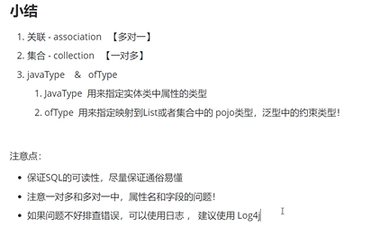

### 动态SQL

指根据不同的条件生成不同的SQL语句

- if
- choose (when, otherwise)
- trim (where, set)
- foreach

#### 搭建环境

```sql
CREATE TABLE `blog`(
`id` VARCHAR(50) NOT NULL COMMENT '博客id',
`title` VARCHAR(100) NOT NULL COMMENT '博客标题',
`author` VARCHAR(30) NOT NULL COMMENT '博客作者',
`create_time` DATETIME NOT NULL COMMENT '创建时间',
`views` INT(30) NOT NULL COMMENT '浏览量'
)ENGINE=INNODB DEFAULT CHARSET=utf8
```

#### 创建工程

导包--编写配置文件--编写实体类--编写实体类对应的Mapper接口与Mapper.xml文件

```java
@Data
public class Blog {
    private int id;
    private String title;
    private String author;
    private Date createTime;
    private int views;
}
```

##### ID随机生成

```java
public class IDUtils {
    public static String getId() {
        return UUID.randomUUID().
                toString().replaceAll("-", "");
    }
}
```

#### If

```xml
<select id="queryBlogIf" parameterType="map">
    SELECT * FROM mybatis.blog
    WHERE title = #{title} and author = #{author};

    select * from mybatis.blog
    where 1=1
    <if test="title != null">
        and title = #{title}
    </if>
    <if test="author != null">
        and author = #{author}
    </if>
</select>
```

```java
//查询博客
List<Blog> queryBlogIf(Map map);

HashMap map = new HashMap();
map.put("title", "Java");
List<Blog> blogs = mapper.queryBlogIf(map);
```

#### choose,when,otherwise

不想使用所有的条件，而只是想从多个条件中选择一个使用。

类似 Java 中的 switch 语句，只执行一个。

```xml
<!--switch-->
<select id="queryChoose" parameterType="map" resultType="Blog">
    SELECT * FROM mybatis.blog
    <where>
        <choose>
            <when test="title != null">
                title = #{title}
            </when>
            <when test="author != null">
                and author = #{author}
            </when>
            <otherwise>
                and views = #{views}
            </otherwise>
        </choose>
    </where>
</select>
```

#### trim、where、set

##### where

*where* 元素只会在子元素返回任何内容的情况下才插入 “WHERE” 子句。而且，**若子句的开头为 “AND” 或 “OR”，*where* 元素也会将它们去除。**

```xml
<select id="queryBlogIf" parameterType="map" resultType="Blog">
    select * from mybatis.blog
    <where>
        <if test="title != null">
            and title = #{title}
        </if>
        <if test="author != null">
            and author = #{author}
        </if>
    </where>
</select>

<!--prefixOverrides前缀-->
<trim prefix="WHERE" prefixOverrides="AND |OR ">
  ...
</trim>
```

##### set

*set* 元素会**动态地在行首插入 SET 关键字**，并会**删掉额外的逗号**（这些逗号是在使用条件语句给列赋值时引入的）。

```xml
<!--基本类型返回值可以不写-->
<update id="updateBlog" parameterType="map">
    UPDATE mybatis.blog
    <set>
        <if test="title != null">
            title = #{title},
        </if>
        <if test="author != null">
            author = #{author},
        </if>
    </set>
    WHERE id = #{id};
</update>

<!--suffixOverrides后缀-->
<trim prefix="SET" suffixOverrides=",">
  ...
</trim>
```

```java
HashMap map = new HashMap();
map.put("title", "Java2");
map.put("id", "02109537875743a0812b5ded2df246be");
int res = mapper.updateBlog(map);
```

##### 动态SQL，本质还是SQL语句，只是作了相关的逻辑代码

### SQL片段

可能需要将一些公共的代码提取出来，方便复用。

注意：

- 最好基于单表来定义SQL片段
- 不要存在where标签
- 尽量**只包含if判断**

```xml
<!--SQL片段-->
<sql id="if-title-author">
    <if test="title != null">
        and title = #{title}
    </if>
    <if test="author != null">
        and author = #{author}
    </if>
</sql>

<select id="queryBlogIf" parameterType="map" resultType="Blog">
    select * from mybatis.blog
    <where>
        <include refid="if-title-author"/>
    </where>
</select>
```

#### Foreach

动态 SQL 的另一个常见使用场景是对集合进行遍历（尤其是在构建 IN 条件语句的时候）。

传过去的Map<key,value>，k唯一，所以只能Foreach

- SQL里面不能加注释

```sql
select * from user where 1=1 and (id=1 or id=2 or id=3)
  <foreach item="id" index="index" collection="ids"
      open="(" separator="," close=")">
        #{item}
  </foreach>
```

```xml
<!--
select * from user where 1=1 and (id=1 or id=2 or id=3)
ids=map中的集合，id为遍历的每项
-->
<select id="queryForeach" parameterType="map" resultType="Blog">
    SELECT * FROM mybatis.blog
    <where>
        <foreach collection="ids" item="id"
                 open="(" close=")" separator="or">
            id = #{id}
        </foreach>
    </where>
</select>
```

```java
//接口：查询1-3
List<Blog> queryForeach(Map map);

//测试
HashMap map = new HashMap();
ArrayList<Integer> ids = new ArrayList<Integer>();
ids.add(1);
ids.add(2);
ids.add(3);
map.put("ids", ids);
List<Blog> blogs = mapper.queryForeach(map);
```


### MySQL

#### 面试高频

- MySQL引擎
- InnoDB底层原理
- 索引
- 索引优化
- 主从复制--读写分离

### 缓存-08

#### 简介

 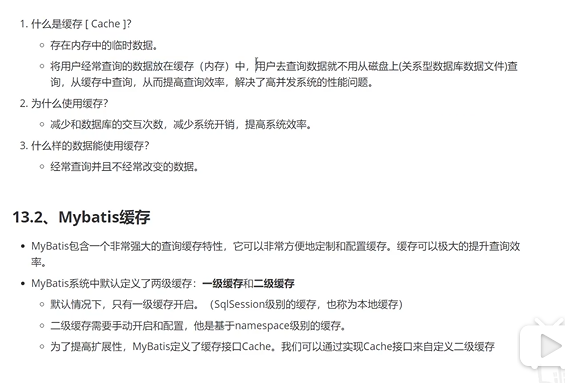

#### 一级缓存

- 默认开启

缓存失效的情况：

1. 增删改
2. 查询不同的对象
3. 查询不同的Mapper.xml
4. 手动清理缓存：clearCache();

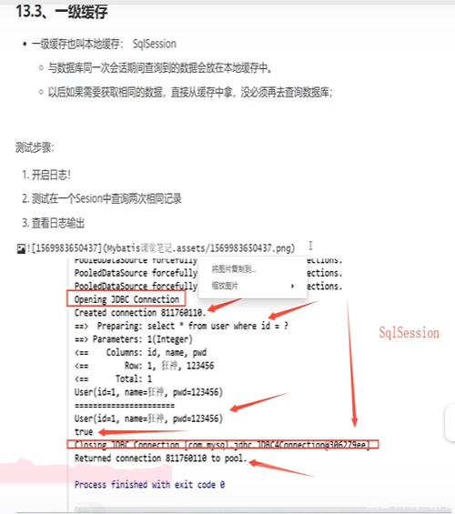

#### 二级缓存

要启用全局的二级缓存，只需要在 SQL 映射文件中添加一行：

```
<cache/>
```

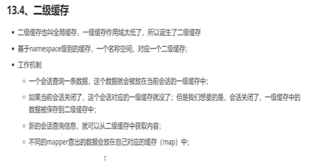

##### 开启

cacheEnabled	全局性地开启或关闭所有映射器配置文件中已配置的任何缓存。	true | false	true

```xml
<!-- 核心配置文件里-->
<setting name="cacheEnabled" value="true"/>

Mapper.xml里
<select id="xxx" resultType="xx" useCache="true">
    select * from mybatis.blog
</select>
```

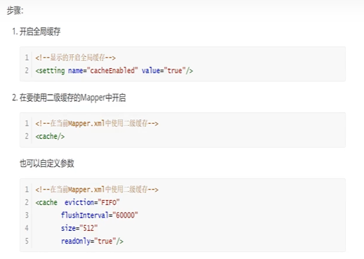

测试：

- 将实体类序列化
- implements Serializable

结：

- 只要开启二级缓存，在同一个Mapper下就有效
- 所有数据都会先缓存到一级缓存
- 只有当会话提高或者关闭时，才会提交到二级缓存

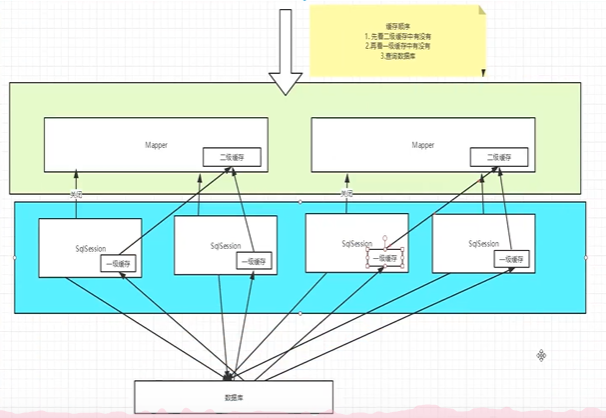


#### 自定义缓存-EhCache