# Spring boot官方

https://spring.io/guides

## Guides

### 1. Building a RESTful

```java
@RestController
public class GreetingController {

    private static final String template = "Hello, %s!";
    // 原子性，同步的Long
    private final AtomicLong counter = new AtomicLong();

    @GetMapping("/greeting")
    public Greeting greeting(@RequestParam(value = "name", defaultValue = "World") String name) {
        return new Greeting(counter.incrementAndGet(), String.format(template, name));
    }
}

@SpringBootApplication  // 启动配置，无bean.xml
@RestController         // rest服务
public class OfficialApplication {

    public static void main(String[] args) {
      	/*无bean.xml--Spring的*/
        SpringApplication.run(OfficialApplication.class, args);
    }
}
```

- `@GetMapping`,`@PostMapping`映射方法Get,POST；可以用`@RequestMapping(method=GET)`代替
  - `@RequestParam`：绑定参数；可默认值`defaultValue = ""`
- Jackson 2：json
  - Spring http消息转换**默认支持对象实例转json**
  - 传统MVC控制器和`Restful Web`服务控制器之间的一个关键区别是**HTTP响应主体的创建方式**。`Restful Web`服务控制器填充并返回一个`Greeting`对象，而不是依赖于视图技术来执行问候数据到HTML的服务器端呈现。**对象数据将作为JSON直接写入HTTP响应。**
- `@RestController`
  -  `@Controller` 和 `@ResponseBody`的简写
  - 它将**类标记为控制器**，其中每个方法都**返回域对象**而不是视图。
- `@SpringBootApplication`：启动类注解，自动添加如下注解`autoconfigure`
  - `@Configuration`：将类对象标记为Bean源
  - `@EnableAutoConfiguration`：使Spring boot 添加在classpath下的beans 
  - `@ComponentScan`：使Spring去找classpath下的`components, configurations, and services`
- restful
  - https://blog.csdn.net/kebi007/article/details/102927209

### 2. 后台定时任务

**Scheduling Tasks**

1.  [Awaitility](http://www.awaitility.org/) ：专门针对异步方法的测试

2. ```java
   /**
    * @Author LJ
    * @Date 2020/11/24
    * msg 定时任务，后台异步任务
    */
   
   @Component      // 标记bean注入
   @EnableScheduling       // 定时任务,Enables Spring's scheduled task execution capability
   public class ScheduledTasks {
       private static final Logger log = LoggerFactory.getLogger(ScheduledTasks.class);
   
       private static final SimpleDateFormat dateFormat = new SimpleDateFormat("HH:mm:ss");
   
       @Scheduled(fixedRate = 5000)		// Annotation that marks a method to be scheduled
       public void reportCurrentTime() {
           log.info("当前时间为：{}", dateFormat.format(new Date()));
       }
   }
   
   
   @SpringBootApplication  // 启动配置
   public class OfficialApplication {
       public static void main(String[] args) {
           SpringApplication.run(OfficialApplication.class, args);
       }
   }
   ```
   
- `@EnableScheduling`：创建后台任务执行器，启用Spring的计划任务执行功能 
   - `@Scheduled(fixedRate = 5000)`	:标记要调度的方法的注释 

3. 注解分类

   - @controller：  controller控制器层（注入服务）
   - @service ：   service服务层（注入dao）
   - @repository ： dao持久层（实现dao访问）
   - @component： **标注一个类为Spring容器的Bean**，（把普通pojo实例化到spring容器中，相当于配置文件中的< bean id="" class=""/>）

### 3. 请求Rest服务

**Consuming a RESTful Web Service**

1. Rest 随机生成字符串API：json

   https://gturnquist-quoters.cfapps.io/api/random

```java
import com.fasterxml.jackson.annotation.JsonIgnoreProperties;

/**
 * @Author LJ
 * @Date 2020/11/24
 * msg 映射类，自定义类型
 */

@JsonIgnoreProperties(ignoreUnknown = true)
public class Quote {
    private String type;
    private Value value;
  	/* 省略get,set*/
}


@JsonIgnoreProperties(ignoreUnknown = true)
public class Value {
    private long id;
    private String quote;
  	/* 省略get,set*/
}


@Component		// 作bean
public class ConsumeRest {

    private static final Logger log = LoggerFactory.getLogger(OfficialApplication.class);

    @Bean		// 注入RestTemplate
    public RestTemplate restTemplate(RestTemplateBuilder builder) {
        return builder.build();
    }

    @Bean
    public CommandLineRunner run(RestTemplate restTemplate) throws Exception {
        // lambda
        return args -> {
            Quote quote = restTemplate.getForObject("https://gturnquist-quoters.cfapps.io/api/random",
                    Quote.class);
            log.info(quote.toString());
        };
    }
}
```

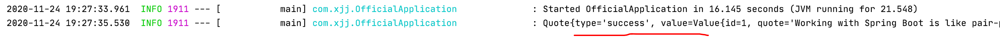

1. 请求Rest服务

   1.  Spring提供了一个方便的模板类`ResTemplate`。`ResTemplate`使与大多数RESTful服务【Json交互】的交互成为简单。可以将这些数据绑定到**自定义域类型**。 

2. 代码分析

   - `CommandLineRunner`

     - 该**函数式接口**主要用于实现在**应用初始化后**，去**执行一段代码**块逻辑，这段初始化代码在整个应用生命周期内**只会执行一次**。

       ```java
       @FunctionalInterface
       public interface CommandLineRunner {
       	void run(String... args) throws Exception;
       }
       ```

       

### 4. jdbc-H2

#### 依赖

```xml
<!-- jdbc       -->
<dependency>
  <groupId>org.springframework.boot</groupId>
  <artifactId>spring-boot-starter-data-jdbc</artifactId>
</dependency>
```

#### 代码

```java
package com.xjj.e_04_database;

public class Customer {
    private long id;
    private String first_name;
    private String last_name;

    public Customer(long id, String first_name, String last_name) {
        this.id = id;
        this.first_name = first_name;
        this.last_name = last_name;
    }
    // 省略get/ set
}


/**
 * @Author LJ
 * @Date 2020/11/25
 * msg 使用Jdbc连接数据库，H2 database[基于内存的数据库]
 */

@Component("h2Database")		// 组件--bean
public class RelationalDataAccess implements CommandLineRunner {
    private static final Logger log = LoggerFactory.getLogger(RelationalDataAccess.class);

    @Autowired	// 域自动注入
    JdbcTemplate jdbcTemplate;

    @Override   // Spring boot 初始化之后调用
    public void run(String... args) throws Exception {
        log.info("创建表");

        jdbcTemplate.execute("DROP TABLE customers IF EXISTS");
        jdbcTemplate.execute("CREATE TABLE customers(" +
                "id SERIAL, first_name VARCHAR(255), last_name VARCHAR(255))");

        List<Object[]> splitUpNames = Arrays.asList("John Woo", "Jeff Dean").stream()
                .map(name -> name.split(" ")).collect(Collectors.toList());

        // 批量插入
        jdbcTemplate.batchUpdate("INSERT INTO customers(first_name, last_name) VALUES (?,?)", splitUpNames);

      	// RowMapper (ResultSet, int) -> T
        jdbcTemplate.query(
                "SELECT id, first_name, last_name FROM customers WHERE first_name = ?", new Object[] { "John" },
                (rs, rowNum) -> new Customer(rs.getLong("id"), rs.getString("first_name"), rs.getString("last_name"))	// 函数式接口
        ).forEach(customer -> log.info(customer.toString()));
    }
}
```

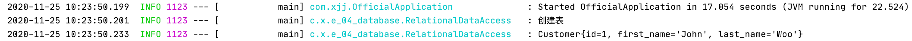

#### 分析

- springboot支持H2（内存中的关系数据库引擎）并**自动创建连接**
- `@Autowired`：所以springboot会**自动创建**一个`JdbcTemplate`。**自动加载**
- `?`：避免SQL注入攻击
- `RowMapper`：映射结果集

#### H2

- 内存中的关系数据库引擎

  

### 5. mysql

1. pom.xml

   ```xml
   <dependency>
     <groupId>mysql</groupId>
     <artifactId>mysql-connector-java</artifactId>
     <scope>runtime</scope>
   </dependency>
   ```

2. springboot**默认数据库**是H2。当使用任何其他数据库时，必须配置`src/main/resources/application.properties`属性文件。

   ```properties
   spring.datasource.url=jdbc:mysql://localhost:3306/spring?characterEncoding=utf-8&useSSL=true&serverTimezone=GMT
   spring.datasource.username=root
   spring.datasource.password=
   spring.datasource.driverClassName=com.mysql.cj.jdbc.Driver
   ```

### 6. Uploading Files

**接收HTTP多文件上传**


### 7. MVC

**与thymeleaf整合**

1. pom.xml

   ```xml
   <!-- thymeleaf: spring HTML-->
   <dependency>
     <groupId>org.springframework.boot</groupId>
     <artifactId>spring-boot-starter-thymeleaf</artifactId>
   </dependency>
   ```

2. Model装配，View【thymeleaf】解析

```java
@Controller
public class GreetingController {
    @GetMapping("/greeting")
    public String greeting(@RequestParam(name="name", required=false, defaultValue="World") String name, Model model) {
        model.addAttribute("name", name);
        return "greeting";
    }
}
```

`src/main/resources/templates/greeting.html`

```html
<!DOCTYPE HTML>
<html xmlns:th="http://www.thymeleaf.org">
<head>
  <title>MVC</title>
  <meta http-equiv="Content-Type" content="text/html; charset=UTF-8" />
</head>
<body>
<p th:text="'Hello, ' + ${name} + '!'" />
</body>
</html>
```

#### Spring Boot Devtools

```xml
<dependency>
  <groupId>org.springframework.boot</groupId>
  <artifactId>spring-boot-devtools</artifactId>
  <scope>runtime</scope>
  <optional>true</optional>
</dependency>
```

为了加快刷新周期，Spring boot提供了一个称为`spring-boot-devtools`的便捷模块

- 启用热交换。
- 将模板引擎切换为禁用缓存。
- 使LiveReload能够自动刷新浏览器。
- 其他基于开发而非生产环境的默认。
- https://www.jianshu.com/p/cdc00059eafe


### 8. Redis-message

**发布和订阅使用Redis发送的消息**

#### 1. Redis

- Remote Dictionary Server ，即远程字典服务

- 是一个高性能的key-value数据库

- NoSQL数据存储

- 消息传递系统

- Mac 安装启动

  - brew install redis

  - redis-server

    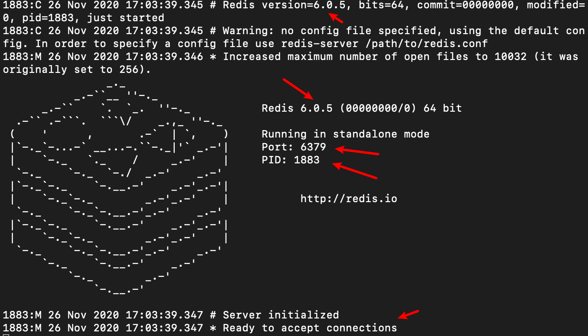

#### 2. 使用技术

- Spring Data Redis：提供了使用Redis发送和接收消息所需的**所有组件**。需要
  - A connection factory：`RedisConnectionFactory` --让监听器和消息容器连接到Redis服务器。 
    - 连接工厂被注入到消息侦听器容器和Redis模板中 
  - A message listener container: `RedisMessageListenerContainer, MessageListenerAdapter`---订阅信息
  - A Redis template: `StringRedisTemplate` ---发布字符串信息

#### 3. 概述

- 基于消息传递的应用程序中，都有**消息发布者和消息接收方**
- 接收方：需要**注册作为监听者**

#### 4. 代码

1. 依赖

```xml
<!-- redis 依赖-->
<dependency>
  <groupId>org.springframework.boot</groupId>
  <artifactId>spring-boot-starter-data-redis</artifactId>
</dependency>
```

2. Spring Data Redis

   ```java
   // 接收器
   public class Receiver {
       //日志器
       private static final Logger log = LoggerFactory.getLogger(Receiver.class);
       // 计数器
       private AtomicInteger counter = new AtomicInteger();
   
       public void receiveMessage(String message) {
           log.info("收到消息：" + message);
           counter.incrementAndGet();
       }
       public int getCounter() {
           return counter.get();
       }
   }
   
   
   
   @Component
   public class MessagingRedis{
   
       private static final Logger log = LoggerFactory.getLogger(MessagingRedis.class);
   
       @Bean
       Receiver receiver() {
           return new Receiver();
       };
   
       // 容器 让监听器和消息容器连接到Redis服务器。
       @Bean
       RedisMessageListenerContainer container(RedisConnectionFactory factory,
                                               MessageListenerAdapter adapter) {
           RedisMessageListenerContainer container = new RedisMessageListenerContainer();
           container.setConnectionFactory(factory);
           // 监听 chat 管道的消息。
           container.addMessageListener(adapter, new PatternTopic("chat"));
   
           return container;
       }
   
       @Bean
       MessageListenerAdapter adapter(Receiver receiver) {
           // 注册监听器及监听方法
           return new MessageListenerAdapter(receiver, "receiveMessage");
       }
   
       @Bean
       StringRedisTemplate template(RedisConnectionFactory factory) {
           // 发送信息
           return new StringRedisTemplate(factory);
       }
   
       // Spring初始化完成启动
       @Bean
       CommandLineRunner initRedis() {
           return args -> {
               StringRedisTemplate template = BeanUtils.getBean(StringRedisTemplate.class);
               Receiver receiver = BeanUtils.getBean(Receiver.class);
   
               while (receiver.getCounter() <= 3) {
                   log.info("=====发送消息======");
                   // 发送到 chat 管道
                   template.convertAndSend("chat", "Hello from Redis!" +
                           receiver.getCounter());
                   Thread.sleep(500L);
               }
   //            System.exit(0);
           };
       }
   }
   ```

   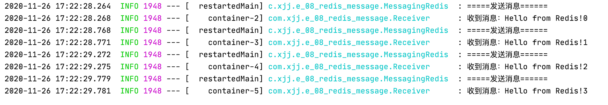

### 9. Validating Form Input

**MVC 接受用户输入并使用标准验证注释检查输入；并在屏幕上显示错误消息，以便用户可以重新输入使其有效。**

#### 1. 依赖

```xml
<!-- validation 依赖-->
<dependency>
  <groupId>org.springframework.boot</groupId>
  <artifactId>spring-boot-starter-validation</artifactId>
</dependency>
```

#### 2. javax.validation

- https://blog.csdn.net/qq_33655674/article/details/81509615

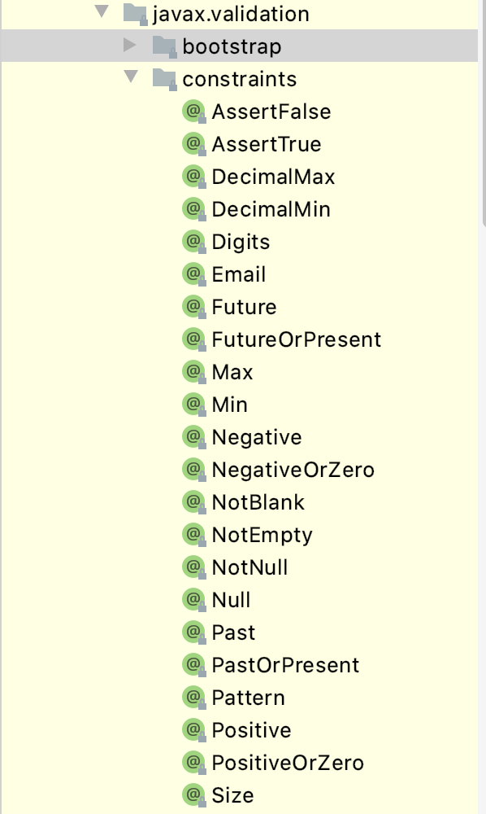

#### 3. 代码

```java
@Controller
public class ValidateController implements WebMvcConfigurer {

    // 参数是传给view的
    @GetMapping("/validate")
    public String showForm(Person person) {
        return "validation";
    }

  	// @Valid 验证参数
    @PostMapping("validate")
    public String checkPersonInfo(@Valid Person person, BindingResult result) {
        if (result.hasErrors())
            return "validation";
        return "redirect:/";
    }
}
```

```html
<form action="#" th:action="@{/validate}" th:object="${person}" method="post">
  <table>
    <tr>
      <td>Name:</td>
      <td><input type="text" th:field="*{name}" /></td>
      <td th:if="${#fields.hasErrors('name')}" th:errors="*{name}">Name Error</td>
    </tr>
    <tr>
      <td>Age:</td>
      <td><input type="text" th:field="*{age}" /></td>
      <td th:if="${#fields.hasErrors('age')}" th:errors="*{age}">Age Error</td>
    </tr>
    <tr>
      <td><button type="submit">Submit</button></td>
    </tr>
  </table>
</form>
```


### 10. Spring Boot Actuator

**对应用系统进行自省和监控的功能模块**，**健康检查、审计、统计和HTTP追踪等**

https://blog.csdn.net/pengjunlee/article/details/80235390

https://www.jianshu.com/p/d5943e303a1f

https://docs.spring.io/spring-boot/docs/current/reference/htmlsingle/#production-ready

#### 1. 依赖

```xml
<!-- actuator依赖 -->
<dependency>
  <groupId>org.springframework.boot</groupId>
  <artifactId>spring-boot-starter-actuator</artifactId>
</dependency>
```

#### 2. 相关配置

1. `src/main/resources/application.properties`

```properties
#server.port: 9000
management.server.port: 9001
management.server.address: 127.0.0.1
management.endpoints.web.exposure.include=*
```

#### 3. 测试

1. 运行测试

   http://localhost:9001/actuator

   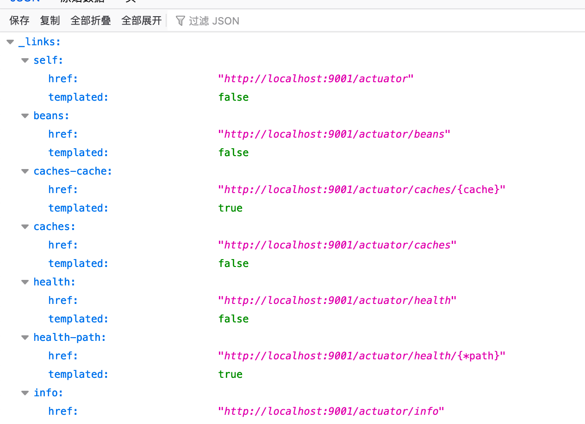

   

### 11. 批处理，文件输入

**创建基本批处理驱动解决方案的过程。**

#### 1. 


### 12. Spring Security

#### 1. 依赖

```xml
<!-- security -->
<dependency>
  <groupId>org.springframework.boot</groupId>
  <artifactId>spring-boot-starter-security</artifactId>
</dependency>
<dependency>
  <groupId>org.springframework.security</groupId>
  <artifactId>spring-security-test</artifactId>
  <scope>test</scope>
</dependency>
```

#### 2. 代码

```java
// MVC配置类
@Configuration
public class MvcConfig implements WebMvcConfigurer {
    @Override
    public void addViewControllers(ViewControllerRegistry registry) {
        // 不用写Controller，直接转templates --> view
        registry.addViewController("/hello").setViewName("hello");
        registry.addViewController("/login").setViewName("login");
    }
}
```

**SecurityConfig类**

```java
/**
 * @Author LJ
 * @Date 2020/11/27
 * msg Spring secure 安全配置类
 */

@Configuration
@EnableWebSecurity
public class WebSecurityConfig extends WebSecurityConfigurerAdapter {

  	// 定义哪些URL路径应该受到保护，哪些不应该 
    @Override
    protected void configure(HttpSecurity http) throws Exception {
        http.authorizeRequests()
                .antMatchers("/", "/index", "/validate").permitAll()     // 设置不用登录页
                .anyRequest().authenticated()
                .and()
                .formLogin()
                .loginPage("/login").permitAll()    // 其余页需要登录访问
                .and()
                .logout().permitAll();
    }

    @Bean
    @Override
    protected UserDetailsService userDetailsService() {
        // 设置权限允许信息
        UserDetails user = User.withDefaultPasswordEncoder()
                .username("user")
                .password("111111")
                .roles("USER")
                .build();
        return new InMemoryUserDetailsManager(user);
    }
}
```

#### 3. 分析

- `@EnableWebSecurity`： 启用Spring Security的web安全支持并提供SpringMVC集成。 
- 当用户成功登录时，它们将被**重定向到以前请求的需要身份验证的页面**。


### 13. 超文本链接

**Hypermedia-Driven**

#### 1. 相关技术

- Spring HATEOAS：Hypermedia as the engine of application state
  - https://blog.csdn.net/weixin_34290096/article/details/93415981


#### 2. 依赖

```xml
<!-- Hypermedia-Driven -->
<dependency>
  <groupId>org.springframework.boot</groupId>
  <artifactId>spring-boot-starter-hateoas</artifactId>
</dependency>
```

#### 3. 代码

```java
public class Greeting extends RepresentationModel<Greeting> {
    private final String content;

    @JsonCreator
    public Greeting(@JsonProperty("content") String content) {
        this.content = content;
    }

    public String getContent() {
        return content;
    }
}

// 静态导入 linkTo
import static org.springframework.hateoas.server.mvc.WebMvcLinkBuilder.*;

@RestController
public class GreetController {

    private static final String template = "Hello, %s!";
    // 原子性，同步的Long
    private final AtomicLong counter = new AtomicLong();

    @GetMapping("/hyper")
    public HttpEntity<Greeting> hyper(@RequestParam(value = "name", defaultValue = "World")
                                                  String name) {
        Greeting greeting = new Greeting(counter.incrementAndGet(), String.format(template, name));
        greeting.add(linkTo(methodOn(GreetController.class).hyper(name)).withSelfRel());

        return new ResponseEntity<>(greeting, HttpStatus.OK);
    }
}
```

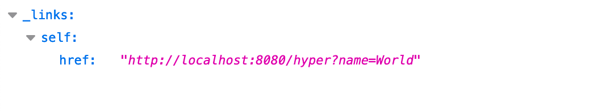

#### 4. 分析

- `RepresentationModel`
  -  Spring hateoas附带了一个基类（称为RepresentationModel），它允许添加Link的实例，并确保它们的呈现 

- `@JsonCreator`:  标志着Jackson如何创建这个实例。 
- `@JsonProperty`:  标记Jackson应将此构造函数参数放入的字段。 


### 14. 异步Async

**异步查询。重点是异步部分，这是扩展服务时经常使用的特性。**

#### 1. 代码

```java
// 实体类
@JsonIgnoreProperties(ignoreUnknown=true)		// 忽略类中未列出的任何属性
public class User {

  private String name;
  private String blog;
}


// service类
@Service
public class GitHubLookupService {

  private static final Logger logger = LoggerFactory.getLogger(GitHubLookupService.class);
  // 请求远程rest服务
  private final RestTemplate restTemplate;
  public GitHubLookupService(RestTemplateBuilder restTemplateBuilder) {
    this.restTemplate = restTemplateBuilder.build();
  }

  @Async
  public CompletableFuture<User> findUser(String user) throws InterruptedException {
    logger.info("查找 " + user);
    String url = String.format("https://api.github.com/users/%s", user);
    // 请求远程rest服务， 并将其转换为对应对象
    User results = restTemplate.getForObject(url, User.class);
    Thread.sleep(1000L);
    // 请求完成
    return CompletableFuture.completedFuture(results);
  }
}


// 单独运行异步方法
@Component
@EnableAsync		// 在后台线程池中运行@Async方法 
public class AppRunner implements CommandLineRunner {

    private static final Logger logger = LoggerFactory.getLogger(AppRunner.class);
    private final GitHubLookupService gitHubLookupService;
    public AppRunner(GitHubLookupService gitHubLookupService) {
        this.gitHubLookupService = gitHubLookupService;
    }

  	// 自定义执行器，否则默认SimpleAsyncTaskExecutor
    @Bean
    public Executor task() {
        ThreadPoolTaskExecutor executor = new ThreadPoolTaskExecutor();
        executor.setCorePoolSize(2);
        executor.setMaxPoolSize(2);
        executor.setQueueCapacity(500);
        executor.setThreadNamePrefix("GithubLookup---");
        executor.initialize();
        return executor;
    }

    @Override
    public void run(String... args) throws Exception {
        long start = System.currentTimeMillis();

        CompletableFuture<User> page1 = gitHubLookupService.findUser("PivotalSoftware");
        CompletableFuture<User> page2 = gitHubLookupService.findUser("CloudFoundry");
        CompletableFuture<User> page3 = gitHubLookupService.findUser("Spring-Projects");

      	// 等待所有都请求完成
        CompletableFuture.allOf(page1, page2, page3).join();

        logger.info("耗时：" + (System.currentTimeMillis() - start));
        logger.info("--> " + page1.get());
        logger.info("--> " + page2.get());
        logger.info("--> " + page3.get());
    }
}

```


#### 2. 分析

- Spring**自动**使用**Jackson JSON**库将GitHub的**JSON响应转换为用户对象**
- `@JsonIgnoreProperties`： 告诉Spring**忽略**类中未列出的任何属性
- `RestTemplate`：请求远程rest服务，并将其转换为对应对象
  - `RestTemplateBuilder`：创建一个对象并自动注入Spring容器
-  `@Service`：
  - 使其成为Spring组件扫描的候选对象，**以检测并添加到应用程序上下文中。**
  - 作用于类 
- `@Async`：指示该方法应该在**单独的线程上**运行。
- 创建GitHubLookupService类的**本地实例不允许**findUser方法异步运行。它必须在`@Configuration`类中创建或由`@ComponentScan`获取。

- 注意，前两个调用发生在不同的线程（GithubLookup-2、GithubLookup-1）中，第三个调用在两个线程中的一个可用之前暂停。要比较不使用异步功能所需的时间，请尝试注释掉@Async注释并再次运行服务。总运行时间应该显著增加，因为每个查询至少需要一秒钟。例如，您还可以调整Executor以增加corePoolSize属性。
- 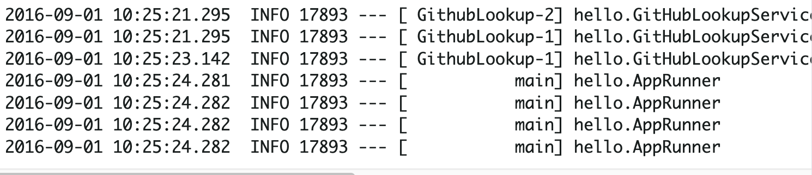


### 15. jquery

#### 配置静态资源

```properties
# 静态文件请求匹配方式
spring.mvc.static-path-pattern=/**
# 修改默认的静态寻址资源目录 多个使用逗号分隔
spring.resources.static-locations = classpath:/META-INF/resources/,classpath:/resources/,classpath:/static/,classpath:/public/,classpath:/os/
```

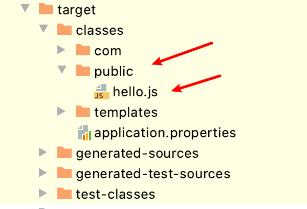

#### 访问

```html
<!DOCTYPE html>
<html>
<head>
  <title>Hello jQuery</title>
  <!-- 无需再加上 public-->
  <script src="/hello.js"></script>
</head>
```

https://www.cnblogs.com/jpfss/p/8341529.html


### 16. 跨域访问

https://www.cnblogs.com/mmzs/p/9167743.html

#### 1. 方法跨域

```java
// 允许可访问的域列表
@CrossOrigin(origins = "http://localhost:8080", maxAge = 3600)
@GetMapping("/greet")
public Greeting greet(@RequestParam(value = "name", defaultValue = "World") String name) {
  return new Greeting(counter.incrementAndGet(), String.format(template, name));
}
```

- origins ： 允许可访问的域列表
- maxAge：准备响应前的缓存持续的最大时间（以秒为单位）。
- 默认情况下，它允许所有源、所有头和指定的HTTP方法。
- 可作用于类
- 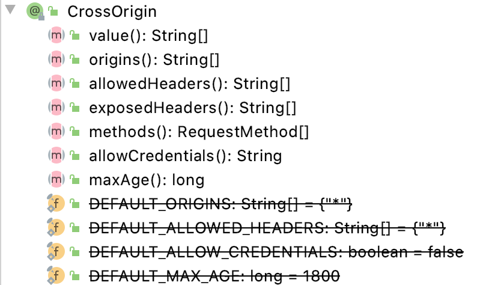

#### 2. 全局跨域

```java
@Configuration
public class CorsConfigure {
    @Bean
    public WebMvcConfigurer cors() {
        return new WebMvcConfigurer() {
            @Override
            public void addCorsMappings(CorsRegistry registry) {
                registry.addMapping("/greeting")
                        .allowedOrigins("http://localhost:8080");
            }
        };
    }
}
```


### 17. cache

#### 1. 依赖

```xml
<!-- cache 依赖-->
<dependency>
  <groupId>org.springframework.boot</groupId>
  <artifactId>spring-boot-starter-cache</artifactId>
</dependency>
```

#### 2. 代码

```java
public class Book implements Serializable {

    private String isbn;
    private String title;
}

@Component
@EnableCaching		// 支持缓存
public class SimpleBookRepository implements BookRepository{

    @Override
    @Cacheable("book")
    public Book getByIsbn(String isbn) {
        simulateSlow();
        return new Book(isbn, "哈哈哈");
    }

    // 模拟数据库查询行为
    private void simulateSlow() {
        try {
            Thread.sleep(3000L);
        } catch (Exception e) {
            return;
        }
    }
}
```

#### 3. 分析

```java
/**
 * Annotation indicating that the result of invoking a method (or all methods
 * in a class) can be cached.
 *
 * <p>Each time an advised method is invoked, caching behavior will be applied,
 * checking whether the method has been already invoked for the given arguments.
 */
@Target({ElementType.TYPE, ElementType.METHOD})
@Retention(RetentionPolicy.RUNTIME)
@Inherited
@Documented
public @interface Cacheable {}
```

- `@Cacheable`
  - 作用于类或方法
  - 每次调用注解方法【类】时，都将应用**缓存行为**，检查是否已针对**给定参数**调用了该方法。

-  `@EnableCaching`
  - 注释触发一个**后处理器**，该处理器检查每个Spring Bean在**公共方法上是否存在缓存注释**。如果找到这样的注释，将**自动创建一个代理**来拦截方法调用并相应地处理缓存行为
  -  后处理器处理`@Cacheable`、`@CachePut`和`@CacheEvict`注释
  -  Spring Boot会**自动配置**一个合适的CacheManager作为**相关缓存的提供者**
  - 默认缓存存储库：`ConcurrentHashMap`


# 注解

## 1. ` @AliasFor`：

- 为注解属性取别名

## 2. `@Component`

```java
@Target(ElementType.TYPE)
@Retention(RetentionPolicy.RUNTIME)
@Documented
@Indexed
public @interface Component {
	String value() default "";

}
```

- 作用于类
- 当基于**注解的配置和类路径扫描**时，该类被当作**自动检测**的候选类

## 3. `@Bean`

```java
/*
* Indicates that a method produces a bean to be managed by the Spring container.
*/
public @interface Bean {}
```

- 作用于方法
- 表明该方法的生成是由**Spring容器管理的bean**。 


## 4. `@Configuration`

```java
@Target(ElementType.TYPE)
@Retention(RetentionPolicy.RUNTIME)
@Documented
@Component
public @interface Configuration {}
```

- **指示一个类声明**的一个或多个方法，并且可以由Spring容器在运行时为这些bean生成bean定义和服务请求
- 作用于类，本质上还是 `@Component`
- 配置类要求
  - @Configuration不可以是final类型；
  - @Configuration不可以是匿名类；
  - 嵌套的configuration必须是静态类

## 5.  `@Service`

- 使类成为Spring组件扫描的候选对象，**以检测并添加到应用程序上下文中。**
- 作用于类 


## 6. `@Repository`

- 注解在Dao上，CRUD
- 在Spring中配置扫描地址，然后生成Dao层的Bean才能被注入到Service层中。
- `@Component`注解的一个派生品，自动扫描


## 7. `@Mapper`

- 注解在Dao上
- 不需要配置扫描地址，通过xml里面的namespace里面的接口地址，生成了Bean后注入到Service层中。


## 8. `@ConfigurationProperties`

### 1. SpringBoot 默认配置文件

**SpringBoot使用一个全局的配置文件 ， 配置文件名称是固定的**

- application.properties

- - 语法结构 ：key=value
  - 需要`@Value`等注解绑定域

- application.yml

- - 语法结构 ：key：空格 value

### 2. yaml

https://mp.weixin.qq.com/s/E4WgcVIFxVVrfEZau-Mikg

```yaml
server：
  prot: 8080
```

- **这种语言以数据**作为中心，而不是以标记语言为重点！
- 语法
  - 空格不能省略
  - 以缩进来控制层级关系，只要是左边对齐的一列数据都是同一个层级的。
  - 属性和值的大小写都是十分敏感的。
- “ ” 双引号，不会转义字符串里面的特殊字符
- 更强大的地方在于，可以给我们的实体类**直接注入匹配值**！


### 3. `@PropertySource`

- 加载**指定的配置文件**；

- `resoures`目录下创建**person.properties**文件

  ```java
  name=kuangshen
  
  @PropertySource(value = "classpath:person.properties")
  @Component //注册bean
  public class Person {
      @Value("${name}")		//.properties：需要`@Value`等注解绑定域
      private String name;
  
  }
  ```

### 4. `@ConfigurationProperties`

- 默认从全局配置文件中获取值：即--> **application.xxx**

- yaml配置，无需`@Value`等

  - 将配置文件中配置的每一个属性的值，映射到这个组件中
  - 告诉SpringBoot将本类中的所有属性和配置文件中相关的配置进行绑定
  - 参数 prefix = “person” : 将配置文件中的person下面的所有属性一一对应

  - 依赖

    ```xml
    <!-- 导入配置文件处理器，配置文件进行绑定就会有提示，需要重启 -->
    <dependency>
      <groupId>org.springframework.boot</groupId>
      <artifactId>spring-boot-configuration-processor</artifactId>
      <optional>true</optional>
    </dependency>
    ```

  ```java
  @Component //注册bean
  @ConfigurationProperties(prefix = "person")
  public class Person {
  }
  ```

### 5. 结论

- 配置yml和配置properties都可以获取到值 ， **强烈推荐 yml**
- 如果说，我们**专门编写了一个JavaBean来和配置文件**进行一一映射，就直接@configurationProperties


## 9. `@RestControllerAdvice`

- `@ControllerAdvice`和@`ResponseBody`的结合
- `@ControllerAdvice`：声明处理`@ExceptionHandler`等


## 10. @Autowired

1. 与构造器注入区别

   https://blog.csdn.net/qq_41819327/article/details/109490135

   **Java变量的初始化顺序**
    -> 静态变量或静态语句块
    –> 实例变量或初始化语句块
    –> 构造方法
    –> @Autowired

- **区别**就是加载顺序的不同，导致出现空指针的问题


# Mybatis-springboot

http://mybatis.org/spring-boot-starter/mybatis-spring-boot-autoconfigure/#

```xml
<dependency>
    <groupId>org.mybatis.spring.boot</groupId>
    <artifactId>mybatis-spring-boot-starter</artifactId>
    <version>2.1.3</version>
</dependency>
```

## 快速开始

要将MyBatis与Spring一起使用，至少需要一个`SqlSessionFactory`和至少一个`mapper`**接口**。 

 `MyBatis-Spring-Boot-Starter`将： 

-  **自动检测**现有数据源 `DataSource`
- 将**创建并注册**一个`SqlSessionFactory`的实例，**该实例将该数据源**作为使用`SqlSessionFactoryBean`作为输入传递 
- 将**创建并注册**从`SqlSessionFactory`中获取的SqlSessionTemplate实例
- **自动扫描映射程序**，将它们链接到SqlSessionTemplate，并将它们**注册**到`Spring context`中，以便将它们**注入**`beans`中 

```java
@Mapper
public interface CityMapper {
  @Select("SELECT * FROM CITY WHERE state = #{state}")
  City findByState(@Param("state") String state);
}

private final CityMapper cityMapper;
this.cityMapper.findByState("CA")
```


# MyBatis-Plus

https://baomidou.com/,,,https://mybatis.plus/

## 1. 测试demo

1. pom.xml

```xml
<dependency>
  <groupId>com.baomidou</groupId>
  <artifactId>mybatis-plus-boot-starter</artifactId>
  <version>3.4.1</version>
</dependency>

<!-- mysql-->
<dependency>
  <groupId>mysql</groupId>
  <artifactId>mysql-connector-java</artifactId>
  <scope>runtime</scope>
</dependency>
```

2. User

   ```java
   @Data
   public class User {
       private Long id;
       private String username;
       private String usernick;
       private String password;
       private Long roleId;		// 数据库采取m_n命名，mybatis-plus采取驼峰命名才能映射
   }
   ```

   ### mapUnderscoreToCamelCase

   - 类型：`boolean`
   - 默认值：`true`

   - 是否开启自动驼峰命名规则（camel case）映射，即从经典数据库列名 A_COLUMN（下划线命名） 到经典 Java 属性名 aColumn（驼峰命名） 的类似映射。

3. UserMapper

   ```java
   import com.baomidou.mybatisplus.core.mapper.BaseMapper;
   public interface UserMapper extends BaseMapper<User> {
     // 与数据库名称对应
   }
   ```

4. Controller

   ```java
   @RestController
   @RequestMapping("/user")
   public class UserController {
   
       @Autowired(required = false)
       private UserMapper userMapper;
   
       @ApiOperation(value = "获取所有用户")
       @GetMapping("/getAll")
       public List<User> getAll() {
           List<User> users = userMapper.selectList(null);
           return users;
       }
   }
   ```

   

## 2. 官方CRUD

```java
package com.baomidou.mybatisplus.samples.crud;

import static org.assertj.core.api.Assertions.assertThat;

import java.util.List;
import java.util.Map;

import javax.annotation.Resource;

import org.junit.Assert;
import org.junit.Test;
import org.junit.runner.RunWith;
import org.springframework.boot.test.context.SpringBootTest;
import org.springframework.test.context.junit4.SpringRunner;

import com.baomidou.mybatisplus.core.conditions.query.LambdaQueryWrapper;
import com.baomidou.mybatisplus.core.conditions.query.QueryWrapper;
import com.baomidou.mybatisplus.core.metadata.IPage;
import com.baomidou.mybatisplus.core.toolkit.Wrappers;
import com.baomidou.mybatisplus.extension.plugins.pagination.Page;
import com.baomidou.mybatisplus.samples.crud.entity.User;
import com.baomidou.mybatisplus.samples.crud.mapper.UserMapper;

/**
 * <p>
 * 内置 CRUD 演示
 * </p>
 *
 * @author hubin
 * @since 2018-08-11
 */
@RunWith(SpringRunner.class)
@SpringBootTest
public class SampleTest {

    @Resource
    private UserMapper mapper;

    @Test
    public void aInsert() {
        User user = new User();
        user.setName("小羊");
        user.setAge(3);
        user.setEmail("abc@mp.com");
        assertThat(mapper.insert(user)).isGreaterThan(0);
        // 成功直接拿会写的 ID
        assertThat(user.getId()).isNotNull();
    }


    @Test
    public void bDelete() {
        assertThat(mapper.deleteById(3L)).isGreaterThan(0);
        assertThat(mapper.delete(new QueryWrapper<User>()
                .lambda().eq(User::getName, "Sandy"))).isGreaterThan(0);
    }


    @Test
    public void cUpdate() {
        assertThat(mapper.updateById(new User().setId(1L).setEmail("ab@c.c"))).isGreaterThan(0);
        assertThat(
                mapper.update(
                        new User().setName("mp"),
                        Wrappers.<User>lambdaUpdate()
                                .set(User::getAge, 3)
                                .eq(User::getId, 2)
                )
        ).isGreaterThan(0);
        User user = mapper.selectById(2);
        assertThat(user.getAge()).isEqualTo(3);
        assertThat(user.getName()).isEqualTo("mp");

        mapper.update(
                null,
                Wrappers.<User>lambdaUpdate().set(User::getEmail, null).eq(User::getId, 2)
        );
        assertThat(mapper.selectById(1).getEmail()).isEqualTo("ab@c.c");
        user = mapper.selectById(2);
        assertThat(user.getEmail()).isNull();
        assertThat(user.getName()).isEqualTo("mp");

        mapper.update(
                new User().setEmail("miemie@baomidou.com"),
                new QueryWrapper<User>()
                        .lambda().eq(User::getId, 2)
        );
        user = mapper.selectById(2);
        assertThat(user.getEmail()).isEqualTo("miemie@baomidou.com");

        mapper.update(
                new User().setEmail("miemie2@baomidou.com"),
                Wrappers.<User>lambdaUpdate()
                        .set(User::getAge, null)
                        .eq(User::getId, 2)
        );
        user = mapper.selectById(2);
        assertThat(user.getEmail()).isEqualTo("miemie2@baomidou.com");
        assertThat(user.getAge()).isNull();
    }


    @Test
    public void dSelect() {
        mapper.insert(
                new User().setId(10086L)
                        .setName("miemie")
                        .setEmail("miemie@baomidou.com")
                        .setAge(3));
        assertThat(mapper.selectById(10086L).getEmail()).isEqualTo("miemie@baomidou.com");
        User user = mapper.selectOne(new QueryWrapper<User>().lambda().eq(User::getId, 10086));
        assertThat(user.getName()).isEqualTo("miemie");
        assertThat(user.getAge()).isEqualTo(3);

        mapper.selectList(Wrappers.<User>lambdaQuery().select(User::getId))
                .forEach(x -> {
                    assertThat(x.getId()).isNotNull();
                    assertThat(x.getEmail()).isNull();
                    assertThat(x.getName()).isNull();
                    assertThat(x.getAge()).isNull();
                });
        mapper.selectList(new QueryWrapper<User>().select("id", "name"))
                .forEach(x -> {
                    assertThat(x.getId()).isNotNull();
                    assertThat(x.getEmail()).isNull();
                    assertThat(x.getName()).isNotNull();
                    assertThat(x.getAge()).isNull();
                });
    }

    @Test
    public void orderBy() {
        List<User> users = mapper.selectList(Wrappers.<User>query().orderByAsc("age"));
        assertThat(users).isNotEmpty();
    }

    @Test
    public void selectMaps() {
        List<Map<String, Object>> mapList = mapper.selectMaps(Wrappers.<User>query().orderByAsc("age"));
        assertThat(mapList).isNotEmpty();
        assertThat(mapList.get(0)).isNotEmpty();
        System.out.println(mapList.get(0));
    }

    @Test
    public void selectMapsPage() {
        IPage<Map<String, Object>> page = mapper.selectMapsPage(new Page<>(1, 5), Wrappers.<User>query().orderByAsc("age"));
        assertThat(page).isNotNull();
        assertThat(page.getRecords()).isNotEmpty();
        assertThat(page.getRecords().get(0)).isNotEmpty();
        System.out.println(page.getRecords().get(0));
    }

    @Test
    public void orderByLambda() {
        List<User> users = mapper.selectList(Wrappers.<User>lambdaQuery().orderByAsc(User::getAge));
        assertThat(users).isNotEmpty();
    }

    @Test
    public void testSelectMaxId() {
        QueryWrapper<User> wrapper = new QueryWrapper<>();
        wrapper.select("max(id) as id");
        User user = mapper.selectOne(wrapper);
        System.out.println("maxId=" + user.getId());
        List<User> users = mapper.selectList(Wrappers.<User>lambdaQuery().orderByDesc(User::getId));
        Assert.assertEquals(user.getId().longValue(), users.get(0).getId().longValue());
    }

    @Test
    public void testGroup() {
        QueryWrapper<User> wrapper = new QueryWrapper<>();
        wrapper.select("age, count(*)")
                .groupBy("age");
        List<Map<String, Object>> maplist = mapper.selectMaps(wrapper);
        for (Map<String, Object> mp : maplist) {
            System.out.println(mp);
        }
        /**
         * lambdaQueryWrapper groupBy orderBy
         */
        LambdaQueryWrapper<User> lambdaQueryWrapper = new QueryWrapper<User>().lambda()
                .select(User::getAge)
                .groupBy(User::getAge)
                .orderByAsc(User::getAge);
        for (User user : mapper.selectList(lambdaQueryWrapper)) {
            System.out.println(user);
        }
    }

    @Test
    public void testTableFieldExistFalse() {
        QueryWrapper<User> wrapper = new QueryWrapper<>();
        wrapper.select("age, count(age) as count")
                .groupBy("age");
        List<User> list = mapper.selectList(wrapper);
        list.forEach(System.out::println);
        list.forEach(x -> {
            Assert.assertNull(x.getId());
            Assert.assertNotNull(x.getAge());
            Assert.assertNotNull(x.getCount());
        });
        mapper.insert(
                new User().setId(10088L)
                        .setName("miemie")
                        .setEmail("miemie@baomidou.com")
                        .setAge(3));
        User miemie = mapper.selectById(10088L);
        Assert.assertNotNull(miemie);

    }

}
```


## 3. BaseMapper IService

**关于mybatis-plus中Service和Mapper的分析**

https://www.cnblogs.com/rain1024/p/12524552.html


- **果然，IService是BaseMapper的大扩充，不但包含了所有基本方法，还加入了很多批处理功能**
- **Service虽然加入了数据库的操作，但还是以业务功能为主**
- **而更加复杂的SQL查询，还是要靠Mapper对应的XML文件里去编写SQL语句**


# Swagger

https://swagger.io/

https://www.cnblogs.com/water-1/p/10820235.html

## Springfox swagger

https://github.com/springfox/springfox-demos

### 1. 依赖

```xml
<!-- swagger2 依赖 -->
<dependency>
  <groupId>io.springfox</groupId>
  <artifactId>springfox-swagger2</artifactId>
  <version>2.9.2</version>
</dependency>

<!-- swagger-ui 依赖 -->
<dependency>
  <groupId>io.springfox</groupId>
  <artifactId>springfox-swagger-ui</artifactId>
  <version>2.9.2</version>
</dependency>
```

### 2. 配置config

```java
@Configuration
public class SwaggerConfig {

    @Bean
    public Docket jlApi() {
        return new Docket(DocumentationType.SWAGGER_2)
                .apiInfo(apiInfo())
                .select()
                .apis(RequestHandlerSelectors.basePackage("com.junlan.controller"))
                .paths(PathSelectors.any())
                .build();
    }

    private ApiInfo apiInfo() {
        return new ApiInfoBuilder()
                .title("JunLan Swagger API")
                .description("JunLan Swagger UI")
                .termsOfServiceUrl("http://localhost:8080")
                .version("1.0")
                .build();
    }
}


/* 启动类 */
@SpringBootApplication
@EnableSwagger2     // Swagger支持
public class JunlanApplication {
    public static void main(String[] args) {
        SpringApplication.run(JunlanApplication.class, args);
    }
}
```

### 3. 访问

http://localhost:8080/swagger-ui.html

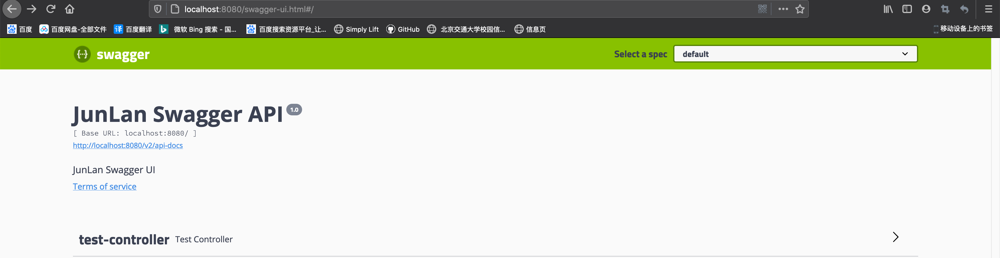

### 4. 注解

```java
 @Api("测试")
/**
 * 标记一个类作为 Swagger resource.
 */
public @interface Api {}

@ApiOperation(value = "摘要", notes = "详细信息")
/**
 * Describes an operation or typically a HTTP method against a specific path.
 * http请求对方法
 */
public @interface ApiOperation {}

/**
 * A wrapper to allow a list of multiple {@link ApiImplicitParam} objects.
 *
 * @see ApiImplicitParam
 */

public @interface ApiImplicitParams {
    ApiImplicitParam[] value();
}

```

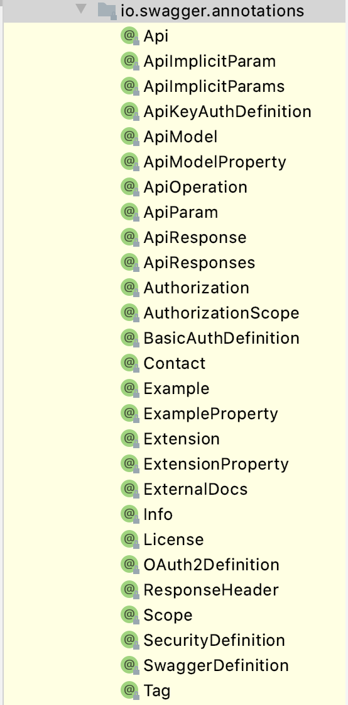

### 4. token配置

#### 1. 指定方法配置

```java
@ApiImplicitParams({ @ApiImplicitParam(paramType = "header", dataType = "String",
                                       name = "token", value = "登录token", required = true) })
```


#### 2. 全局配置

```java
@Configuration
public class SwaggerConfig {

    @Bean
    public Docket jlApi() {
        return new Docket(DocumentationType.SWAGGER_2)
                .apiInfo(apiInfo())
                .select()
                .apis(RequestHandlerSelectors.basePackage("com.junlan.controller"))
                .paths(PathSelectors.any())
                .build()
                // 配置统一参数，具体操作涉及见securityContexts
                .securitySchemes(securitySchemes())
                .securityContexts(securityContexts());
    }

    private ApiInfo apiInfo() {
        return new ApiInfoBuilder()
                .title("JunLan Swagger API")
                .description("JunLan Swagger UI")
                .termsOfServiceUrl("http://localhost:8080")
                .version("1.0")
                .build();
    }

    // 全站统一参数配置，一般是token。
    private List<ApiKey> securitySchemes() {
        List<ApiKey> apiKeyList= new ArrayList();
        apiKeyList.add(new ApiKey("token", "token", "header"));
        return apiKeyList;
    }

    //  配置应用于securitySchemes操作（通过正则表达式）和HTTP方法。
    private List<SecurityContext> securityContexts() {
        List<SecurityContext> securityContexts = new ArrayList<>();
        securityContexts.add(SecurityContext.builder().securityReferences(defaultAuth())
                //过滤要验证的路径
                .forPaths(PathSelectors.regex("^(?!auth).*$"))
                .build());
        return securityContexts;
    }

    // 增加全局认证
    List<SecurityReference> defaultAuth() {
        AuthorizationScope authorizationScope = new AuthorizationScope("global", "accessEverything");
        AuthorizationScope[] authorizationScopes = new AuthorizationScope[1];
        authorizationScopes[0] = authorizationScope;
        List<SecurityReference> securityReferences = new ArrayList<>();
        // 验证增加, 名称同securitySchemes()中header写入token
        securityReferences.add(new SecurityReference("token", authorizationScopes));
        return securityReferences;
    }
}
```

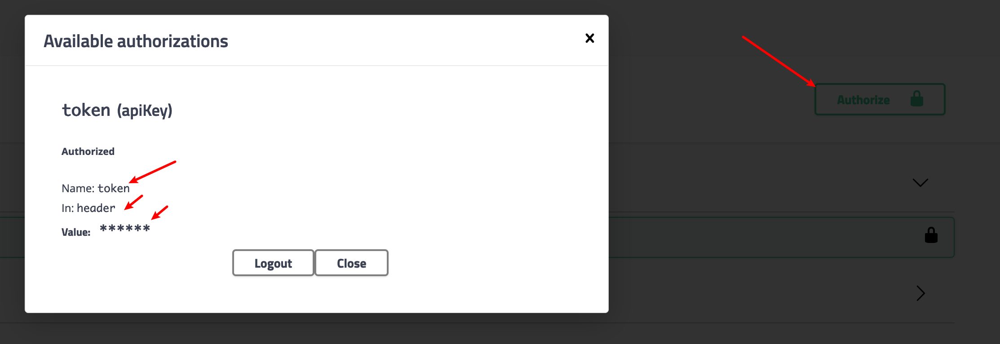


# JWT

**JSON WEB TOKEN**

https://jwt.io/introduction/

https://github.com/auth0/java-jwt

## 1. 简介

https://www.jianshu.com/p/576dbf44b2ae


### 包含

- Header：头部
- Payload：载荷
- Signature：签证

### 概述

- JSON Web Token（JWT）是目前最流行的**跨域身份验证**解决方案
- JSON Web令牌是一种开放的行业标准  RFC 7519方法，用于在双方之间安全地表示声明

## 2. Spring boot JWT

```java
package com.junlan.utils;

import com.auth0.jwt.JWT;
import com.auth0.jwt.JWTVerifier;
import com.auth0.jwt.algorithms.Algorithm;
import com.auth0.jwt.exceptions.JWTDecodeException;
import com.auth0.jwt.interfaces.DecodedJWT;

import java.util.Date;

/**
 * @Author LJ
 * @Date 2020/11/27
 * msg
 */

public class JwtUtils {

    // 过期时间 24 小时
    private static final long EXPIRE_TIME = 60 * 24 * 60 * 1000;
    // 密钥
    private static final String SECRET = "SHIRO+JWT+JunLan";

    /**
     * 生成 token
     *
     * @param username
     * @return 加密的token
     */
    public static String createToken(String username) {
        try {
            // 过期时间
            Date expire = new Date(System.currentTimeMillis() + EXPIRE_TIME);
            // 生成算法
            Algorithm algorithm = Algorithm.HMAC256(SECRET);
            // 附带username信息
            return JWT.create()
                    .withClaim("username", username)
                    //到期时间
                    .withExpiresAt(date)
                    //创建一个新的JWT，并使用给定的算法进行标记
                    .sign(algorithm);
        } catch (Exception e) {
            return null;
        }
    }

    /**
     * 校验 token 是否正确
     *
     * @param token    
     * @param username 用户名
     * @return 
     */
    public static boolean verify(String token, String username) {
        try {
            Algorithm algorithm = Algorithm.HMAC256(SECRET);
            //在token中附带了username信息
            JWTVerifier verifier = JWT.require(algorithm)
                    .withClaim("username", username)
                    .build();
            //验证 token
            verifier.verify(token);
            return true;
        } catch (Exception exception) {
            return false;
        }
    }

    /**
     * 获得token中的信息，无需secret解密也能获得
     *
     * @return token中包含的用户名
     */
    public static String getUsername(String token) {
        try {
            DecodedJWT jwt = JWT.decode(token);
            return jwt.getClaim("username").asString();
        } catch (JWTDecodeException e) {
            return null;
        }
    }
}
```


## 3. Spring boot plus

https://springboot.plus/guide/shiro-jwt.html#springboot-shiro-jwt


# Shiro

https://shiro.apache.org/spring-boot.html

## 1. 依赖

```xml
<!-- shiro -->
<dependency>
  <groupId>org.apache.shiro</groupId>
  <artifactId>shiro-spring</artifactId>
  <version>1.7.0</version>
</dependency>
```

## 2. Spring boot plus

https://springboot.plus/guide/shiro-jwt.html#springboot-shiro-jwt

## 3. 简介

https://www.w3cschool.cn/shiro/co4m1if2.html

Apache Shiro 是 Java 的一个安全框架。


**Authentication**：身份认证 / 登录，验证用户是不是拥有相应的身份；

**Authorization**：授权，即**权限验证**，验证某个已认证的用户是否拥有某个权限；即验证某个用户是否拥有**某个角色**；或者细粒度的验证某个用户对某个资源是否具有**某个权限**。

**Session** **Management**：会话管理，即用户登录后就是一次会话，在没有退出之前，它的所有信息都在会话中。

**Cryptography**：加密，保护数据的安全性，如**密码加密**存储到数据库，而不是明文存储。


### 1. 架构


直接交互的对象是 Subject，也就是说 Shiro 的**对外 API 核心**就是 Subject

**Subject**：主体，代表了当前 “用户”，这个用户不一定是一个具体的人，与当前应用交互的任何东西都是  Subject，如网络爬虫，机器人等；即一个抽象概念；所有 Subject 都绑定到 SecurityManager，与 Subject  的所有交互都会委托给 SecurityManager；可以把 Subject 认为是一个门面；SecurityManager 才是**实际的执行者**；

**SecurityManager**：安全管理器；即所有与安全有关的操作都会与 SecurityManager 交互；且它管理着所有 Subject；可以看出它是 Shiro 的核心，它负责与后边介绍的其他组件进行交互；

**Realm**：域，Shiro 从从 Realm **获取安全数据**（如用户、角色、权限），就是说  SecurityManager 要验证用户身份，那么它需要从 Realm 获取相应的用户进行比较**以确定用户身份是否合法**；也需要从 Realm  得到用户相应的**角色 / 权限进行验证**用户是否能进行操作；可以把 Realm 看成 DataSource，即安全数据源。

也就是说对于我们而言，最简单的一个 Shiro 应用：

1. 应用代码通过 Subject 来进行认证和授权，而 Subject 又委托给 SecurityManager；
2. 我们需要给 Shiro 的 SecurityManager 注入 Realm，从而让 SecurityManager 能得到合法的用户及其权限进行判断。

**从以上也可以看出，Shiro 不提供维护用户 / 权限，而是通过 Realm 让开发人员自己注入。**


### 2. 权限管理RBAC

**1. 基于资源的权限管理(Resource-Based Access Control)** 

https://www.iteye.com/blog/globeeip-1236167

### 3. 继承关系

#### Filter

**BasicHttpAuthenticationFilter**

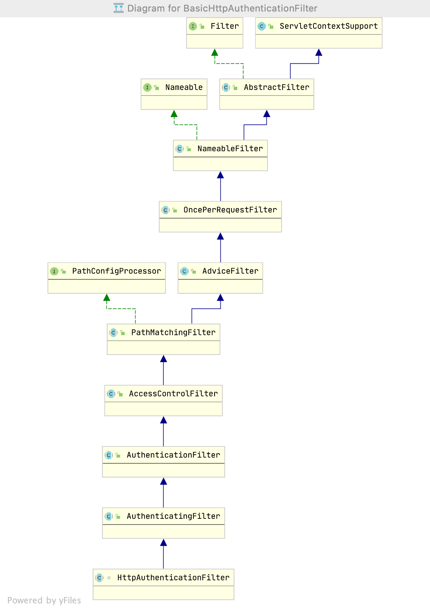

- Shiro Filter，是在整个 Shiro Web 应用中**请求的门户**【入口】，所有的请求都会被 ShiroFilter  拦截并进行相应的**链式处理**。

- ShiroFilterFactoryBean实现FactoryBean，是ShiroFilter的工厂类。

  

  

#### ShiroFilterFactoryBean


- https://blog.csdn.net/achenyuan/article/details/78541529 

- 在基于Spring的web应用程序中用于定义主Shiro过滤器的FactoryBean。 

- ShiroFilterFactoryBean实现FactoryBean，是ShiroFilter的工厂类。

  - yaml
  
  ```yaml
  ########### shiro配置 #######
  shiro:
    enable: true
    # 权限配置，List
    anno:
      # 排除登录登出
      - /login,/logout
      # 排除静态资源
      - /static/**,/templates/**
      # 排除Swagger
      - /swagger-ui.html,/docs,/doc.html,/swagger-resources/**,/webjars/**,/v2/api-docs,/csrf,/v2/api-docs-ext,/null/swagger-resources/**
      # 排除actuator
      - /actuator/**
      - # 排除首页
      - /,/index.html
      # 排除无权限页
      - /unauthorized/**
      # 排除测试路径
      - /test/**
  
    permission:
      - /user/**
    - /article/**
  ```
  
  - java--properties
  
  ```java
  package com.junlan.config.properties;
  
  import lombok.Data;
  import org.springframework.boot.context.properties.ConfigurationProperties;
  import org.springframework.stereotype.Component;
  
  import java.util.List;
  
  /**
   * @Author LJ
   * @Date 2020/12/1
   * msg Shiro 配置映射类，配置yaml的
   */
  
  @Data
  @ConfigurationProperties(value = "shiro")
  @Component
  public class ShiroProperties {
  
      /**
       * 是否启用
       */
      private boolean enable;
  
      /**
       * 路径权限配置, xxx-xxx松散绑定
       */
      private String filterChainDefinitions;
  
      /**
       * 设置无需权限路径集合
       */
      private List<String[]> anon;
  
      /*
      * 设置通过JwtShiro
      * */
      private List<String[]> permission;
  }
  ```
  
  

```java
/**
 * ShiroConfig
 * @author XJJ
 * @date 2019-09-27
 * 1. 请求门户入口，是ShiroFilter的工厂类
 *
 **/


@Configuration
public class ShiroConfig {

    // JWT过滤器名称
    private static final String JWT_FILTER_NAME = "jwtFilter";

    //Shiro过滤器名称
    private static final String SHIRO_FILTER_NAME = "shiroFilter";

    private static Logger logger = LoggerFactory.getLogger(ShiroConfig.class);

    /**
     * 先走 filter ，然后 filter 如果检测到请求头存在 token，则用 token 去 login，走 Realm 去验证
     *
     * 定义主Shiro过滤器。
     */
    @Bean
    public ShiroFilterFactoryBean factory(SecurityManager securityManager,
                                          ShiroProperties shiro) {
        ShiroFilterFactoryBean factoryBean = new ShiroFilterFactoryBean();
        // 1. 设置安全管理器
        factoryBean.setSecurityManager(securityManager);
        // 2. 设置在创建setFilterChainDefinitionMap筛选器链定义时可用的筛选器
        factoryBean.setFilters(getFilterMap());
        // 3. 设置链定义的链名到链定义映射，以用于创建被Shiro筛选器拦截的筛选器链
        factoryBean.setFilterChainDefinitionMap(getFilterChainDefinitionMap(shiro));

        // 设置无权限时跳转的 url;
        factoryBean.setUnauthorizedUrl("/user/unauthorized");
        return factoryBean;
    }

    /**
     * 获取自定义的JwtFilter
     *
     * @return map
     */
    private Map<String, Filter> getFilterMap() {
        Map<String, Filter> filterMap = new LinkedHashMap<>();
        filterMap.put(JWT_FILTER_NAME, new JwtFilter());
        return filterMap;
    }

    /**
     * Shiro 链名到链定义映射
     *
     * @return map
     */
    private Map<String, String> getFilterChainDefinitionMap(ShiroProperties shiroProperties) {
        Map<String, String> filterChainDefinitionMap = new LinkedHashMap<>();
        // 获取排除的路径
        List<String[]> anonList = shiroProperties.getAnon();
//        log.debug("anonList:{}", JSON.toJSONString(anonList));
        if (CollectionUtils.isNotEmpty(anonList)) {
            anonList.forEach(anons -> {
                if (ArrayUtils.isNotEmpty(anons))
                    for (String anon : anons) {
                        // anon, 匿名拦截器，即不需要登录即可访问
                        filterChainDefinitionMap.put(anon, "anon");
                    }
            });
        }

        // JwtShiro
        List<String[]> permission = shiroProperties.getPermission();
        if (CollectionUtils.isNotEmpty(permission)) {
            permission.forEach(pers -> {
                if (ArrayUtils.isNotEmpty(pers))
                    for (String per : pers) {
                        // anon, 匿名拦截器，即不需要登录即可访问
                        filterChainDefinitionMap.put(per, JWT_FILTER_NAME);
                    }
            });
        }

        // 如果没有启用shiro，全部路径放行
        if (!shiroProperties.isEnable()) {
            filterChainDefinitionMap.put("/**", "anon");
        }
        return filterChainDefinitionMap;
    }


    /**
     * 注入 securityManager
     */
    @Bean
    public SecurityManager securityManager(MyRealm myRealm) {
        DefaultWebSecurityManager securityManager = new DefaultWebSecurityManager();
        // 设置自定义 realm.
        securityManager.setRealm(myRealm);

        /*
         * 关闭shiro自带的session，详情见文档
         * http://shiro.apache.org/session-management.html#SessionManagement-StatelessApplications%28Sessionless%29
         */
        DefaultSubjectDAO subjectDAO = new DefaultSubjectDAO();
        DefaultSessionStorageEvaluator defaultSessionStorageEvaluator = new DefaultSessionStorageEvaluator();
        defaultSessionStorageEvaluator.setSessionStorageEnabled(false);
        subjectDAO.setSessionStorageEvaluator(defaultSessionStorageEvaluator);
        securityManager.setSubjectDAO(subjectDAO);
        return securityManager;
    }

    /**
     * 添加注解支持
     */
    @Bean
    public DefaultAdvisorAutoProxyCreator defaultAdvisorAutoProxyCreator() {
        DefaultAdvisorAutoProxyCreator defaultAdvisorAutoProxyCreator = new DefaultAdvisorAutoProxyCreator();
        // 强制使用cglib，防止重复代理和可能引起代理出错的问题
        // https://zhuanlan.zhihu.com/p/29161098
        defaultAdvisorAutoProxyCreator.setProxyTargetClass(true);
        return defaultAdvisorAutoProxyCreator;
    }

    @Bean
    public AuthorizationAttributeSourceAdvisor authorizationAttributeSourceAdvisor(SecurityManager securityManager) {
        AuthorizationAttributeSourceAdvisor advisor = new AuthorizationAttributeSourceAdvisor();
        advisor.setSecurityManager(securityManager);
        return advisor;
    }

    @Bean
    public LifecycleBeanPostProcessor lifecycleBeanPostProcessor() {
        return new LifecycleBeanPostProcessor();
    }
}

```


```java
/**
 * JWT 提供token
 * 2. Shiro 对象过滤验证
 *
 * @author XJJ
 * @date 2019-09-27
 *
 **/
public class JwtFilter extends BasicHttpAuthenticationFilter {
    private Logger logger = LoggerFactory.getLogger(this.getClass());

    /**
     * 是否允许访问
     * 如果带有 token，则对 token 进行检查
     */
    @Override
    protected boolean isAccessAllowed(ServletRequest request, ServletResponse response, Object mappedValue) throws UnauthorizedException {
        final String uri = WebUtils.toHttp(request).getRequestURI();
        logger.info("access url:{}", uri);
        boolean allowed = false;
        //判断请求的请求头是否带上 "Token"
        if (isLoginAttempt(request, response)) {
            //如果存在，则进入 executeLogin 方法执行登入，检查 token 是否正确
            try {
                allowed = executeLogin(request, response);
            } catch (Exception e) {
                //token 错误
                responseError(response, e.getMessage());
            }
        }
        return allowed || super.isPermissive(mappedValue);
    }

    /**
     * 判断用户是否想要登入。
     * 检测 header 里面是否包含 Token 字段
     */
    @Override
    protected boolean isLoginAttempt(ServletRequest request, ServletResponse response) {
        String token = WebUtils.toHttp(request).getHeader("token");
        return StringUtils.isNotBlank(token);
    }

    /**
     * 执行登陆操作, 注入【包装】JwtToken到AuthenticationToken
     * 或者重写executeLogin调用到方法createToken，
     */
    @Override
    protected boolean executeLogin(ServletRequest request, ServletResponse response) throws Exception {
        String token = WebUtils.toHttp(request).getHeader("token");
        JwtToken jwtToken = new JwtToken(token);
        try {
            // 提交jwtToken给realm进行登入
            Subject subject = getSubject(request, response);
            subject.login(jwtToken);
            return onLoginSuccess(jwtToken, subject, request, response);
        } catch (AuthenticationException e) {
            return onLoginFailure(jwtToken, e, request, response);
        }
    }

    /**
     * 登录成功处理, executeLogin调用
     *
     * @param token
     * @param subject
     * @param request
     * @param response
     * @return
     * @throws Exception
     */
    @Override
    protected boolean onLoginSuccess(AuthenticationToken token, Subject subject, ServletRequest request, ServletResponse response) throws Exception {
        String url = WebUtils.toHttp(request).getRequestURI();
        logger.info("Realm 登录成功,url:{},token:{}", url, token);
        // 刷新token
        JwtToken jwtToken = (JwtToken) token;
        HttpServletResponse httpServletResponse = WebUtils.toHttp(response);
//        shiroLoginService.refreshToken(jwtToken, httpServletResponse);
        return true;
    }

    /**
     * 访问失败处理
     *
     * @param request
     * @param response
     * @return
     * @throws Exception
     */
    @Override
    protected boolean onAccessDenied(ServletRequest request, ServletResponse response) throws Exception {
        HttpServletRequest httpServletRequest = WebUtils.toHttp(request);
        HttpServletResponse httpServletResponse = WebUtils.toHttp(response);
        // 返回401
        httpServletResponse.setStatus(HttpServletResponse.SC_UNAUTHORIZED);
        // 设置响应码为401或者直接输出消息
        String url = httpServletRequest.getRequestURI();
        logger.error("访问失败 url：{}", url);
        ApiResult<Boolean> apiResult = ApiResult.fail(ApiCode.UNAUTHORIZED);
//        HttpServletResponseUtil.printJson(httpServletResponse, apiResult);
        return false;
    }

    /**
     * 登录失败处理， executeLogin调用
     *
     * @param token
     * @param e
     * @param request
     * @param response
     * @return
     */
    @Override
    protected boolean onLoginFailure(AuthenticationToken token, AuthenticationException e, ServletRequest request, ServletResponse response) {
        logger.error("登录失败，token:" + token + ",error:" + e.getMessage(), e);
        return false;
    }

    /**
     * 对跨域提供支持
     */
    @Override
    protected boolean preHandle(ServletRequest request, ServletResponse response) throws Exception {
        HttpServletRequest httpServletRequest = (HttpServletRequest) request;
        HttpServletResponse httpServletResponse = (HttpServletResponse) response;
        httpServletResponse.setHeader("Access-control-Allow-Origin", httpServletRequest.getHeader("Origin"));
        httpServletResponse.setHeader("Access-Control-Allow-Methods", "GET,POST,OPTIONS,PUT,DELETE");
        httpServletResponse.setHeader("Access-Control-Allow-Headers", httpServletRequest.getHeader("Access-Control-Request-Headers"));
        // 跨域时会首先发送一个option请求，这里我们给option请求直接返回正常状态
        if (httpServletRequest.getMethod().equals(RequestMethod.OPTIONS.name())) {
            httpServletResponse.setStatus(HttpStatus.OK.value());
            return false;
        }
        return super.preHandle(request, response);
    }

    /**
     * 将非法请求跳转到 /unauthorized/**
     */
    private void responseError(ServletResponse response, String message) {
        try {
            HttpServletResponse httpServletResponse = (HttpServletResponse) response;
            //设置编码，否则中文字符在重定向时会变为空字符串
            message = URLEncoder.encode(message, "UTF-8");
            httpServletResponse.sendRedirect("/unauthorized/" + message);
        } catch (IOException e) {
            logger.error(e.getMessage());
        }
    }
}

```


#### Realm


- 一般继承 `AuthorizingRealm`（授权）即可；

- 其继承了 `AuthenticatingRealm`（即身份验证），而且也间接继承了 `CachingRealm`（带有缓存实现）


```java
/**
 *
 * @Author LJ
 * @Date 2020/11/28
 * 3. Shiro 登录权限配置
 */

@Component
public class MyRealm extends AuthorizingRealm {
    private static final Logger log = LoggerFactory.getLogger(MyRealm.class);

    private LoginService loginService;

    public MyRealm(LoginService loginService) {
        this.loginService = loginService;
    }

    /**
     * 仅支持JwtToken类型的Token，即需实现AuthenticationToken
     *
     * @param token
     * @return
     */
    @Override
    public boolean supports(AuthenticationToken token) {
        return token != null && token instanceof JwtToken;
    }

    /**
     * 授权认证,设置角色/权限信息，只有当需要检测用户权限的时候才会调用此方法
     *
     * @param principals
     * @return
     */
    @Override
    protected AuthorizationInfo doGetAuthorizationInfo(PrincipalCollection principals) {
        String username = JwtUtil.getUsername(principals.toString());
        log.info("验证权限：{}", username);
        Long roleId = loginService.getUserByName(username).getRoleId();
        // 获得该用户角色编码
        String rCode = loginService.getRodeCode(roleId);
        // 获取用户权限编码
        Set<String> pCodes = loginService.getPermissionByRodeId(roleId);

        SimpleAuthorizationInfo info = new SimpleAuthorizationInfo();
        info.setRoles(SetUtils.hashSet(rCode));
        info.setStringPermissions(pCodes);
        return info;
    }

    /**
     * token验证，在进行登录
     *
     * @param aToken
     * @return
     * @throws AuthenticationException
     */
    @Override
    protected AuthenticationInfo doGetAuthenticationInfo(AuthenticationToken aToken) throws AuthenticationException {
        log.info("验证token：{}", aToken);
        String token = (String) aToken.getCredentials();
        if (StringUtils.isBlank(token)) {
            throw new AuthenticationException("token不能为空");
        }
        return new SimpleAuthenticationInfo(token, token, getName());
    }
}
```


#### AuthenticationToken


- 用于收集用户提交的身份（如用户名）及凭据（如密码）：  

```java
public interface AuthenticationToken extends Serializable {
    Object getPrincipal(); 		//身份
    Object getCredentials(); 	//凭据
}
```

- 扩展接口 
  - RememberMeAuthenticationToken：提供了 “boolean isRememberMe()” **现“记住我”的功能**；
  - HostAuthenticationToken：提供了 “String getHost()” 方法用于**获取用户 “主机” 的功能**。
- Shiro 提供了一个直接拿来用的 UsernamePasswordToken，用于实现用户名 / 密码 Token 组，另外其实现了  RememberMeAuthenticationToken 和 HostAuthenticationToken，可以实现记住我及主机验证的支持。

```java
/**
 * 4. 收集用户提交的身份
 * Shiro JwtToken对象
 *
 * @author XJJ
 * @date 2019-09-27
 *
 **/
@Data
@Accessors(chain = true)
public class JwtToken implements HostAuthenticationToken {

    private String host;
    private String token;
    public JwtToken() {}

    public JwtToken(String token) {
        this.token = token;
    }

    @Override
    public Object getPrincipal() {
        return token;
    }

    @Override
    public Object getCredentials() {
        return token;
    }
}

```


#### AuthenticationInfo


作用：  

- 如果 Realm 是 AuthenticatingRealm 子类，则提供给 AuthenticatingRealm 内部使用的 CredentialsMatcher 进行凭据验证；（如果没有继承它需要在自己的 Realm 中自己实现验证）；
- 提供给 SecurityManager 来创建 Subject（提供身份信息）；


## 4. 默认拦截器

| 默认拦截器名      | 拦截器类                                                     | 说明（括号里的表示默认值）                                   |
| ----------------- | ------------------------------------------------------------ | ------------------------------------------------------------ |
| 身份验证相关的    |                                                              |                                                              |
| authc             | org.apache.shiro.web.filter.authc .FormAuthenticationFilter  | 基于表单的拦截器；如“/**=authc”，如果没有登录会跳到相应的登录页面登录；主要属性：usernameParam：表单提交的用户名参数名（ username）；  passwordParam：表单提交的密码参数名（password）；  rememberMeParam：表单提交的密码参数名（rememberMe）；  loginUrl：登录页面地址（/login.jsp）；successUrl：登录成功后的默认重定向地址；  failureKeyAttribute：登录失败后错误信息存储key（shiroLoginFailure）； |
| authcBasic        | org.apache.shiro.web.filter.authc .BasicHttpAuthenticationFilter | Basic HTTP身份验证拦截器，主要属性： applicationName：弹出登录框显示的信息（application）； |
| logout            | org.apache.shiro.web.filter.authc .LogoutFilter              | 退出拦截器，主要属性：redirectUrl：退出成功后重定向的地址（/）;示例“/logout=logout” |
| user              | org.apache.shiro.web.filter.authc .UserFilter                | 用户拦截器，用户已经身份验证/记住我登录的都可；示例“/**=user” |
| anon              | org.apache.shiro.web.filter.authc .AnonymousFilter           | 匿名拦截器，即不需要登录即可访问；一般用于静态资源过滤；示例“/static/**=anon” |
| 授权相关的        |                                                              |                                                              |
| roles             | org.apache.shiro.web.filter.authz .RolesAuthorizationFilter  | 角色授权拦截器，验证用户是否拥有所有角色；主要属性： loginUrl：登录页面地址（/login.jsp）；unauthorizedUrl：未授权后重定向的地址；示例“/admin/**=roles[admin]” |
| perms             | org.apache.shiro.web.filter.authz .PermissionsAuthorizationFilter | 权限授权拦截器，验证用户是否拥有所有权限；属性和roles一样；示例“/user/**=perms["user:create"]” |
| port              | org.apache.shiro.web.filter.authz .PortFilter                | 端口拦截器，主要属性：port（80）：可以通过的端口；示例“/test= port[80]”，如果用户访问该页面是非80，将自动将请求端口改为80并重定向到该80端口，其他路径/参数等都一样 |
| rest              | org.apache.shiro.web.filter.authz .HttpMethodPermissionFilter | rest风格拦截器，自动根据请求方法构建权限字符串（GET=read, POST=create,PUT=update,DELETE=delete,HEAD=read,TRACE=read,OPTIONS=read,  MKCOL=create）构建权限字符串；示例“/users=rest[user]”，会自动拼出“user:read,user:create,user:update,user:delete”权限字符串进行权限匹配（所有都得匹配，isPermittedAll）； |
| ssl               | org.apache.shiro.web.filter.authz .SslFilter                 | SSL拦截器，只有请求协议是https才能通过；否则自动跳转会https端口（443）；其他和port拦截器一样； |
| 其他              |                                                              |                                                              |
| noSessionCreation | org.apache.shiro.web.filter.session .NoSessionCreationFilter | 不创建会话拦截器，调用 subject.getSession(false)不会有什么问题，但是如果 subject.getSession(true)将抛出 Disable |


# Redis

https://www.cnblogs.com/wyl-0120/p/10011805.html

https://www.cnblogs.com/powertoolsteam/p/redis.html

## 1. 简介

1. 是什么
   - Remote Dictionary Server ，即远程字典服务
   - 是一个高性能的**key-value数据库**，**NoSQL**数据存储
   - **基于内存运行**，性能高效
   - 支持分布式，理论上可以无限扩展
2. 特点
   - C/S通讯模型
   - **单进程单线程**模型，操作具有**原子性**
   - 丰富的数据类型
     - string(字符串)、hash(哈希)、list(列表)
     - set(无序集合)、zset(sorted set：有序集合)
   - 持久化
   - 高并发读写
3. 应用场景
   - 缓存数据：经常**需要查询且变动不频繁**的数据，【热点数据】
   - 消息队列：相当于消息订阅系统，比如ActiveMQ、RocketMQ
   - 计数器：比如统计点击率、点赞率，redis具有原子性，可以避免并发问题
   - 电商网站信息：大型电商平台初始化页面数据的缓存
   - 热点数据：比如新闻网站实时热点、微博热搜等，需要频繁更新。
     - 总数据量比较大的时候**直接从数据库查询会影响性能**

## 操作

https://www.cnblogs.com/javastack/p/9854489.html

```
redis-server
redis-cli
keys *
dbsize
get key
del key

//删除当前数据库中的所有Key
flushdb
//删除所有数据库中的key
flushall

```


## 2. 缓存登录信息

1.依赖

```xml
<!-- redis 依赖-->
<dependency>
  <groupId>org.springframework.boot</groupId>
  <artifactId>spring-boot-starter-data-redis</artifactId>
</dependency>
```

2. 配置

   ```yaml
   spring:
     ######### redis 配置###########
     redis:
       timeout: 10s
       connect-timeout: 5s
   ```

   


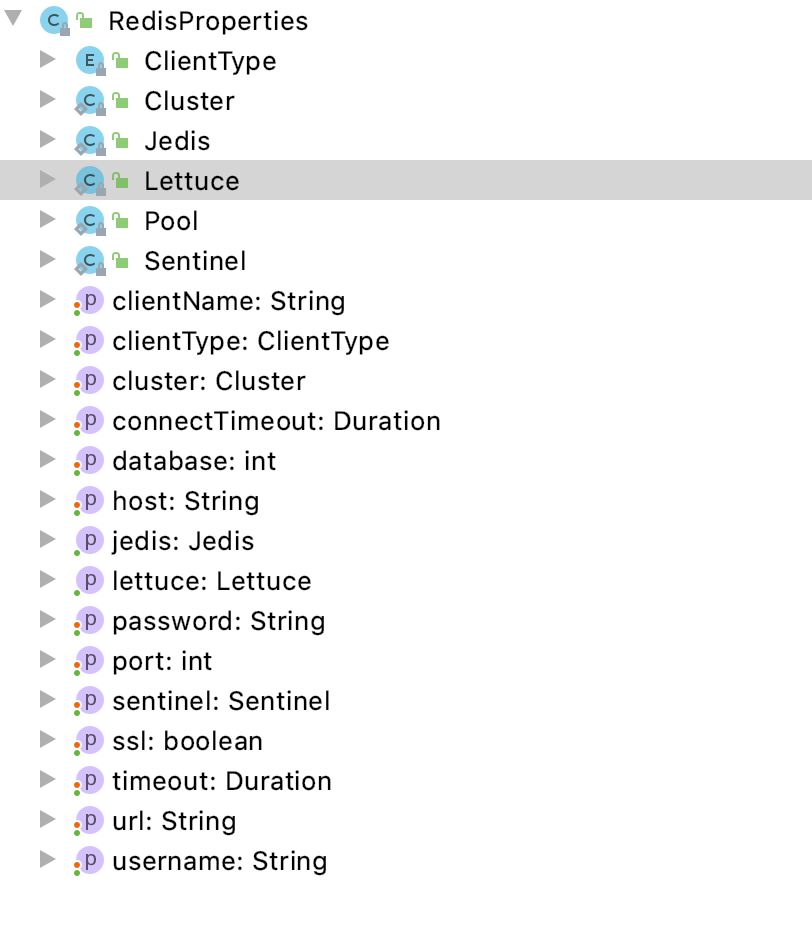


## 问题

1. key:\xac\xxxx

   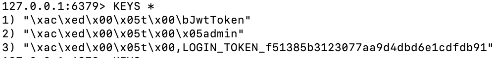

- 解决：修改键默认序列化方式

  https://www.cnblogs.com/chen-lhx/p/7559834.html

  ```java
  @Autowired(required = false)
  public void setRedisTemplate(RedisTemplate redisTemplate) {
    RedisSerializer stringSerializer = new StringRedisSerializer();
    redisTemplate.setKeySerializer(stringSerializer);
    this.redisTemplate = redisTemplate;
  }
  ```

2. value:xxx; `redisTemplate.opsForValue().get("JwtToken")`报错

   - 解决

     https://blog.csdn.net/baize__/article/details/88740497

     ```java
     // 加上TimeUnit.SECONDS参数，过期时间形式
     redisTemplate.opsForValue().set("JwtToken", jwtToken, jwtProperties.getExpireSecond(), TimeUnit.SECONDS);
     ```

     


# 工具类

## 1. 日志Logger

```java
import org.slf4j.Logger;
import org.slf4j.LoggerFactory;

public class ScheduledTasks {
    // 属性，传入当前类
    private static final Logger log = LoggerFactory.getLogger(ScheduledTasks.class);

    private static final SimpleDateFormat dateFormat = new SimpleDateFormat("HH:mm:ss");

    @Scheduled(fixedRate = 5000)        // 间隔时间
    public void reportCurrentTime() {
      	// 日志类型
        log.info("当前时间为：{}", dateFormat.format(new Date()));
    }
}
```

## 2. Lombok

1. `@Accessors(chain = true)`：生成迭代器，build
2. 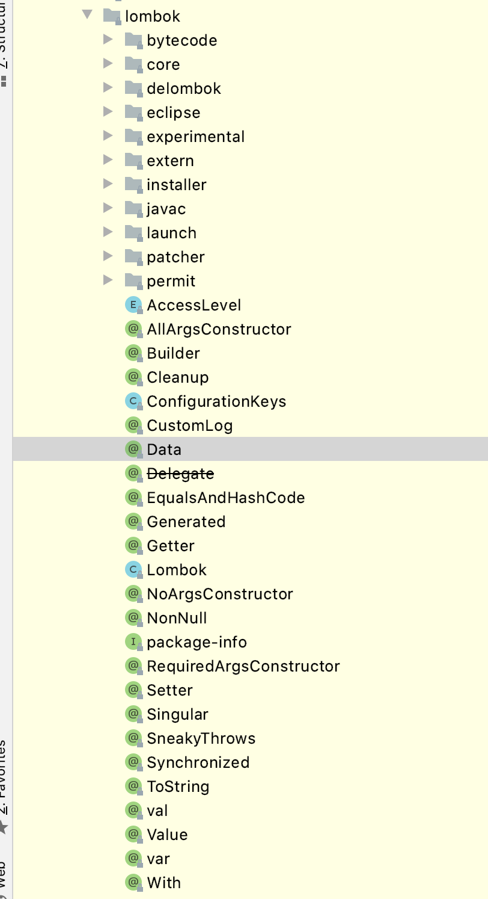


## 3. 字符串处理commons-lang3

```xml
<!-- 字符串公共包 -->
<dependency>
  <groupId>org.apache.commons</groupId>
  <artifactId>commons-lang3</artifactId>
  <version>3.10</version>
</dependency>
```

### 1. StringUtils.isBlank()

`isBlank()`方法一次性校验如下三种情况判断一个String变量是否为空:

- 是否为 null
- 是否为 ""
- 是否为空字符串(引号中间有空格)  如： "   "
- Checks if a CharSequence is empty (""), null or whitespace only.

## 4. 集合工具类

**Commons-Collections4 集合工具类的使用**

```xml
<!-- 集合工具类 commons-collections4 -->
<dependency>
    <groupId>org.apache.commons</groupId>
    <artifactId>commons-collections4</artifactId>
    <version>4.4</version>
</dependency>

```


# W3C Spring

## 1. 概述

### Spring 的优良特性

- 非侵入式：基于Spring开发的应用中的对象可以不依赖于Spring的API
- **控制反转**：IOC——Inversion of Control，指的是**将对象的创建权交给 Spring 去创建**。使用 Spring 之前，对象的创建都是由我们自己在代码中new创建。而使用 Spring 之后。对象的创建都是给了 Spring 框架。
- 依赖注入：DI——Dependency Injection，是指**依赖的对象不需要手动调用 setXX 方法去设置，而是通过配置赋值。**
- 面向切面编程：Aspect Oriented Programming——AOP
- 容器：Spring 是一个容器，因为它包含并且管理应用对象的生命周期

### 依赖注入（DI）

Spring 最认同的技术是控制反转的**依赖注入（DI）**模式。控制反转（IoC）是一个通用的概念，它可以用许多不同的方式去表达，依赖注入**仅仅是控制反转**的一个具体的例子。

当编写一个复杂的 Java 应用程序时，应用程序类应该尽可能的独立于其他的 Java 类来增加这些类可重用可能性，当进行单元测试时，可以使它们独立于其他类进行测试。依赖注入（或者有时被称为配线）有助于将这些类粘合在一起，并且在同一时间让它们保持独立。

```
如果一个类A 的功能实现需要借助于类B，那么就称类B是类A的依赖，如果在类A的内部去实例化类B，那么两者之间会出现较高的耦合，一旦类B出现了问题，类A也需要进行改造，如果这样的情况较多，每个类之间都有很多依赖，那么就会出现牵一发而动全身的情况，程序会极难维护，并且很容易出现问题。要解决这个问题，就要把A类对B类的控制权抽离出来，交给一个第三方去做，把控制权反转给第三方，就称作控制反转（IOC Inversion Of Control）。控制反转是一种思想，是能够解决问题的一种可能的结果，而依赖注入（Dependency Injection）就是其最典型的实现方法。由第三方（我们称作IOC容器）来控制依赖，把他通过构造函数、属性或者工厂模式等方法，注入到类A内，这样就极大程度的对类A和类B进行了解耦。
```

依赖注入可以以向**构造函数传递参数**的方式发生，或者通过使用 setter 方法 post-construction。

### 面向切面的程序设计（AOP）：

Spring 框架的一个关键组件是**面向切面的程序设计（AOP）**框架。一个程序中跨越多个点的功能被称为**横切关注点**，这些横切关注点在概念上独立于应用程序的业务逻辑。有各种各样常见的很好的**关于方面**的例子，比如**日志记录、声明性事务、安全性，和缓存**等等。

在 OOP 中模块化的关键单元是类，而在 AOP 中模块化的**关键单元是面**。AOP 帮助你将横切关注点从它们所影响的对象中分离出来，然而依赖注入帮助你将你的应用程序对象从彼此中分离出来。

Spring 框架的 AOP 模块提供了面向方面的程序设计实现，可以定义诸如方法拦截器和切入点等，从而使实现功能的代码彻底的解耦出来。


## 2. 体系结构

Spring 是模块化的，允许你**挑选和选择**适用于你的模块，**不必要把剩余部分也引入**。

Spring 框架提供约 20 个模块，可以根据应用程序的要求来使用。 


## 3. IoC容器

### 容器

- 容器是 Spring  框架的核心。容器将**创建对象**，把它们**连接在一起，配置它们**，并管理他们的**整个生命周期**从创建到销毁。Spring  容器使用**依赖注入**（DI）来**管理**组成一个应用程序的组件。**这些对象【各种组件】被称为 Spring Beans。** 

- 通过阅读配置元数据提供的指令，容器知道对哪些对象进行**实例化，配置和组装**。配置元数据可以通过 XML，Java 注释或 Java 代码来表示。

- **IOC 容器**具有依赖注入功能的容器，它可以**创建对象**，IOC 容器负责**实例化、定位、配置**应用程序中的对象及**建立这些对象间的依赖**。

  - IOC：【控制反转】通常new一个实例，控制权由程序员控制，而"控制反转"是指new实例工作不由程序员来做而是交给Spring容器来做。

- Spring 提供了以下两种不同类型的容器。

  | 序号 | 容器 & 描述                                                  |
  | ---- | ------------------------------------------------------------ |
  | 1    | [Spring BeanFactory 容器](https://www.w3cschool.cn/wkspring/j3181mm3.html)<br />它是最简单的容器，给 DI 提供了基本的支持 |
  | 2    | [Spring ApplicationContext 容器](https://www.w3cschool.cn/wkspring/yqdx1mm5.html) <br />该容器添加了更多的企业特定的功能 |

  ApplicationContext 容器包括 BeanFactory 容器的所有功能，所以通常不建议使用BeanFactory。

### Bean 定义

- 被称作 bean 的对象是构成**应用程序的支柱**
- 由 Spring IoC 容器管理的。
- bean对象是一个被**实例化，组装**，被IoC 容器所管理的对象。这些 bean 是由用容器提供的**配置元数据创建**的。

上述所有的配置元数据转换成一组构成每个 bean 定义的下列属性。

| 属性                     | 描述                                                         |
| ------------------------ | ------------------------------------------------------------ |
| class                    | 这个属性是强制性的，并且指定用来创建 bean 的 bean 类。       |
| name                     | 这个属性指定唯一的 bean 标识符。在基于 XML 的配置元数据中，你可以使用 ID 和/或 name 属性来指定 bean 标识符。 |
| scope                    | 这个属性指定由特定的 bean 定义创建的对象的作用域。           |
| constructor-arg          | 它是用来注入依赖关系的，                                     |
| properties               | 它是用来注入依赖关系的，                                     |
| autowiring mode          | 它是用来注入依赖关系的，                                     |
| lazy-initialization mode | 延迟初始化的 bean 告诉 IoC 容器在它第一次被请求时，而不是在启动时去创建一个 bean 实例。 |
| initialization 方法      | 在 bean 的所有必需的属性被容器设置之后，调用回调方法。       |
| destruction 方法         | 当包含该 bean 的容器被销毁时，使用回调方法。                 |

**Bean 与 Spring 容器的关系**


# 狂神说Spring

## 1. 概念简介

- 2002年，Rod Jahnson首次推出了Spring框架雏形interface21框架。悉尼大学的博士，然而他的专业不是计算机，而是音乐学。
- 2004年3月24日，Spring框架以interface21框架为基础，经过重新设计，发布了1.0正式版。
- Spring理念 : 使现有技术更加实用 . 本身就是一个大杂烩 , 整合现有的框架技术

官网 : http://spring.io/

官方下载地址 : https://repo.spring.io/libs-release-local/org/springframework/spring/

GitHub : https://github.com/spring-projects

中文文档：https://www.docs4dev.com/docs/zh/spring-framework/5.1.3.RELEASE/reference/overview.html#overview-spring

官方文档：https://docs.spring.io/spring-framework/docs/current/spring-framework-reference/core.html#beans

```xml
<!-- https://mvnrepository.com/artifact/org.springframework/spring-webmvc -->
<dependency>
    <groupId>org.springframework</groupId>
    <artifactId>spring-webmvc</artifactId>
    <version>5.2.0.RELEASE</version>
</dependency>

<dependency>
    <groupId>org.springframework</groupId>
    <artifactId>spring-jdbc</artifactId>
    <version>5.2.0.RELEASE</version>
</dependency>
```

### 1.1 优点

- Spring是一个开源免费的框架 , 容器  .
- Spring是一个轻量级的框架 , 非侵入式的 (对原来栏目不影响).
- **控制反转 IoC  , 面向切面 Aop**

**Spring是一个轻量级的控制反转(IoC)和面向切面(AOP)的容器（框架）。**

### 1.2 组成


Spring 框架是一个分层架构，由 7 个定义良好的模块组成。Spring 模块构建在核心容器之上，核心容器定义了**创建、配置和管理 bean 的方式 .**


组成 Spring 框架的每个模块（或组件）都可以**单独存在**，或者与其他一个或多个模块联合实现。每个模块的功能如下：

- **核心容器**：核心容器提供 Spring 框架的基本功能。核心容器的主要组件是BeanFactory，它是工厂模式的实现。BeanFactory 使用*控制反转*（IOC） 模式将应用程序的配置和依赖性规范与实际的应用程序代码分开。
- **Spring 上下文**：Spring 上下文是一个配置文件，向 Spring 框架提供上下文信息。Spring 上下文包括企业服务，例如 JNDI、EJB、电子邮件、国际化、校验和调度功能。
- **Spring AOP**：通过配置管理特性，Spring AOP 模块直接将面向切面的编程功能 , 集成到了 Spring 框架中。
- **Spring DAO**：JDBC DAO 抽象层提供了有意义的异常层次结构
- **Spring ORM**：Spring 框架插入了若干个 ORM 框架【对象关系映射】，从而提供了 ORM 的对象关系工具，其中包括 JDO、Hibernate 和 iBatis SQL Map。所有这些都遵从 Spring 的通用事务和 DAO 异常层次结构。
- **Spring Web 模块**：Web 上下文模块建立在应用程序上下文模块之上，为基于 Web 的应用程序提供了上下文。
- **Spring MVC 框架**：MVC 框架是一个全功能的构建 Web 应用程序的 MVC 实现。通过策略接口，MVC 框架变成为高度可配置的，MVC 容纳了大量视图技术，其中包括 JSP、Velocity、Tiles、iText 和 POI。


### 1.3 Spring Boot与Spring Cloud

- Spring Boot 是 Spring 的一套**快速配置脚手架**，可以基于Spring Boot 快速开发**单个微服务**;
- Spring Cloud是基于Spring Boot实现的；
- Spring Boot专注于**快速、方便集成的单个微服务个体**，Spring Cloud关注**全局**的服务治理框架；
- Spring Boot使用了**约束优于配置**的理念，很多集成方案已经帮你选择好了，能不配置就不配置 , Spring Cloud很大的一部分是基于Spring Boot来实现，Spring Boot可以离开Spring Cloud独立使用开发项目，但是Spring Cloud离不开Spring Boot，属于依赖的关系。
- SpringBoot在Spring Clound中起到了承上启下的作用，如果你要学习SpringCloud必须要学习SpringBoot。


### 1.4 IoC基础

```java
public interface UserDao {
   public void getUser();
}

public interface UserService {
   public void getUser();
}

public class UserServiceImpl implements UserService {
   private UserDao userDao;
	 // 利用set实现
   public void setUserDao(UserDao userDao) {
       this.userDao = userDao;
  }

   @Override
   public void getUser() {
       userDao.getUser();
  }
}


@Test
public void test(){
   UserServiceImpl service = new UserServiceImpl();
   service.setUserDao( new UserDaoMySqlImpl() );
   service.getUser();
   //那我们现在又想用Oracle去实现呢
   service.setUserDao( new UserDaoOracleImpl() );
   service.getUser();
}
```

- 之前，是程序**主动创建对象**，**控制权在程序员手里**
- 现在，**使用set注入后**，程序不再具有主动性，而是变成了被动的接受对象
- **发生了根本性的变化** , 把**主动权交给了调用者**。 程序只负责提供一个接口

这种思想 , 从本质上解决了问题 , 我们**程序员不再去管理对象的创建了 , 更多的去关注业务的实现** . 耦合性大大降低 . 这也就是**IOC的原型** !


### 1.5 IOC本质

- **控制反转IoC(Inversion of Control)，是一种设计思想，DI(依赖注入)是实现IoC的一种方法**，
- 控制反转后将对象的创建转移给第三方，个人认为所谓控制反转就是：获得依赖对象的方式反转了。


- **IoC是Spring框架的核心内容**，使用多种方式完美的实现了IoC，可以使用XML配置，也可以使用注解，新版本的Spring也可以零配置实现IoC。
- Spring容器在初始化时先读取配置文件，根据配置文件或**元数据创建与组织对象存入容器中**，程序使用时再从Ioc容器中取出需要的对象。


- 采用XML方式配置Bean的时候，Bean的定义信息是和实现分离的，
- 采用注解的方式可以把两者合为一体，Bean的定义信息直接以注解的形式定义在实现类中，从而达到了零配置的目的。

**控制反转是一种通过描述（XML或注解）并通过第三方去生产或获取特定对象的方式。在Spring中实现控制反转的是IoC容器，其实现方法是依赖注入（Dependency Injection,DI）。**


## 2. IOC编程详解

### 2.1 初试

#### 导入Jar包

注 : spring 需要导入commons-logging进行日志记录 . 我们利用maven , 他会自动下载对应的依赖项 .

```xml
<dependency>
   <groupId>org.springframework</groupId>
   <artifactId>spring-webmvc</artifactId>
   <version>5.1.10.RELEASE</version>
</dependency>
```

#### 编写代码

1、编写一个Hello实体类

```java
public class Hello {
   private String name;

   public String getName() {
       return name;
  }
   public void setName(String name) {
       this.name = name;
  }

   public void show(){
       System.out.println("Hello,"+ name );
  }
}
```

2、编写我们的spring文件 , 这里我们命名为beans.xml

```xml
<?xml version="1.0" encoding="UTF-8"?>
<beans xmlns="http://www.springframework.org/schema/beans"
      xmlns:xsi="http://www.w3.org/2001/XMLSchema-instance"
      xsi:schemaLocation="http://www.springframework.org/schema/beans
       http://www.springframework.org/schema/beans/spring-beans.xsd">

   <!--bean就是java对象 , 由Spring创建和管理-->
   <bean id="hello" class="com.kuang.pojo.Hello">
       <property name="name" value="Spring"/>
   </bean>

</beans>
```

3、我们可以去进行测试了 .

```java
@Test
public void test(){
   //解析beans.xml文件 , 生成管理相应的Bean对象
   ApplicationContext context = new ClassPathXmlApplicationContext("beans.xml");
   //getBean : 参数即为spring配置文件中bean的id .
   Hello hello = (Hello) context.getBean("hello");
   hello.show();
}
```

#### 思考

- Hello 对象是谁创建的 ?  
  - hello 对象是由**Spring创建**的
- Hello 对象的属性是怎么设置的 ?  
  - hello 对象的属性是由**Spring容器设置**的

这个过程就叫控制反转 :

- 控制 : 谁来控制对象的创建 **, 传统应用程序的对象是由程序本身控制创建的 , 使用Spring后 , 对象是由Spring来创建的**
- 反转 : **程序本身不创建对象 , 而变成被动的接收对象 .**
- 依赖注入 : 就是利用set方法来进行注入的.（必须有）

 IOC是一种编程思想，**由主动的编程变成被动的接收**


可以通过new ClassPathXmlApplicationContext去浏览一下底层源码 .

> 修改案例一

我们在案例一中， 新增一个Spring配置文件beans.xml

```xml
<?xml version="1.0" encoding="UTF-8"?>
<beans xmlns="http://www.springframework.org/schema/beans"
      xmlns:xsi="http://www.w3.org/2001/XMLSchema-instance"
      xsi:schemaLocation="http://www.springframework.org/schema/beans
       http://www.springframework.org/schema/beans/spring-beans.xsd">

   <bean id="MysqlImpl" class="com.kuang.dao.impl.UserDaoMySqlImpl"/>
   <bean id="OracleImpl" class="com.kuang.dao.impl.UserDaoOracleImpl"/>

   <bean id="ServiceImpl" class="com.kuang.service.impl.UserServiceImpl">
       <!--注意: 这里的name并不是属性 , 而是set方法后面的那部分 , 首字母小写-->
       <!--引用另外一个bean , 不是用value 而是用 ref-->
       <property name="userDao" ref="OracleImpl"/>
   </bean>

</beans>
```

测试！

```java
@Test
public void test2(){
   ApplicationContext context = new ClassPathXmlApplicationContext("beans.xml");
   UserServiceImpl serviceImpl = (UserServiceImpl) context.getBean("ServiceImpl");
   serviceImpl.getUser();
}
```

OK , 到了现在 , 我们彻底不用再程序中去改动了 , 要实现不同的操作 , 只需要在xml配置文件中进行修改（改配置文件） , 所谓的IoC,一句话搞定 : **对象由Spring 来创建 , 管理 , 装配 !** 


### 2.2 IOC创建对象方式

#### 通过无参构造方法来创建（默认实现）

1、User.java

```java
public class User {

   private String name;

   public User() {
       System.out.println("user无参构造方法");
  }

   public void setName(String name) {
       this.name = name;
  }

   public void show(){
       System.out.println("name="+ name );
  }

}
```

2、beans.xml

```xml
<?xml version="1.0" encoding="UTF-8"?>
<beans xmlns="http://www.springframework.org/schema/beans"
      xmlns:xsi="http://www.w3.org/2001/XMLSchema-instance"
      xsi:schemaLocation="http://www.springframework.org/schema/beans
       http://www.springframework.org/schema/beans/spring-beans.xsd">

   <bean id="user" class="com.kuang.pojo.User">
       <property name="name" value="kuangshen"/>
   </bean>

</beans>
```

3、测试类

```java
@Test
public void test(){
   ApplicationContext context = new ClassPathXmlApplicationContext("beans.xml");
   //在执行getBean的时候, user已经创建好了 , 通过无参构造
   User user = (User) context.getBean("user");
   //调用对象的方法 .
   user.show();
}
```

结果可以发现，在调用show方法之前，User对象已经通过无参构造初始化了！


#### 通过有参构造方法来创建

1、UserT . java

```java
public class UserT {

   private String name;

   public UserT(String name) {
       this.name = name;
  }

   public void setName(String name) {
       this.name = name;
  }

   public void show(){
       System.out.println("name="+ name );
  }

}
```

2、beans.xml 有三种方式编写

```xml
<!-- 第一种根据index参数下标设置 -->
<bean id="userT" class="com.kuang.pojo.UserT">
   <!-- index指构造方法 , 下标从0开始 -->
   <constructor-arg index="0" value="kuangshen2"/>
</bean>
<!-- 第二种根据参数名字设置 -->
<bean id="userT" class="com.kuang.pojo.UserT">
   <!-- name指参数名 -->
   <constructor-arg name="name" value="kuangshen2"/>
</bean>
<!-- 第三种根据参数类型设置 -->
<bean id="userT" class="com.kuang.pojo.UserT">
   <constructor-arg type="java.lang.String" value="kuangshen2"/>
</bean>
```

3、测试

```java
@Test
public void testT(){
   ApplicationContext context = new ClassPathXmlApplicationContext("beans.xml");
   UserT user = (UserT) context.getBean("userT");
   user.show();
}
```

结论：**在配置文件加载的时候。（即使不调用）其中管理的对象都已经初始化了！**

### 2.3 Spring配置

#### 别名

alias 设置别名 , 为bean设置别名 , 可以设置多个别名

```xml
<!--设置别名：在获取Bean的时候可以使用别名获取-->
<alias name="userT" alias="userNew"/>
```

#### Bean的配置

```xml
<!--bean就是java对象,由Spring创建和管理-->

<!--
   id：是bean的标识符,要唯一,如果没有配置id,name就是默认标识符
       如果配置id,又配置了name,那么name是别名
   name：可以设置多个别名,可以用逗号,分号,空格隔开
       如果不配置id和name,可以根据applicationContext.getBean(.class)获取对象;

   class是bean的全限定名=包名+类名
-->
<bean id="hello" name="hello2 h2,h3;h4" class="com.kuang.pojo.Hello">
   <property name="name" value="Spring"/>
</bean>
```

#### import

团队的合作通过import来实现 .

- applicationContext.xml

```xml
<import resource="{path}/beans.xml"/>
```


## 3. 依赖注入

### 3.1 概念

- 依赖注入（Dependency Injection,DI）。
- 依赖 : 指Bean对象的创建**依赖于容器** . Bean对象的**依赖资源** .
- 注入 : 指Bean对象所依赖的资源 , 由**容器来设置和装配** .

### 3.2 构造器注入

见之前的案例

### 3.3 Set 注入 （重点）

要求被**注入的属性 , 必须有set方法** , set方法的方法名由set + 属性首字母大写 , 如果属性是boolean类型 , 没有set方法 , 是 is .

```java
//测试pojo类
public class Address {
     private String address;
     public String getAddress() {
         return address;
    }
 
     public void setAddress(String address) {
         this.address = address;
    }
 }
```

```java
 package com.kuang.pojo;
 
 import java.util.List;
 import java.util.Map;
 import java.util.Properties;
 import java.util.Set;
 
 public class Student {
 
     private String name;
     private Address address;
     private String[] books;
     private List<String> hobbys;
     private Map<String,String> card;
     private Set<String> games;
     private String wife;
     private Properties info;
 
     public void setName(String name) {
         this.name = name;
    }
 
     public void setAddress(Address address) {
         this.address = address;
    }
 
     public void setBooks(String[] books) {
         this.books = books;
    }
 
     public void setHobbys(List<String> hobbys) {
         this.hobbys = hobbys;
    }
 
     public void setCard(Map<String, String> card) {
         this.card = card;
    }
 
     public void setGames(Set<String> games) {
         this.games = games;
    }
 
     public void setWife(String wife) {
         this.wife = wife;
    }
 
     public void setInfo(Properties info) {
         this.info = info;
    }
 
     public void show(){
         System.out.println("name="+ name
                 + ",address="+ address.getAddress()
                 + ",books="
        );
         for (String book:books){
             System.out.print("<<"+book+">>\t");
        }
         System.out.println("\n爱好:"+hobbys);
 
         System.out.println("card:"+card);
 
         System.out.println("games:"+games);
 
         System.out.println("wife:"+wife);
 
         System.out.println("info:"+info);
 
    }
 }
```

#### 常量注入

```xml
<!-- private String name; --> 
<bean id="student" class="com.kuang.pojo.Student">
     <property name="name" value="小明"/>
 </bean>
```

```java
 @Test
 public void test01(){
     ApplicationContext context = newClassPathXmlApplicationContext("applicationContext.xml");
     Student student = (Student) context.getBean("student");
     System.out.println(student.getName());
 }
```

#### Bean注入 

注意点：这里的值是一个引用，ref

```xml
 <bean id="addr" class="com.kuang.pojo.Address">
     <property name="address" value="重庆"/>
 </bean>
 
 <bean id="student" class="com.kuang.pojo.Student">
     <property name="name" value="小明"/>
   	 <!--引用-->
     <property name="address" ref="addr"/>
 </bean>
```

#### 数组注入

```xml
<!-- private String[] books;  -->
<bean id="student" class="com.kuang.pojo.Student">
     <property name="name" value="小明"/>
     <property name="address" ref="addr"/>
     <property name="books">
         <array>
             <value>西游记</value>
             <value>红楼梦</value>
             <value>水浒传</value>
         </array>
     </property>
 </bean>
```

#### List注入

```xml
 <property name="hobbys">
     <list>
         <value>听歌</value>
         <value>看电影</value>
         <value>爬山</value>
     </list>
 </property>
```

#### Map注入

```xml
 <property name="card">
     <map>
         <entry key="中国邮政" value="456456456465456"/>
         <entry key="建设" value="1456682255511"/>
     </map>
 </property>
```

#### set注入

```xml
 <property name="games">
     <set>
         <value>LOL</value>
         <value>BOB</value>
         <value>COC</value>
     </set>
 </property>
```

#### Null注入

```xml
 <property name="wife"><null/></property>
```

#### Properties注入

```xml
 <property name="info">
     <props>
         <prop key="学号">20190604</prop>
         <prop key="性别">男</prop>
         <prop key="姓名">小明</prop>
     </props>
 </property>
```

### 3.4 p命名和c命名注入

User.java ：【注意：这里没有有参构造器！】

```java
 public class User {
     private String name;
     private int age;
 
     public void setName(String name) {
         this.name = name;
    }
 
     public void setAge(int age) {
         this.age = age;
    }
 
     @Override
     public String toString() {
         return "User{" +
                 "name='" + name + '\'' +
                 ", age=" + age +
                 '}';
    }
 }
```

#### P命名空间注入 

需要在头文件中加入约束文件:  xmlns:p="http://www.springframework.org/schema/p"

```xml
  <!--P(属性: properties)命名空间 , 属性依然要设置set方法-->
 <bean id="user" class="com.kuang.pojo.User" p:name="狂神" p:age="18"/>
```

#### c 命名空间注入（有参注入） : 

需要在头文件中加入约束文件:   xmlns:c="http://www.springframework.org/schema/c"

```xml
 <!--C(构造: Constructor)命名空间 , 属性依然要设置set方法-->
 <bean id="user" class="com.kuang.pojo.User" c:name="狂神" c:age="18"/>
```

发现问题：报错了，刚才我们没有写有参构造！

解决：把有参构造器加上，这里也能知道，**c 就是所谓的构造器注入！**


### 3.5 Bean的作用域

在Spring中，那些组成应用程序的**主体及由Spring IoC容器所管理的对象**，被称之为**bean**。简单地讲，

- bean就是由IoC容器**初始化、装配及管理**的对象 .


#### Singleton（默认）

当一个bean的作用域为Singleton，那么Spring IoC容器中只会存在一个共享的bean实例，并且所有对bean的请求，只要id与该bean定义相匹配，则只会返回bean的同一实例。Singleton是单例类型，就是在创建起容器时就同时自动创建了一个bean的对象，不管你是否使用，他都存在了，每次获取到的对象都是同一个对象。注意，Singleton作用域是Spring中的缺省作用域。要在XML中将bean定义成singleton，可以这样配置：

```xml
 <bean id="ServiceImpl" class="cn.csdn.service.ServiceImpl" scope="singleton">
```

测试：

```java
 @Test
 public void test03(){
     ApplicationContext context = newClassPathXmlApplicationContext("applicationContext.xml");
     User user = (User) context.getBean("user");
     User user2 = (User) context.getBean("user");
     System.out.println(user==user2);
 }
```

#### Prototype

当一个bean的作用域为Prototype，表示一个bean定义对应**多个对象实**例。

```xml
 <bean id="account" class="com.foo.DefaultAccount" scope="prototype"/>  
 
 <bean id="account" class="com.foo.DefaultAccount" singleton="false"/>
```

#### Request

当一个bean的作用域为Request，表示在一次HTTP请求中，一个bean定义对应一个实例；即每个HTTP请求都会有各自的bean实例

```xml
 <bean id="loginAction" class=cn.csdn.LoginAction" scope="request"/>
```

#### Session

当一个bean的作用域为Session，表示在一个HTTP Session中，一个bean定义对应一个实例。

```xml
 <bean id="userPreferences" class="com.foo.UserPreferences" scope="session"/>
```


## 4. Bean的自动装配

### 4.1 自动装配说明

- 自动装配是使用spring满足bean依赖的一种方法
- spring会在**应用上下文中为某个bean寻找其依赖的bean**。

#### 三种装配机制

- 在xml中显式配置；（手动）
- 在java中显式配置；
- 隐式的bean发现机制和自动装配。

主要讲第三种：**自动化的装配bean**。

### 4.2 自动装配

Spring的自动装配需要从两个角度来实现，或者说是两个操作：

1. 组件扫描(component scanning)：spring会**自动发现应用上下文中所创建的bean**；
2. 自动装配(autowiring)：spring自动满足bean之间的**依赖**，也就是我们说的IoC/DI；

组件扫描和自动装配组合发挥巨大威力，使得显示的配置降低到最少。

**推荐不使用自动装配xml配置 , 而使用注解 .**

### 4.3 测试

新建两个实体类，Cat  Dog  都有一个叫的方法

```java
public class Cat {
   public void shout() {
       System.out.println("miao~");
  }
}
public class Dog {
   public void shout() {
       System.out.println("wang~");
  }
}
```

3、新建一个用户类 User

```java
public class User {
   private Cat cat;
   private Dog dog;
   private String str;
}
```

4、编写Spring配置文件

```xml
<?xml version="1.0" encoding="UTF-8"?>
<beans xmlns="http://www.springframework.org/schema/beans"
      xmlns:xsi="http://www.w3.org/2001/XMLSchema-instance"
      xsi:schemaLocation="http://www.springframework.org/schema/beans
       http://www.springframework.org/schema/beans/spring-beans.xsd">

   <bean id="dog" class="com.kuang.pojo.Dog"/>
   <bean id="cat" class="com.kuang.pojo.Cat"/>

   <bean id="user" class="com.kuang.pojo.User">
       <property name="cat" ref="cat"/>
       <property name="dog" ref="dog"/>
       <property name="str" value="qinjiang"/>
   </bean>
</beans>
```

5、测试

```java
public class MyTest {
   @Test
   public void testMethodAutowire() {
       ApplicationContext context = newClassPathXmlApplicationContext("beans.xml");
       User user = (User) context.getBean("user");
       user.getCat().shout();
       user.getDog().shout();
  }
}
```

结果正常输出，环境OK


### 4.4 名称自动装配

**autowire byName (按名称自动装配)**

由于在手动配置xml过程中，常常发生字母缺漏和大小写等错误，而无法对其进行检查，使得开发效率降低。

采用自动装配将避免这些错误，并且使配置简单化。

测试：

1、修改bean配置，增加一个属性  autowire="byName"

```xml
<bean id="user" class="com.kuang.pojo.User" autowire="byName">
   <property name="str" value="qinjiang"/>
</bean>
```

**小结：**

当一个bean节点带有 autowire byName的属性时。

1. **将查找其类中所有的set方法名**，例如setCat，获得将set去掉并且首字母小写的字符串，即cat。

2. 去spring容器中寻找是否有此字符串名称id的对象。

3. 如果有，就取出注入；如果没有，就报空指针异常。

   

### 4.5 类型自动装配

**autowire byType (按类型自动装配)**

使用autowire byType首先需要保证：**同一类型的对象，在spring容器中唯一**。如果不唯一，会报不唯一的异常。

测试：

1、将user的bean配置修改一下 ： autowire="byType"

2、测试，正常输出

3、在注册一个cat 的bean对象！

```xml
<bean id="dog" class="com.kuang.pojo.Dog"/>
<bean id="cat" class="com.kuang.pojo.Cat"/>
<bean id="cat2" class="com.kuang.pojo.Cat"/>

<bean id="user" class="com.kuang.pojo.User" autowire="byType">
   <property name="str" value="qinjiang"/>
</bean>
```

4、测试，报错：NoUniqueBeanDefinitionException

5、删掉cat2，将cat的bean名称改掉！测试！因为是按类型装配，所以并不会报异常，也不影响最后的结果。甚至将id属性去掉，也不影响结果。

这就是按照类型自动装配！


### 4.6 使用注解

> 使用注解

**jdk1.5开始支持注解，spring2.5开始全面支持注解。**

准备工作：利用注解的方式注入属性。

1、在spring配置文件中引入context文件头

```xml
xmlns:context="http://www.springframework.org/schema/context"

http://www.springframework.org/schema/context
http://www.springframework.org/schema/context/spring-context.xsd
```

2、开启属性注解支持！

```xml
<context:annotation-config/>
```

#### @Autowired

- @Autowired**是按类型自动转配的**，不支持id匹配（与id无关）。
- 可以不用set方法
- 需要导入 spring-aop的包！

测试：

1、将User类中的set方法去掉，使用@Autowired注解

```java
public class User {
   @Autowired
   private Cat cat;
   @Autowired
   private Dog dog;
   private String str;

   public Cat getCat() {
       return cat;
  }
   public Dog getDog() {
       return dog;
  }
   public String getStr() {
       return str;
  }
}
```

2、此时配置文件内容

```xml
<context:annotation-config/>

<bean id="dog" class="com.kuang.pojo.Dog"/>
<bean id="cat" class="com.kuang.pojo.Cat"/>
<bean id="user" class="com.kuang.pojo.User"/>
```

3、测试，成功输出结果！

【科普时间】

@Autowired(required=false)  

- false，对象可以为null；
- true，对象必须存对象，不能为null。
- false：表示忽略当前要注入的bean，如果有直接注入，没有跳过，不会报错。

```java
//如果允许对象为null，设置required = false,默认为true
@Autowired(required = false)
private Cat cat;
```

#### @Qualifier

- @Autowired是**根据类型自动装配的**，加上@Qualifier则可以根据**byName的方式自动装配**
- @Qualifier**不能单独**使用。

测试实验步骤：

1、配置文件修改内容，保证类型存在对象。且名字不为类的默认名字！

```xml
<bean id="dog1" class="com.kuang.pojo.Dog"/>
<bean id="dog2" class="com.kuang.pojo.Dog"/>
<bean id="cat1" class="com.kuang.pojo.Cat"/>
<bean id="cat2" class="com.kuang.pojo.Cat"/>
```

2、没有加Qualifier测试，直接报错：类型不唯一

3、在属性上添加Qualifier注解

```java
@Autowired
@Qualifier(value = "cat2")
private Cat cat;
@Autowired
@Qualifier(value = "dog2")
private Dog dog;
```

测试，成功输出！

#### @Resource

- @Resource如有指定的name属性，先按该属性进行byName方式查找装配；
- 其次再进行默认的byName方式进行装配；
- 如果以上都不成功，则按byType的方式自动装配。
- 都不成功，则报异常。

实体类：

```java
public class User {
   //如果允许对象为null，设置required = false,默认为true
   @Resource(name = "cat2")
   private Cat cat;
   @Resource
   private Dog dog;
   private String str;
}
```

beans.xml

```xml
<bean id="dog" class="com.kuang.pojo.Dog"/>
<bean id="cat1" class="com.kuang.pojo.Cat"/>
<bean id="cat2" class="com.kuang.pojo.Cat"/>

<bean id="user" class="com.kuang.pojo.User"/>
```

测试：结果OK

配置文件2：beans.xml ， 删掉cat2

```xml
<bean id="dog" class="com.kuang.pojo.Dog"/>
<bean id="cat1" class="com.kuang.pojo.Cat"/>
```

实体类上只保留注解

```java
@Resource
private Cat cat;
@Resource
private Dog dog;
```

结果：OK

结论：**先进行byName查找，失败；再进行byType查找，成功。**

#### 小结

@Autowired与@Resource异同：

1、@Autowired与@Resource都可以用来装配bean。都可以写在字段上，或写在setter方法上。

2、@Autowired默认按**类型装配**（属于spring规范），默认情况下必须要求依赖对象必须存在，如果要允许null 值，可以设置它的required属性为false，如：@Autowired(required=false) ，如果我们想**使用名称装配**可以结合@Qualifier注解进行使用

3、@Resource（属于J2EE），默认按照**名称进行装配**，名称可以通过name属性进行指定。如果没有指定name属性，当注解写在字段上时，默认取字段名进行按照名称查找，如果注解写在setter方法上默认取属性名进行装配。当找不到与名称匹配的bean时才按照类型进行装配。但是需要注意的是，如果name属性一旦指定，就只会按照名称进行装配。

它们的作用相同都是**用注解方式注入对象**，但执行顺序不同。**@Autowired先byType，@Resource先byName。**


## 5. 使用注解开发

> 说明

在spring4之后，想要使用注解形式，必须得要引入aop的包

在配置文件当中，还得要引入一个context约束

```xml
<?xml version="1.0" encoding="UTF-8"?>
<beans xmlns="http://www.springframework.org/schema/beans"
      xmlns:xsi="http://www.w3.org/2001/XMLSchema-instance"
      xmlns:context="http://www.springframework.org/schema/context"
      xsi:schemaLocation="http://www.springframework.org/schema/beans
       http://www.springframework.org/schema/beans/spring-beans.xsd
       http://www.springframework.org/schema/context
       http://www.springframework.org/schema/context/spring-context.xsd">
       
       <context:annotation-config/>

</beans>
```

### Bean的实现

我们之前都是使用 bean 的标签进行bean注入，但是实际开发中，我们一般都会使用注解！

1、配置扫描哪些包下的注解

```xml
<!--指定注解扫描包-->
<context:component-scan base-package="com.kuang.pojo"/>
```

2、在指定包下编写类，增加注解

```java
@Component("user")
// 相当于配置文件中 <bean id="user" class="当前注解的类"/>
public class User {
   public String name = "秦疆";
}
```

3、测试

```java
@Test
public void test(){
   ApplicationContext applicationContext =
       new ClassPathXmlApplicationContext("beans.xml");
   User user = (User) applicationContext.getBean("user");
   System.out.println(user.name);
}
```


#### 属性注入

使用注解注入属性

1、可以**不用提供set方法**，直接在直接**名上添加@value("值")**

```java
@Component("user")
// 相当于配置文件中 <bean id="user" class="当前注解的类"/>
public class User {
   @Value("秦疆")
   // 相当于配置文件中 <property name="name" value="秦疆"/>
   public String name;
}
```

2、如果提供了set方法，在set方法上添加@value("值");

```java
@Component("user")
public class User {
   public String name;

   @Value("秦疆")
   public void setName(String name) {
       this.name = name;
  }
}
```


#### 衍生注解

**@Component三个衍生注解**

为了更好的进行分层，Spring可以使用其它三个注解，功能一样，目前使用哪一个功能都一样。

- @Controller：web层
- @Service：service层
- @Repository：dao层

写上这些注解，就相当于将这个类交给Spring管理装配了！

@scope

- singleton：默认的，Spring会采用单例模式创建这个对象。关闭工厂 ，所有的对象都会销毁。
- prototype：多例模式。关闭工厂 ，所有的对象不会销毁。内部的垃圾回收机制会回收

```java
@Controller("user")
@Scope("prototype")
public class User {
   @Value("秦疆")
   public String name;
}
```

#### 小结

**XML与注解比较**

- XML可以适用任何场景 ，结构清晰，维护方便
- 注解不是自己提供的类使用不了，开发简单方便

**xml与注解整合开发** ：推荐最佳实践

- xml管理Bean
- 注解完成属性注入
- 使用过程中， 可以不用扫描，扫描是为了类上的注解

```xml
<context:annotation-config/>  
```

作用：

- 进行注解驱动注册，从而使注解生效

- 用于激活那些已经在spring容器里注册过的bean上面的注解，也就是显示的向Spring注册

- 如果不扫描包，就需要手动配置bean

- 如果不加注解驱动，则注入的值为null！

  

### 基于Java类进行配置

JavaConfig 原来是 Spring 的一个子项目，它通过 Java 类的方式提供 Bean 的定义信息，在 Spring4 的版本， **JavaConfig 已正式成为 Spring4 的核心功能** 。(替代xml)

测试：

1、编写一个实体类，Dog

```java
@Component  //将这个类标注为Spring的一个组件，放到容器中！
public class Dog {
   public String name = "dog";
}
```

2、新建一个config配置包，编写一个MyConfig配置类

```java
@Configuration  //代表这是一个配置类
public class MyConfig {
   @Bean //通过方法注册一个bean，这里的返回值就Bean的类型，方法名就是bean的id！
   public Dog dog(){
       return new Dog();
  }
}
```

3、测试

```java
@Test
public void test2(){
   ApplicationContext applicationContext =
           new AnnotationConfigApplicationContext(MyConfig.class);
   Dog dog = (Dog) applicationContext.getBean("dog");
   System.out.println(dog.name);
}
```

4、成功输出结果！

**导入其他配置如何做呢？**

1、我们再编写一个配置类！

```java
@Configuration  //代表这是一个配置类
public class MyConfig2 {
}
```

2、在之前的配置类中我们来选择导入这个配置类

```java
@Configuration
@Import(MyConfig2.class)  //导入合并其他配置类，类似于配置文件中的 inculde 标签
public class MyConfig {
   @Bean
   public Dog dog(){
       return new Dog();
  }
}
```

关于这种Java类的配置方式，我们在之后的SpringBoot 和 SpringCloud中还会大量看到，我们需要知道这些注解的作用即可！


## Springboot


# Spring骨架

```xml
<?xml version="1.0" encoding="UTF-8"?>
<beans xmlns="http://www.springframework.org/schema/beans"
       xmlns:xsi="http://www.w3.org/2001/XMLSchema-instance"
       xsi:schemaLocation="http://www.springframework.org/schema/beans
       http://www.springframework.org/schema/beans/spring-beans.xsd">

    <!--bean 即new对象-->
    <bean id="mysqlImpl" class="com.xjj.dao.UserDaoMySqlImpl"/>
    <bean id="OracleImpl" class="com.xjj.dao.UserDaoOracleImpl"/>
    
    <bean id="ServiceImpl" class="com.xjj.service.UserServiceImpl">
        <!--注意: 这里的name并不是属性 , 而是set方法后面的那部分 , 首字母小写-->
        <!--引用另外一个bean , 不是用value 而是用 ref-->
        <!--ref : 引用Spring容器中创建好的对象
            value:引用具体的值，基本数据类型
        -->
        <property name="userDao" ref="OracleImpl"/>
    </bean>

</beans>
```


## 注解说明

- @Autowird ：自动装配通过类型，@Qualifier(value="xxx")
- @Nullable ：改字段可为null
- @Resource ：自动装配，通过名字、类型
- Component ：组件，放在类上，说明该类被Spring管理了，就是bean


## spring-dao.xml

```xml
<?xml version="1.0" encoding="UTF-8"?>
<beans xmlns="http://www.springframework.org/schema/beans"
       xmlns:xsi="http://www.w3.org/2001/XMLSchema-instance"
       xsi:schemaLocation="http://www.springframework.org/schema/beans
       http://www.springframework.org/schema/beans/spring-beans.xsd">

    <!--配置数据源：数据源有非常多，可以使用第三方的，也可使使用Spring的-->
    <bean id="dataSource" class="org.springframework.jdbc.datasource.DriverManagerDataSource">
        <property name="driverClassName" value="com.mysql.jdbc.Driver"/>
        <property name="url" value="jdbc:mysql://localhost:3306/mybatis?useSSL=true&amp;useUnicode=true&amp;characterEncoding=utf8"/>
        <property name="username" value="root"/>
        <property name="password" value="123456"/>
    </bean>

    <!--SqlSessionFactory-->
    <bean id="sqlSessionFactory" class="org.mybatis.spring.SqlSessionFactoryBean">
        <property name="dataSource" ref="dataSource" />
        <!--关联Mybatis-->
        <property name="configLocation" value="classpath:mybatis-config.xml"/>
        <property name="mapperLocations" value="classpath:com/xjj/mapper/*.xml"/>
    </bean>

    <!--sqlSession-->
    <bean id="sqlSession" class="org.mybatis.spring.SqlSessionTemplate">
        <!--没有set方法：只能构造方法注入-->
        <constructor-arg index="0" ref="sqlSessionFactory" />
    </bean>

</beans>
```


# 层次架构

**mapper，service，controller，model**

https://blog.csdn.net/qq_41647999/article/details/83314842


**sql是不是可以写在service层？虽然service是业务层**

https://blog.csdn.net/y_dzaichirou/article/details/53673528


**解析Java框架中entity层，mapper层，service层，controller各层作用**

https://blog.csdn.net/u011095110/article/details/86088976


**关于mybatis-plus中Service和Mapper的分析**

https://www.cnblogs.com/rain1024/p/12524552.html


- **果然，IService是BaseMapper的大扩充，不但包含了所有基本方法，还加入了很多批处理功能**
- **Service虽然加入了数据库的操作，但还是以业务功能为主**
- **而更加复杂的SQL查询，还是要靠Mapper对应的XML文件里去编写SQL语句**


## 关系

**view调用control，  control调用service，service调用mapper**

### 1. Controller

- 别名：web 层
- 用途： 控制层，负责具体模块的业务流程控制，
- 需要调用service逻辑设计层的接口来控制业务流程。因为service中的方法是我们使用到的，
- controller通过接收前端H5或者App传过来的参数进行业务操作，再将处理结果返回到前端。

### 2. Service

- 用途：业务Service层，
- **给Controller层的类提供接口进行调用**。
- 方法封装，声明一下，
- 具体实现在**ServiceImpl**中。
- Service层叫服务层，被称为服务，粗略的理解就是对一个或多个**DAO进行的再次封装**，**封装成一个服务**，所以这里也就不会是一个原子操作了，**需要事物控制**。

### 3. mapper层

- 别名： dao层
- 用途： 对数据库进行数据持久化操作，
- 他的方法语句是**直接针对数据库操作**的，主要实现一些增删改查操作，
- 在mybatis中方法主要与与xxx.xml内相互一一映射。
- 底层、基础的操作，具体到对于**某个表的增删改查**，也就是说某个DAO一定是和数据库的某一张表一一对应的，其中封装了**增删改查**基本操作，**建议DAO只做原子操作**，增删改查。

### 4. model层

- 别名： domain层，entity层， POJO
- 用途： 实体层，用于存放**实体类**，与**数据库中的属性值**基本保持一致
- 实现set和get的方法。


## PO,BO,VO和POJO的区别

https://blog.csdn.net/u011870547/article/details/81077153


### entity

- entity 里的每一个字段，与数据库相对应

### VO

- value object 值对象 / view object 表现层对象
- 主要对应页面显示（web页面/swt、swing界面）的数据对象。
- 可以和表对应，也可以不，这根据业务的需要。