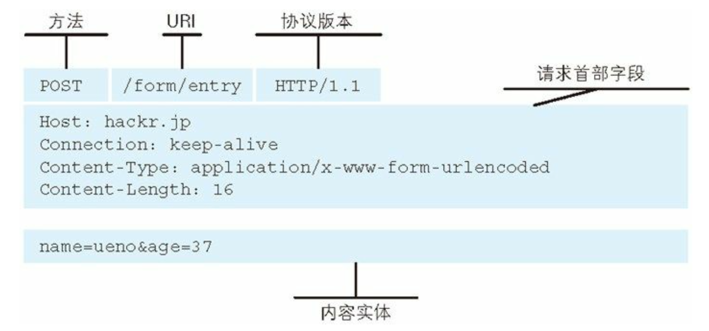
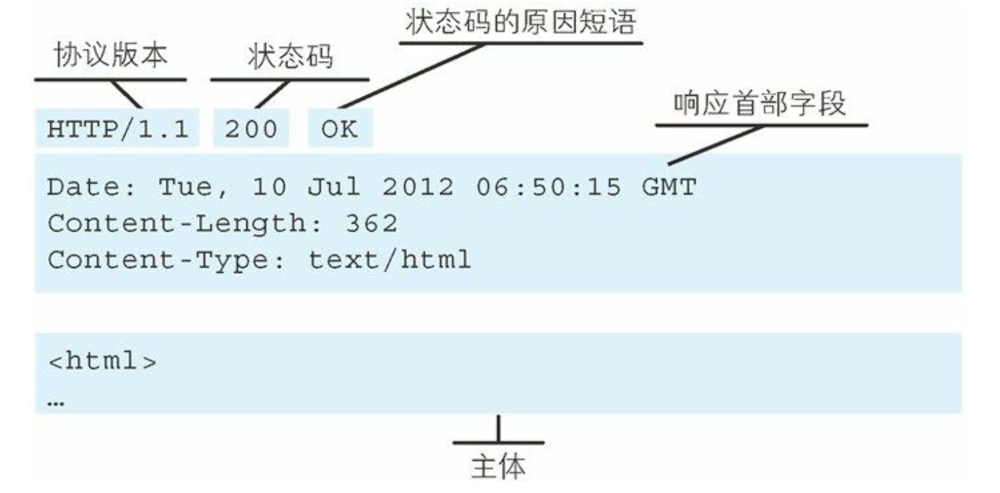

# 图解HTTP

# 第一章 了解

## 1.2 构建技术

- HTML：超文本标记语言
- HTTP：文档传递协议
- URL：统一资源定位符

## 1.3 网络基础

### 1.3.1 TCP/IP

- 协议族：互联网相关的各类协议族的总称
- 分层：易于维护，设计相对简单

### 1.3.3 传输流

- 封装：将数据信息包装，即增加首部的过程

## 1.4 相关协议

### 1. 负责传输的 IP 协议

1. 网络层，非IP地址

2. 作用：将各类数据包传送给对方
   - IP地址：节点被分配到的地址，可变换
   - MAC地址：网卡所属的固定地址，基本不变化
3. ARQ协议
   - 地址解析协议：根据IP地址反查出MAC地址
4. 计算机网络中MAC地址与IP地址

- https://blog.csdn.net/kenjianqi1647/article/details/81636898
- 

- 无法全面掌握互联网中的传输细节
  - 快递送货：寄件--集散中心--集散中心--收件人

### 2. 确保可靠性的TCP协议

1. 传输层：提供可靠的字节流服务

   - 为了方便传输，将大块数据**分割成以报文段为单位的数据包**进行管理

   - 三次握手

     

### 3. 域名解析的DNS服务

1. 同HTTP是应用层协议

2. **域名到IP地址**之间的解析服务

   

3. 输入URL
   - DNS解析，TCP连接
   - 发送HTTP请求，服务器处理请求并返回HTTP报文
   - 浏览器解析渲染HTML页面，连接结束

# 第二章 HTTP协议

## 2.2 请求响应

1. 协议规定：请求从客户端发出，服务器端响应请求并返回

2. 请求报文

   - 组成：请求方法，请求URI，协议版本，可选请求首部字段和内容实体

     

3. 响应报文

   - 协议版本，状态码，原因，可选首部字段以及主体

     

## 2.3 HTTP是不保存状态的

1. 为了更快地处理大量事务

   1. Cookie：Set-Cookie
   2. sid

2. 请求方法

   

# 第四章 状态码

- 状态码告知从服务器端返回的请求结果

- 状态码：客户端向服务器发送请求，服务器返回的请求结果

## 1. 2XX成功

　　**200 OK**：请求正常返回

　　**204 NO Content**：请求处理成功，但没有资源可以返回

　　**206 Partial Content**：成功进行了范围请求，响应报文中包含Content-Range指定范围的实体内容

## 2. 3XX重定向

　　**301 Moved Permanently**：永久重定向，永久使用指定地址访问

　　**302 Found** ：临时重定向，临时使用指定地址访问

　　**303 See Other**：用GET方法重定向到URI上

　　**304 Not Modified**：服务器允许请求访问资源，但请求未满足条件。（304返回时，不包含任何主体部分，与重定向没关）

- GET方法请求报文中包含`If-Match`

　　**307 Temporary Redirect**：临时重定向，和302相同。（禁止POST变换成GET）

## 3. 4XX客户端错误

　　**400 Bad Request**：请求报文存在语法错误

　　**401 Unauthorized**：请求需要通过认证信息

　　**403 Forbidden**：未获得文件系统的访问授权，被服务器拒绝

　　**404 Not Found**：服务器上无法找到请求的资源，或服务器拒绝请求且没有理由

## 4. 5XX服务器错误

　　**500 Internal Server Error**：服务器执行请求出现故障，web应用存在bug或故障

　　**503 Service Unavailable**：服务器处于超负载或正在维修停机状态