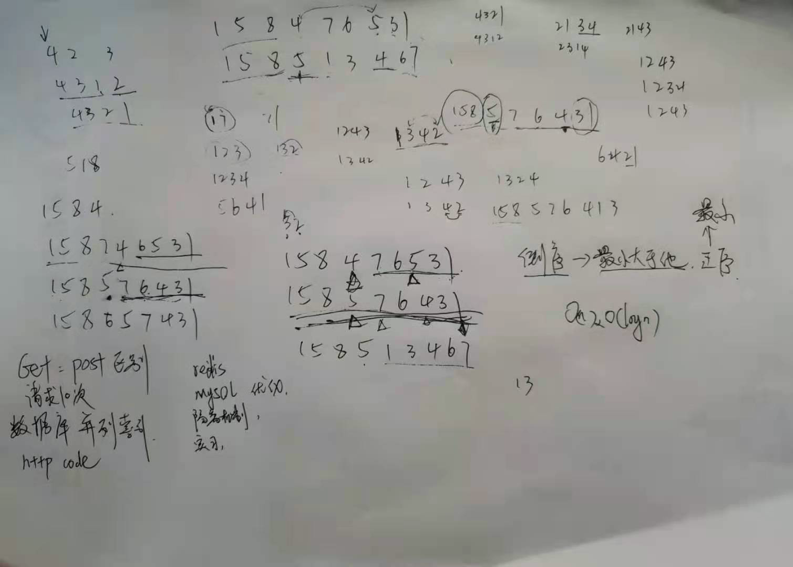
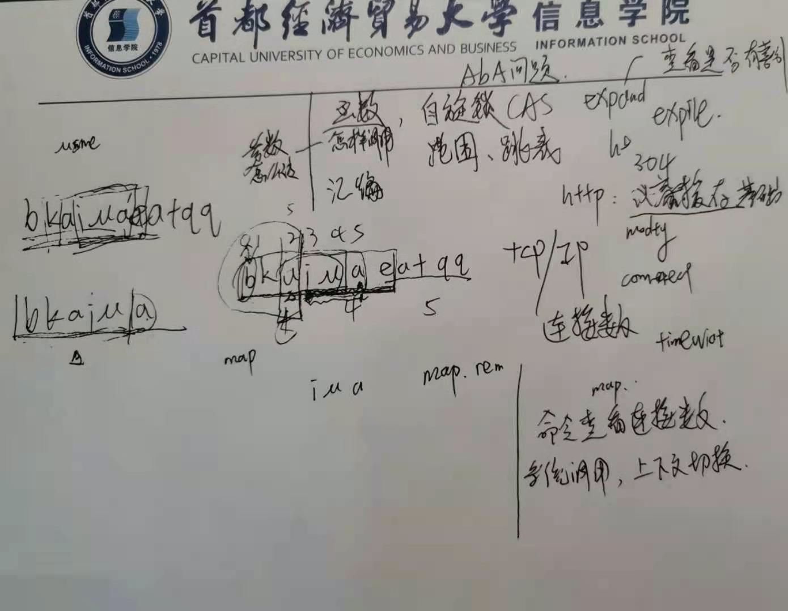

# 自我介绍


# 公司

## 字节

### 一面2020.12.14

1. 算法题：https://leetcode-cn.com/problems/next-permutation/

没做出来



2. 数据库

   1. MySQL数据库为什么大多使用B+树，而不是用Hash存储索引

      https://blog.csdn.net/u013967628/article/details/85112715

      - B+数据的查询时间为log(n),而利用Hash时间为o(1)
      - 利用Hash需要把数据全部加载到内存中，如果数据量大，是一件很消耗内存的事，采用B+树，是基于按照节点分段加载，由此减少内存消耗。
      -  和业务场景有关，对于唯一查找（查找一个值，记录），Hash确实更快，**但数据库中经常查询多条数据**，这时候由于**B+数据的有序性**，与叶子节点又有链表相连，他的查询效率会比Hash快的多。


### 二面

算法题

bkaiuaeatqq

求最长不重复子串

求最大长度



### 9个常用网络命令

https://blog.csdn.net/m0_37357063/article/details/80738959


### Mysql查看是否使用到索引

https://blog.csdn.net/vtopqx/article/details/86504206

### java中的各种锁详细介绍

https://www.cnblogs.com/jyroy/p/11365935.html


## 柠檬微趣

### 笔试

算法题

#### 最浅叶节点

```java
public class Main {
  	// 保存二叉树<第几层，层数节点和>
    Map<Integer, Integer> map = new HashMap<>();
    static int index = 0;
    private int sumOfShallowestLeaves(TreeNode root) {
        help(root, 0);
        for (int j = 0; j <= index; j++) {
            if (map.containsKey(j)) {
                return map.get(j);
            }
        }
        return 0;
    }
    public void help(TreeNode root, int deep) {
        if (root == null)
            return;
        if (root.left == null && root.right == null) {
            if (map.containsKey(deep)) {
                map.put(deep, map.get(deep) + root.val);
            } else {
                map.put(deep, root.val);
            }
            return;
        }
        index++;
        help(root.left, deep+1);
        help(root.right, deep+1);
    }
}
```


#### 字符串数据有序化

```java
class Solution {
    /*
       ["xga"
        "xfb"
        "yfa"]
    */

    public int minDeletionSize(String[] A) {
        if (A.length <= 1) return 0;
        // 每个字符串有几个字符
        int col = A[0].length();
        // 数组多少字符串
        int row = A.length;
        /*
        *  保存行是否相对升序，即如
            ["xga"
            "xfb"
            "yfa"]
            v_row[2]第2行 较 v_row[1]第一行已经相对升序，那么b<a也不用删除
        */ 
        int[] v_row = new int[row];
        int res = 0;
        // 几个字符
        for(int i = 0; i < col; i++) {
            boolean delete = false;
            // 数组多少个
            for (int j = 1; j < row; j++) {
                // 相对有序
                if (v_row[j] == 1)
                    continue;
                // 降序一定删除
                if (A[j].charAt(i) - A[j-1].charAt(i) < 0) {
                    res += 1;
                    delete = true;
                    break;
                }
            }
            // 如果该列不删除，判断是否有相对升序，为后面类似 b<a ["xfb", "yfa"]不删除
            if (!delete) {
                for (int j = 1; j < row; j++) {
                    // 该两行相对升序
                    if (A[j].charAt(i) - A[j-1].charAt(i) > 0) {
                        v_row[j] = 1;
                    }
                }
            }
        }
        return res;
    }
}
```


#### 旋转字母圆盘

```
import java.util.*;


public class Solution {
    /**
     * 代码中的类名、方法名、参数名已经指定，请勿修改，直接返回方法规定的值即可
     * 
     * @param plate string字符串 plate.size() <= 100
     * @param target string字符串 target.size() <= 100
     * @return int整型
     */
    
    // 1. 用二维数据保存每个字符离头字符的最近距离
    // 2. 一个指针指向每次的头字符，循环相加
    public int findMinRotateSum (String plate, String target) {
        int len = plate.length();
        int[][] dp = new int[len][len];
        for(int i = 0; i < len; i++) {
            for (int j = 0; j < len; j++) {
                if (j < len/2) {
                    dp[i][j] = j-i;
                    dp[j][i] = j-i;
                } else {
                    // 循环
                    dp[i][j] = len+i-j;
                    dp[j][i] = len+i-j;
                }
            }
        }
        
        return 0;
    }
}
```

#### 整数变长编码


# 为什么需要验证

1. http是无状态的，电商想要跟踪用户

   1. cookies+sessionId：【cookies->客户端，sessionId服务端】

      - 存在问题：CSRF【跨站请求伪造】，非法链接获取sessionId
      - 缺点：依赖cookies【url】，不适合移动端；Session服务器的可用性

   2. token

      - 一段字符串。临时令牌--客户端保存服务器返回的

      - 存在本地，能防CSRF

   3. XSS：跨站脚本攻击

      - 脚本盗用cookies，token等

2. JWT


# OAuth2微信支付


# 项目


# 数据库

## MySQL

### 平衡二叉树、B树、B+树

https://zhuanlan.zhihu.com/p/27700617

https://blog.csdn.net/wanghao112956/article/details/103042934

二叉查找树


**B树**，P为页


**B+树**


**看下 B+ 树和 B 树有什么不同：**

1. B+仅叶子结点存储数据
   - B+ 树非叶子节点上是不存储数据的，仅存储键值
   - 而 B 树节点中不仅存储键值，也会存储数据。
   - 为什么
     - 数据库中页【IO减少】的大小是固定的，InnoDB 中页的默认大小是 16KB。
     - 如果不存储数据，那么就会**存储更多的键值**，相应的树的阶数（节点的子节点树）就会更大，树就会更矮更胖，如此一来我们**查找数据进行磁盘的 IO 次数又会再次减少**，**数据查询的效率也会更快**。
     - B+ 树的阶数是等于键值的数量的，如果我们的 B+ 树一个节点可以存储 1000 个键值，那么 3 层 B+ 树可以存储 1000×1000×1000=10 亿个数据。
     - 一般根节点是常驻内存的，所以一般我们查找 10 亿数据，只需要 2 次磁盘 IO。

2. 因为 B+ 树索引的**所有数据均存储在叶子节点，而且数据是按照顺序排列的。**
   - 那么 B+ 树使得**范围查找，排序查找，分组查找以及去重查找变得异常简单**。而 B 树因为数据分散在各个节点，要实现这一点是很不容易的。
   - B+ 树中各个页之间是通过双向链表连接的，叶子节点中的数据是通过单向链表连接的。
   - 也就是说上图中的 B+ 树索引就是 **InnoDB 中 B+ 树索引真正的实现方式**，准确的说应该是聚集索引。
   
   

**好文章**

https://www.cnblogs.com/boothsun/p/8970952.html


## Redis

### I/O多路复用


 *I/O multiplexing*

- 一根网线，多个sock复用


# Java

## Arrays.sort

Arrays.sort并不是单一的排序，而是**插入排序，快速排序，归并排序**三种排序的组合【47，286】


